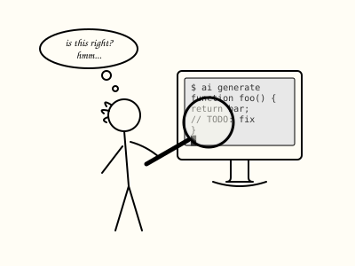
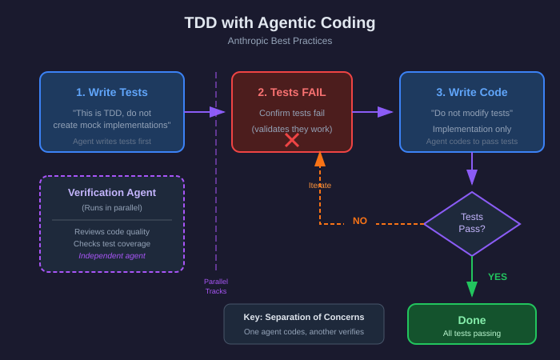
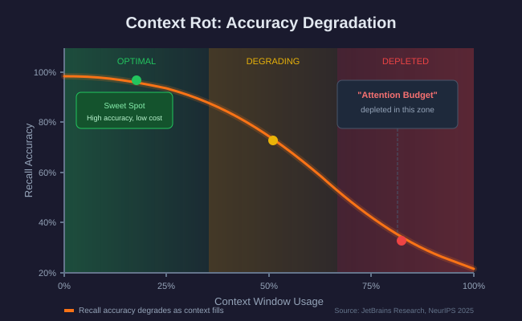
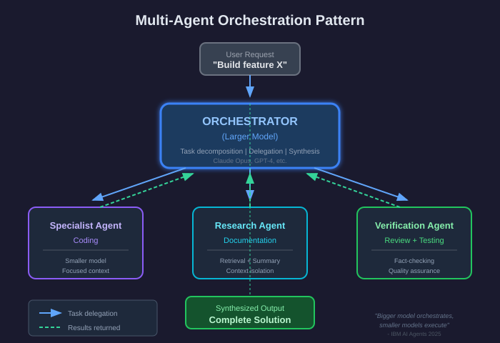
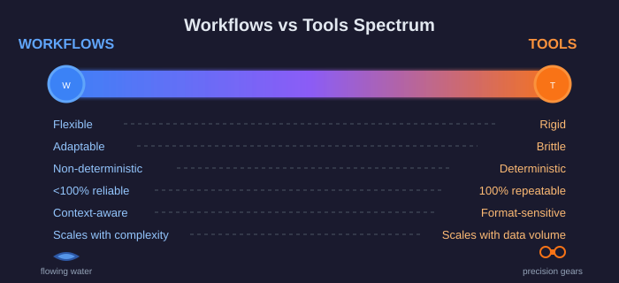
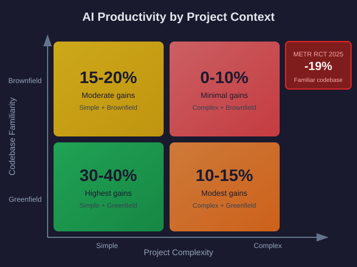
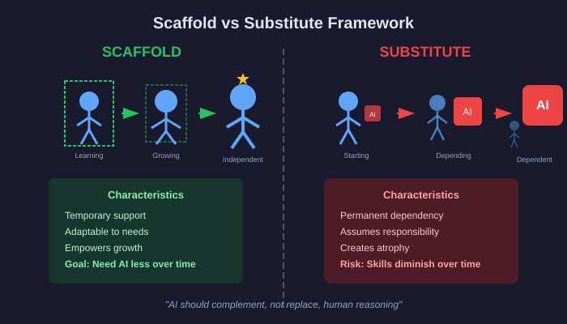
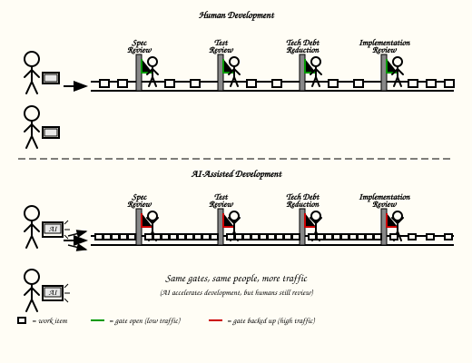
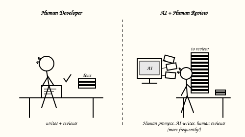
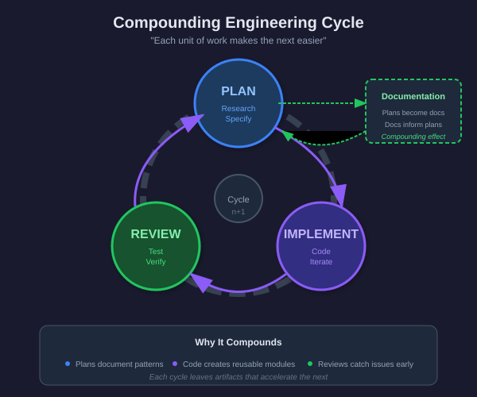

# AI-Assisted Software Development

LLM based agents for software development are evolving rapidly.  I wouldn't claim that there can be "best practices" established in the field at this time; what follows is a collection of points to consider.

## Core Principle: Always Review AI Output

Mistakes and agent misunderstandings are common. Every piece of AI-generated code, documentation, and analysis requires human review before acceptance.

When output falls short:
- Describe the specific issues to the agent
- Provide examples of "good" patterns to follow
- Give multiple, thorough prompts (including document files when appropriate) to align results with expectations

When AI is still producing faulty output: fix the output yourself, clear the agent's context and have it read the corrected output before proceeding with further development.  Consider asking the agent to document its understanding of the solution, and review that document to ensure that future development is not based on hallucinations.

---

## Specification-First Development

Models [guided by specifications](https://aws.amazon.com/blogs/storage/how-automated-reasoning-helps-us-innovate-at-s3-scale/) produce more robust, maintainable, and feature-complete code [more efficiently](https://developers.redhat.com/articles/2025/10/22/how-spec-driven-development-improves-ai-coding-quality#review__refine__and_remix).

See also: [Specification as Code](https://youtu.be/8rABwKRsec4?si=7JhAr_klMcKp97Yt&t=47) (video presentation)

### The Workflow

1. **Specify** - Write clear requirements; with [preconditions, postconditions](https://en.wikipedia.org/wiki/Design_by_contract), and [constraints](https://www.eiffel.org/doc/eiffel/ET-_Design_by_Contract_(tm),_Assertions_and_Exceptions) when appropriate; note that .md markdown format files [are considered optimal](https://developers.cloudflare.com/workers-ai/features/markdown-conversion/) for communication with AI agents
2. **Plan** - Have the agent create a detailed implementation plan from the specification; review the plan for correctness
3. **Implement** - Agent writes code according to plan to satisfy the specification
4. **Verify** - Tests (usually specified in the plan) validate specification compliance
5. **Review** - Human confirms correctness and quality
6. **Iterate** - Improve or expand the specification as needed, replan when modifications are extensive, then implement, verify and review the new specifications' features

### Why It Works

- Explicit requirements eliminate ambiguity
- Specifications provide verifiable and stable acceptance criteria
- Plans derived from specs are more complete than ad-hoc implementations
- Reduces "MVP drift" where agents quietly trim features

### Research Support

- **[SpecGen](https://arxiv.org/abs/2401.08807):** Generated verifiable specifications for 279/385 programs, outperforming conventional tools
- **[Astrogator](https://arxiv.org/html/2507.13290):** Using formal query language, proved correctness in 83% of cases and identified incorrect code in 92%

---

## AI/LLM Agents write specifications too

While human input and review is crucial at every step of the development process, don't overlook the fact that LLMs [can also](https://arxiv.org/html/2508.00083v1):

- help to draft, review and improve specifications documents
- review and critique implementation code, particularly with fresh agents and clear context windows
- evaluate and expand test coverage
- update documentation
- review the entire project for consistency, completeness and technical debt

Never forget: every one of these automated LLM based workflow processes comes with a built in non-zero error rate, and that errors left in the project will propagate and grow.  Thorough critical review is essential to clean out errors, but the power of LLMs to draft an 80+% complete and correct framework should not be ignored.

---

## Test-Driven Development with Agents

[Anthropic's best practices](https://www.anthropic.com/engineering/claude-code-best-practices) recommend TDD as particularly powerful with agentic coding for verifiable changes.

### The Process

1. **Write tests first**
   - "This is TDD - do not create mock implementations"
   - "Run tests and confirm they fail"

2. **Implement to pass tests**
   - "Do not modify the tests"
   - "Keep going until all tests pass"

3. **Separate coding from verification**
   - One agent writes code
   - Another reviews and tests it

This separation of concerns catches errors that a single-agent approach misses.  Incorporate TDD into plans of sufficient complexity to benefit from the formalism.

---

## Context Engineering

Context is a finite resource with diminishing returns. As context window fills, the model's ability to accurately recall information decreases ("[context rot](https://blog.jetbrains.com/research/2025/12/efficient-context-management/)").

See: [Anthropic's guide to effective context engineering](https://www.anthropic.com/engineering/effective-context-engineering-for-ai-agents)

### Practical Strategies

| Strategy | When to Use |
|----------|-------------|
| **Fresh context** | Starting new tasks or when stuck on bugs |
| **Summary documents** | Capturing session state for later resumption (in a fresh context) |
| **Delegate reading** | Have research agents summarize docs for primary agent |
| **Prune aggressively** | Remove verbose tool logs after they've served their purpose |

### Warning Signs of Context Problems

- Agent repeating fixed bugs (pattern stuck in context)
- Losing sight of requirements late in long sessions
- Detailed output about recent topics, sparse on earlier topics
- Agent "forgetting" earlier decisions

**Solution:** Write summary documents during sessions, start fresh sessions for new tasks.  Refer back to relevant documents as needed.

### Multi-agent Application

Each agent has its own context, which can be shaped appropriately to its own sub-task with agent specific instructions.

---

## Legible Software

Keep your software's operation visible - this enables both human review and agent self-debugging. ([academic paper](https://arxiv.org/html/2508.14511v2), [Register summary](https://www.theregister.com/2025/11/07/researchers_detail_legible_software_model/))

### Principles

- **Modules small and focused** - Don't overwhelm agent with details
- **Well-defined interfaces** - Clear boundaries between components
- **Visible state** - Logs, graphs, status displays for intermediate processes
- **Rich logging** - Timestamps, file/line numbers, thread IDs enable accurate diagnosis

Agents can read logs to diagnose their own mistakes - but only when the logs capture sufficient detail.

---

## Design Patterns Reduce Cognitive Load

Patterns provide pre-solved solutions to recurring problems. When an agent recognizes a pattern, it skips inventing a solution from scratch. ([design patterns catalog](https://refactoring.guru/design-patterns/))

### Benefits for AI-Assisted Development

- **Shared vocabulary** - "Use Repository pattern" conveys hours of design in four words
- **Predictable structure** - Consistent organization aids navigation
- **Reduced decisions** - Sensible defaults conserve capacity for novel problems
- **Risk mitigation** - Battle-tested approaches reduce edge case issues

Patterns trade the one-time cost of learning conventions for repeated recognition-based problem solving.

---

## Workflows vs Tools

"Tools" in AI systems can be many things.  In software development they can often take the form of small deterministic programs that provide useful services in the course of development; for example: a python script to interpret a SSOT .json data structure into different tables for use in the program. 

| Aspect | Workflows (Natural Language) | Tools (Deterministic Code) |
|--------|------------------------------|---------------------------|
| **Reliability** | <100%, varies per execution | 100% repeatable |
| **Adaptability** | High - handles varied inputs | Low - brittle to changes |
| **Scaling** | Degrades with volume | Handles large datasets |
| **Maintenance** | Adjust prompts | Code changes required |

### Guidance

- Use **tools** for tasks requiring precision and repeatability
- Use **workflows** for tasks requiring flexibility and judgment
- Typically keep tools under ~1000 lines to maintain LLM agent maintainability
- Keep workflows as compact and focused as possible to avoid context window overload
- Monitor workflow outputs - different mistakes appear on different runs

More [perspective on agents and tools](https://www.ibm.com/think/topics/compound-ai-systems) in AI systems.

---

## Manage Technical Debt

Agents declare "100% complete" while accumulating significant debt. Actively watch for:

- TODO comments flagging unimplemented functionality
- Stubbed functions that don't implement specified behavior
- Missing or ineffective unit and integration tests
- Console warnings/errors during normal operation
- Documentation not synchronized with implementation
- Hard-coded values that should reference configuration

**Countermeasure:** Prompt "review for technical debt" periodically, especially just after an agent claims task complete.  Plan and execute technical debt cleanup often.

The speed of LLM code refactoring and cleanup presents opportunity to address technical debt much more frequently and thoroughly than might be practiced with a traditional team of developers.  The speed of LLM writing unit and integration tests means that higher test coverage ratios are practical to achieve and technical debt refactorings can be executed with greater confidence that they will not cause functional regressions.

---

## Key Principles to Reinforce

### DRY (Don't Repeat Yourself)

Agents scatter copies of values, defaults, and concepts throughout code and documentation. This leads to divergence (hanging on to old values/concepts) when implementation choices change.

- Review new documents for repetition, prefer references to repetition.
- Prompt agents to "DRY out" code and documentation
  - Also prompt to remove dead (and now irrelevant or potentially misleading) code, dead code and comments still get read into context and can influence future development choices.
- Define and use parametric "helper functions" rather than repeating similar logic and processes multiple times.
- Define defaults and constants in single locations.

### SSOT (Single Source of Truth)

Agents create local copies, buffers, and caches when they should reference the authoritative source.

- Clearly identify SSOT for each concept in specifications
- Periodically prompt to "review for SSOT violations"
- Refactor local copies to authoritative references
- Watch for agents keeping [magic numbers](https://en.wikipedia.org/wiki/Magic_number_(programming) ) and other concepts in sync manually instead of defining them in a central location

### Replacement vs Additive

Agents usually default to additive changes (add new code) rather than replacement (remove old code). This leaves obsolete, faulty and misleading information in the code and documentation where it becomes context during future operations.

- Explicitly instruct replacement when appropriate
- Verify old implementations are removed, not just augmented or supplemented with alternative implementations
- Watch for functionality reverting to deprecated behavior

---

## When to Skip AI Assistance

A [METR study (July 2025)](https://metr.org/blog/2025-07-10-early-2025-ai-experienced-os-dev-study/) found experienced developers on familiar codebases were **19% slower** with AI tools.

AI can slow down development and/or lower the quality of developement outputs, especially in these contexts:

- **Familiar codebases** you've worked on for years
- **Debugging emergencies** where preserved diagnostic skills matter
- **Simple changes** where context-loading overhead exceeds task complexity
- **Security-critical code** where hallucination risk is unacceptable
- **Architecture decisions** requiring deep domain reasoning

---

## Scaffold vs Substitute

Research warns about over-reliance on AI coding assistants:
- [Gerlich Study (2025)](https://phys.org/news/2025-01-ai-linked-eroding-critical-skills.html): Cognitive offloading correlated +0.72 with AI usage, inversely correlated -0.75 with critical thinking
- [Microsoft & Carnegie Mellon](https://addyo.substack.com/p/avoiding-skill-atrophy-in-the-age): The more people lean on AI tools, the less critical thinking they engage in

The critical question: Is AI strengthening your capabilities or replacing them?

| Scaffold | Substitute |
|----------|------------|
| Temporary, empowering | Dependency-creating |
| Need AI less over time | Skills diminish over time |
| Builds internal capacity | Technology assumes responsibility |

### Warning Signs of Substitution

- Skipping debugger, going straight to AI for every exception
- Not reading error messages before sending to AI
- Finding it arduous to step through code or read stacktraces
- At a loss when AI is unavailable

**Preserve diagnostic and debugging skills** - you'll need them when AI fails or is unavailable.

---

## Process Discipline

Using AI agents is no reason to abandon software development best practices. The firehose of AI output requires a **more** rigorous and formalized process, not less:

- Specifications before implementation
- Robust automated test coverage (reduces regressions)
  - Tests before code (TDD) when appropriate
- Regular technical debt assessment and correction
- Documentation frequently synchronized with implementation
- Review before merge

The same domain-specific processes that ensure human developers' product quality also ensure AI-assisted development product quality.  Due to the speed at which agents produce code and documentation, the processes need to be applied more frequently.

The unavoidable human labor of review needs to happen much more frequently with AI agents generating code and documentation; whereas single human review happens naturally / invisibly as part of the work when a human is doing the development.

Incidentally, at least one [research study shows](https://arxiv.org/html/2509.13942v1) LLMs use more tokens, but also produce better quality code when using Agile methods vs Waterfall. 

---

## Compounding Engineering

The goal of [Compounding Engineering](https://github.com/EveryInc/compounding-engineering-plugin) is for each unit of engineering work to make subsequent units easier.

1. **Specify** - Clear requirements with acceptance criteria
2. **Plan** - Detailed implementation plan from specification
3. **Test First** - Write tests before implementation
4. **Implement** - Agent codes to specification
5. **Verify** - Tests pass, specification satisfied
6. **Review** - Human confirms quality, checks for debt
7. **Document** - Keep docs synchronized with implementation

Each step creates artifacts that inform subsequent work. Quality compounds when the process is followed consistently, like a pro-active [CAPA](https://en.wikipedia.org/wiki/Corrective_and_preventive_action#Concepts) loop.  The plugin linked above was developed [with great enthusiasm](https://every.to/source-code/my-ai-had-already-fixed-the-code-before-i-saw-it) by its users.

-----

End of document