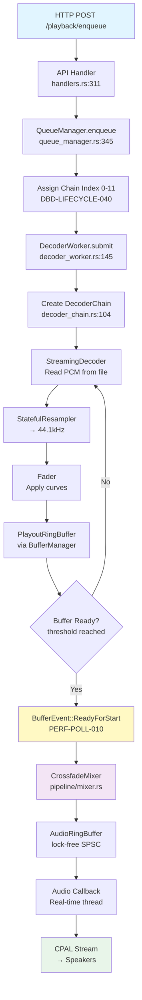
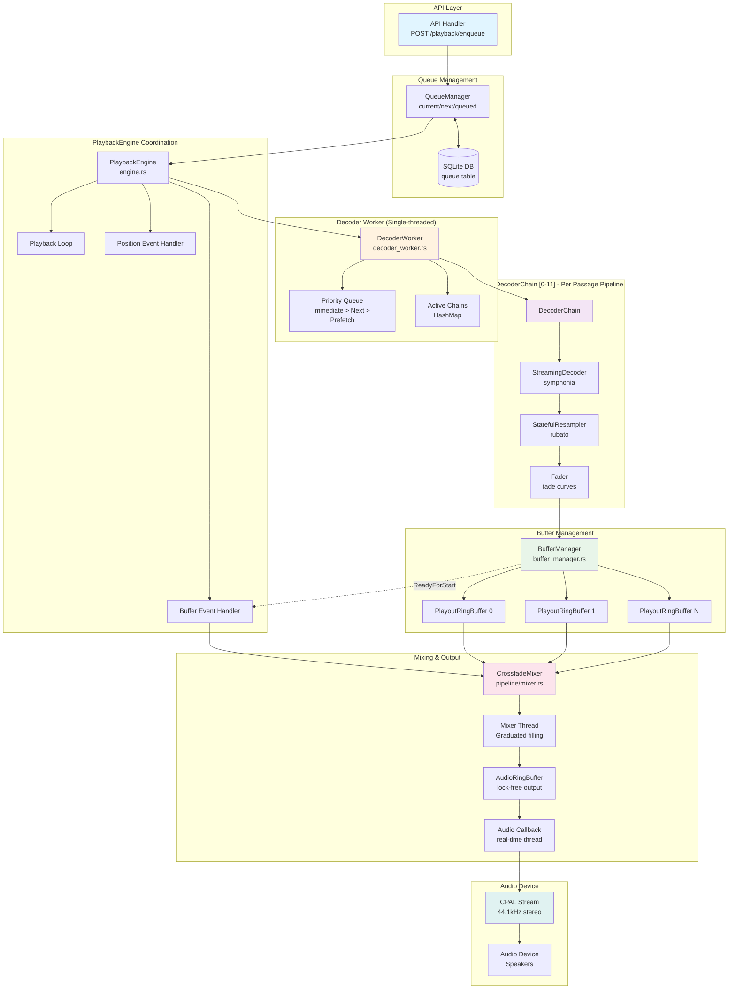
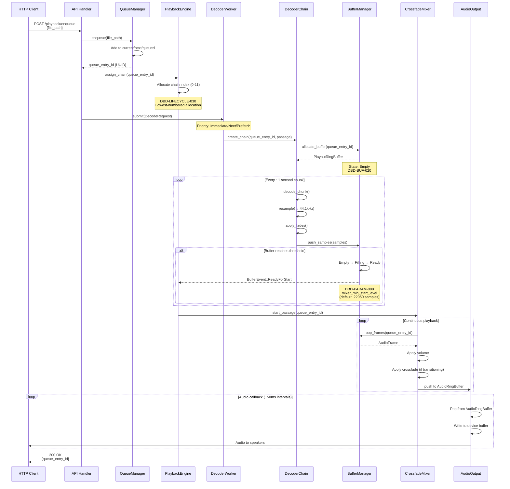
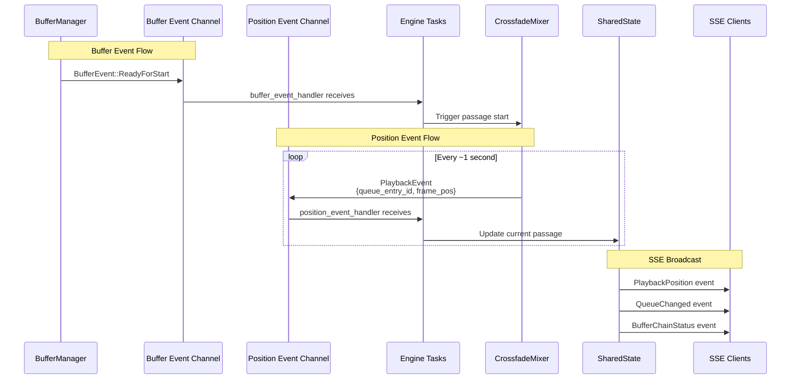
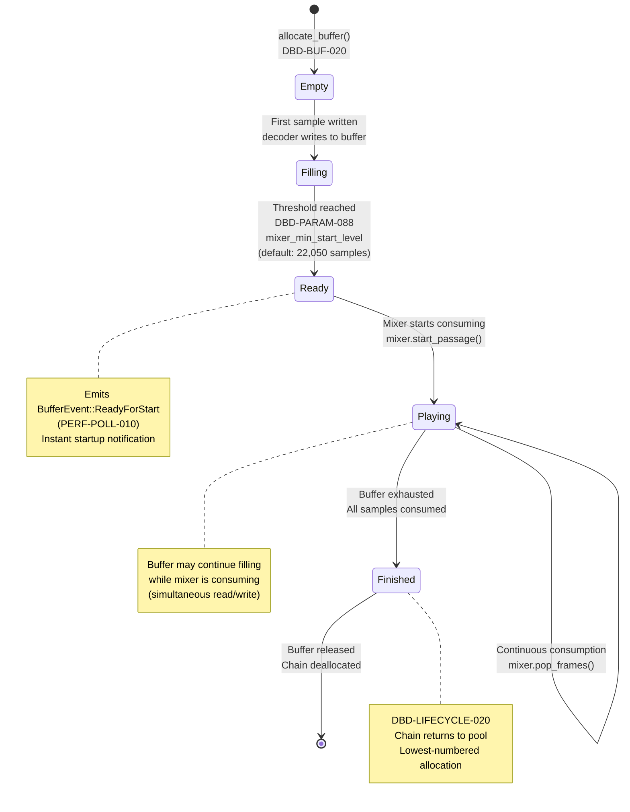
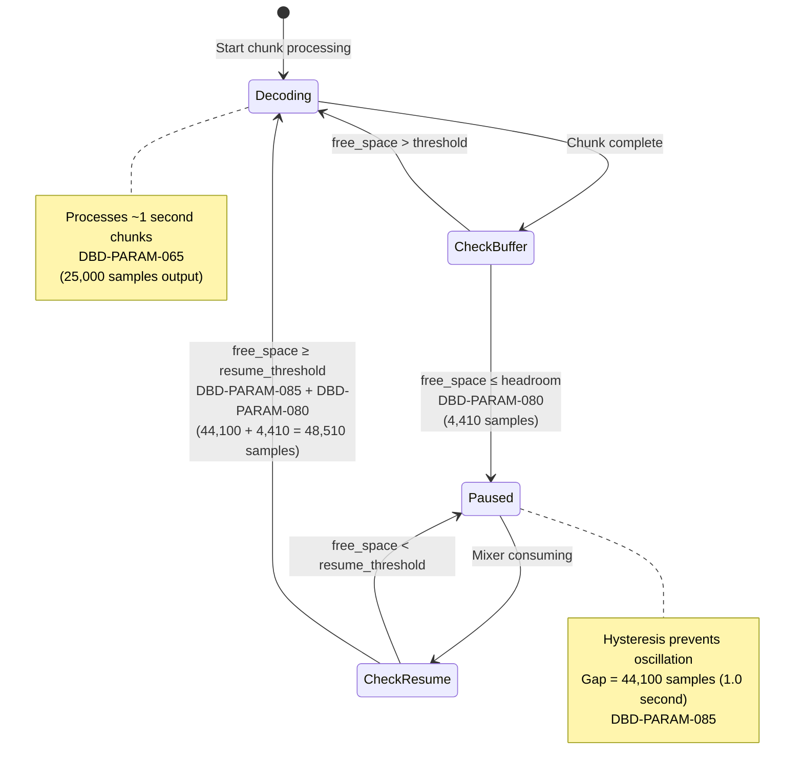
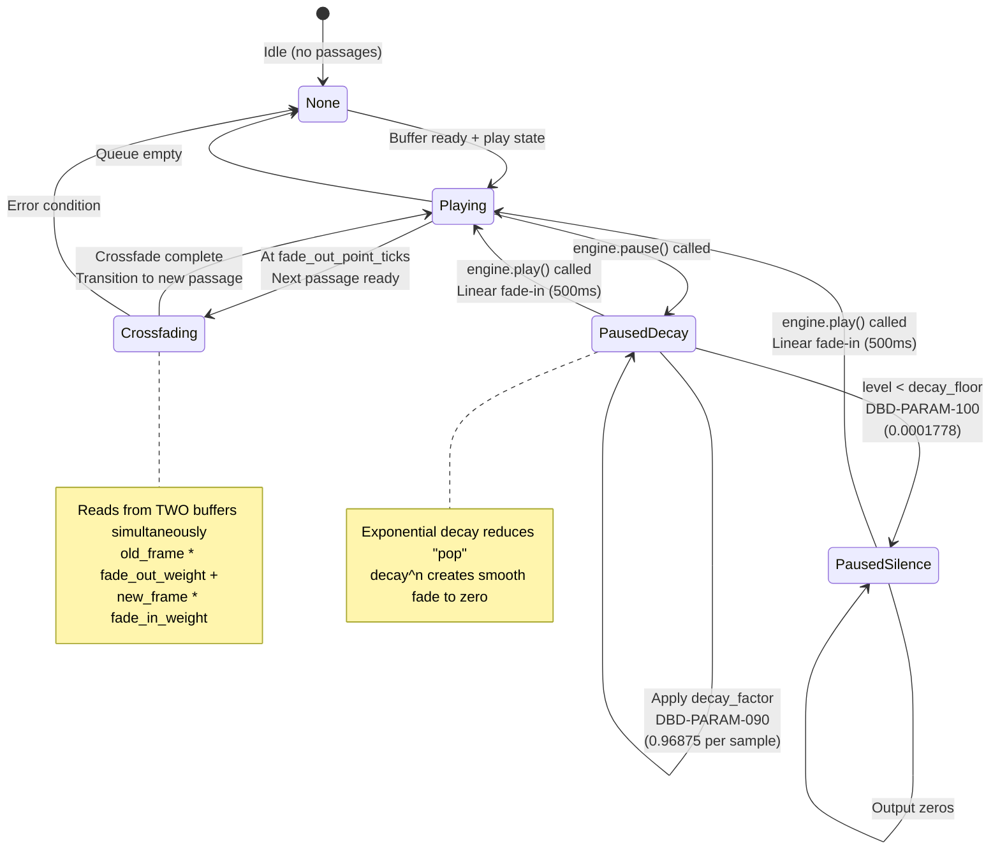
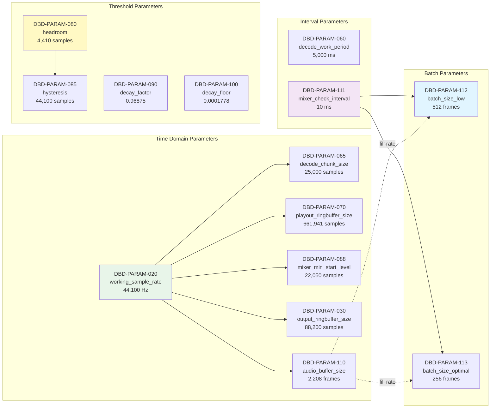

# Audio Processing Pipeline Diagrams

**PURPOSE:** Visual reference for the complete audio processing chain from API enqueue through queue management, decoder chains, buffer management, mixer, and audio output.

**AUDIENCE:** Developers, architects, and technical documentation readers

**RELATED DOCUMENTATION:**
- [SPEC016 Decoder Buffer Design](../docs/SPEC016-decoder_buffer_design.md)
- [SPEC013 Single Stream Playback](../docs/SPEC013-single_stream_playback.md)
- [SPEC014 Single Stream Design](../docs/SPEC014-single_stream_design.md)
- [SPEC002 Crossfade Design](../docs/SPEC002-crossfade.md)

---

## Table of Contents

1. [High-Level Overview (Mermaid Flowchart)](#1-high-level-overview)
2. [Interaction Flow (Mermaid Sequence Diagram)](#2-interaction-flow)
3. [Buffer Lifecycle (Mermaid State Diagram)](#3-buffer-lifecycle)
4. [Comprehensive Reference (ASCII Diagram)](#4-comprehensive-reference)
5. [DBD-PARAM Parameter Mapping](#5-dbd-param-parameter-mapping)

---

## 1. High-Level Overview

### Linear Pipeline Flow



### Component Architecture



---

## 2. Interaction Flow

### Sequence Diagram: Enqueue to Playback



### Event-Driven Architecture



---

## 3. Buffer Lifecycle

### Buffer State Machine



### Decoder Pause/Resume State Machine



### Mixer Mode State Machine



---

## 4. Comprehensive Reference

### Complete ASCII Pipeline Diagram

```
┌─────────────────────────────────────────────────────────────────────────────┐
│                    WKMP-AP AUDIO PROCESSING PIPELINE                        │
│                    (API → Queue → Decode → Mix → Output)                    │
└─────────────────────────────────────────────────────────────────────────────┘

═══════════════════════════════════════════════════════════════════════════════
 1. API REQUEST (handlers.rs:311-366)
═══════════════════════════════════════════════════════════════════════════════

    HTTP POST /playback/enqueue
         │
         │ EnqueueRequest { file_path }
         ▼
    [API Handler: enqueue_passage]
         │
         │ PathBuf::from(file_path)
         ▼
    engine.enqueue_file(file_path)
         │
         │ Emits: QueueChanged, QueueStateUpdate (SSE)
         └─→ Returns queue_entry_id (UUID)


═══════════════════════════════════════════════════════════════════════════════
 2. QUEUE MANAGEMENT (engine.rs + queue_manager.rs:90-451)
═══════════════════════════════════════════════════════════════════════════════

    engine.enqueue_file()
         │
         ├─→ [Load/Create Passage from DB]
         │   • passages::get_passage_with_timing()
         │   • OR passages::create_ephemeral_passage()
         │
         ├─→ [QueueManager::enqueue]
         │   • State: current → next → queued[]
         │   • Updates play_order in database
         │
         ├─→ [Chain Assignment - DBD-LIFECYCLE-040]
         │   • Allocate chain_index (0-11 from pool)
         │   • chain_assignments[queue_entry_id] = chain_index
         │   • DBD-PARAM-050: maximum_decode_streams = 12
         │
         └─→ [Submit Decode Request]
             • decoder_worker.submit(queue_entry_id, passage, priority)
             • priority = Immediate (current), Next, or Prefetch


═══════════════════════════════════════════════════════════════════════════════
 3. DECODER WORKER (decoder_worker.rs:1-200)
═══════════════════════════════════════════════════════════════════════════════

    DecoderWorker receives DecodeRequest
         │
         │ Priority queue: Immediate > Next > Prefetch
         │ DBD-PARAM-060: Check priority every 5000ms
         ▼
    [Worker Loop - Single-threaded serial decoding]
         │
         ├─→ Pending Request?
         │   └─→ Create DecoderChain
         │
         ├─→ Active Chains?
         │   └─→ Process one chunk (~1 second audio)
         │       DBD-PARAM-065: 25,000 samples/chunk (at 44.1kHz)
         │
         └─→ Yielded Chains?
             └─→ Retry if buffer has space


═══════════════════════════════════════════════════════════════════════════════
 4. DECODER CHAIN (pipeline/decoder_chain.rs:1-200)
═══════════════════════════════════════════════════════════════════════════════

    DecoderChain::new(queue_entry_id, chain_index, passage)
         │
         ├─→ [StreamingDecoder]
         │   • symphonia-based audio decoder
         │   • Reads from file (start_ms → end_ms)
         │   • Outputs PCM samples at source rate
         │
         ├─→ [StatefulResampler]
         │   • rubato-based resampler
         │   • Source rate → 44.1kHz (TARGET_SAMPLE_RATE)
         │   • DBD-PARAM-020: working_sample_rate = 44,100 Hz
         │   • Maintains state for streaming
         │
         ├─→ [Fader]
         │   • Applies fade-in curve (at fade_in_point)
         │   • Applies fade-out curve (at fade_out_point)
         │   • 5 curve types: linear, exponential, etc.
         │
         └─→ [Buffer Allocation]
             • buffer_manager.allocate_buffer(queue_entry_id)
             • Creates PlayoutRingBuffer
             • DBD-PARAM-070: playout_ringbuffer_size = 661,941 samples (15.01s)
             • DBD-PARAM-080: playout_ringbuffer_headroom = 4,410 samples (0.1s)
             • DBD-PARAM-085: decoder_resume_hysteresis = 44,100 samples (1.0s)


    DecoderChain::process_chunk()
         │
         │ [DBD-DEC-110] Process ~1 second chunks
         │
         ├─→ STEP 1: Decode
         │   decoder.decode_chunk() → Vec<f32> (PCM samples)
         │
         ├─→ STEP 2: Resample
         │   resampler.process(samples) → Vec<f32> (44.1kHz)
         │   DBD-PARAM-065: 25,000 samples output per chunk
         │
         ├─→ STEP 3: Fade
         │   fader.apply_fades(samples) → Vec<f32> (with curves)
         │
         └─→ STEP 4: Push to Buffer
             │
             buffer_manager.push_samples(queue_entry_id, samples)
             │
             └─→ Result:
                 • ChunkProcessResult::Processed → Continue
                 • ChunkProcessResult::BufferFull → Yield
                   (free_space ≤ playout_ringbuffer_headroom)
                 • ChunkProcessResult::Finished → Done


═══════════════════════════════════════════════════════════════════════════════
 5. BUFFER MANAGER (buffer_manager.rs:1-300)
═══════════════════════════════════════════════════════════════════════════════

    BufferManager maintains HashMap<Uuid, ManagedBuffer>
         │
         ├─→ [ManagedBuffer]
         │   • PlayoutRingBuffer (lock-free ring buffer)
         │   • BufferMetadata (state machine)
         │   • States: Empty → Filling → Ready → Playing → Finished
         │
         ├─→ [State Transitions - DBD-BUF-020 through DBD-BUF-060]
         │   │
         │   ├─→ Empty → Filling (first sample written)
         │   │
         │   ├─→ Filling → Ready (threshold reached)
         │   │   • DBD-PARAM-088: mixer_min_start_level = 22,050 samples (0.5s)
         │   │   • For first passage: may use lower threshold (500ms)
         │   │   └─→ Emits BufferEvent::ReadyForStart (PERF-POLL-010)
         │   │
         │   ├─→ Ready → Playing (mixer starts consuming)
         │   │
         │   └─→ Playing → Finished (all samples consumed)
         │
         ├─→ [Decoder Pause Logic]
         │   • Pause when: free_space ≤ playout_ringbuffer_headroom (4,410)
         │   • Resume when: free_space ≥ resume_threshold (48,510)
         │   • Resume threshold = DBD-PARAM-085 + DBD-PARAM-080
         │   •                  = 44,100 + 4,410 = 48,510 samples
         │   • Hysteresis gap = 44,100 samples (1.0 second)
         │
         └─→ [PlayoutRingBuffer Operations]
             • push_samples() - Decoder writes here
             • pop_frames() - Mixer reads here
             • Lock-free ring buffer with capacity tracking
             • DBD-PARAM-070: Capacity = 661,941 samples (15.01s @ 44.1kHz)


═══════════════════════════════════════════════════════════════════════════════
 6. PLAYBACK ENGINE COORDINATION (engine.rs:346-530)
═══════════════════════════════════════════════════════════════════════════════

    engine.start() spawns multiple tasks:

    ┌────────────────────────────────────────┐
    │ A. Playback Loop (playback_loop)       │
    │    • Monitors queue state              │
    │    • Triggers passage transitions      │
    │    • Calculates decode priorities      │
    │    • Submits decode requests           │
    └────────────────────────────────────────┘
                     │
    ┌────────────────────────────────────────┐
    │ B. Buffer Event Handler                │
    │    (buffer_event_handler)              │
    │    • Receives BufferEvent::ReadyForStart│
    │    • Triggers mixer to start passage   │
    │    • PERF-POLL-010: Instant startup    │
    └────────────────────────────────────────┘
                     │
    ┌────────────────────────────────────────┐
    │ C. Position Event Handler              │
    │    (position_event_handler)            │
    │    • Receives PlaybackEvent from mixer │
    │    • Updates SharedState               │
    │    • Emits PlaybackPosition SSE        │
    └────────────────────────────────────────┘
                     │
    ┌────────────────────────────────────────┐
    │ D. Mixer Thread                        │
    │    (fills AudioRingBuffer)             │
    │    • DBD-PARAM-111: Check every 10ms   │
    │    • Graduated filling strategy:       │
    │      - Critical (<25%): No sleep       │
    │      - Low (25-50%): 512 frames/wake   │
    │        (DBD-PARAM-112)                 │
    │      - Optimal (50-75%): 256 frames/wake│
    │        (DBD-PARAM-113)                 │
    │      - High (>75%): Sleep              │
    └────────────────────────────────────────┘


═══════════════════════════════════════════════════════════════════════════════
 7. CROSSFADE MIXER (pipeline/mixer.rs)
═══════════════════════════════════════════════════════════════════════════════

    CrossfadeMixer::get_next_frame()
         │
         │ [State Machine - SSD-MIX-010]
         │
         ├─→ None (idle)
         │   └─→ Check buffer_manager for ready passages
         │       • DBD-PARAM-088: Require 22,050 samples before start
         │       └─→ Transition to Playing or Crossfading
         │
         ├─→ Playing (single passage)
         │   │
         │   ├─→ Read frame from PlayoutRingBuffer
         │   │   • buffer_manager.pop_frames(queue_entry_id, 1)
         │   │
         │   ├─→ Apply master volume
         │   │   • frame.left *= volume
         │   │   • frame.right *= volume
         │   │
         │   ├─→ Check for crossfade trigger
         │   │   • At fade_out_point_ticks
         │   │   • If next passage ready → Start crossfade
         │   │
         │   └─→ Emit PositionUpdate events (every ~1 second)
         │       • PlaybackEvent { queue_entry_id, frame_position }
         │
         ├─→ Crossfading (two passages)
         │   │
         │   ├─→ Read from BOTH buffers simultaneously
         │   │   • old_frame = pop_frames(old_queue_entry_id)
         │   │   • new_frame = pop_frames(new_queue_entry_id)
         │   │
         │   ├─→ Apply crossfade curves
         │   │   • old_weight = fade_out_curve(progress)
         │   │   • new_weight = fade_in_curve(progress)
         │   │
         │   ├─→ Mix frames
         │   │   • mixed = (old_frame * old_weight) + (new_frame * new_weight)
         │   │
         │   ├─→ Apply master volume
         │   │
         │   └─→ When crossfade complete:
         │       • Transition to Playing (new passage)
         │       • old_queue_entry_id marked Finished
         │       • queue.advance()
         │
         └─→ PausedDecay (pause mode)
             │
             ├─→ Start from last played sample
             │
             ├─→ Apply exponential decay per sample
             │   • sample *= decay_factor
             │   • DBD-PARAM-090: pause_decay_factor = 0.96875 (31/32)
             │
             ├─→ Check decay floor
             │   • If |sample| < pause_decay_floor → Output 0.0
             │   • DBD-PARAM-100: pause_decay_floor = 0.0001778
             │
             └─→ On play: Linear fade-in over 500ms


═══════════════════════════════════════════════════════════════════════════════
 8. AUDIO RING BUFFER (ring_buffer.rs)
═══════════════════════════════════════════════════════════════════════════════

    AudioRingBuffer (lock-free SPSC ring buffer)
         │
         │ DBD-PARAM-030: output_ringbuffer_size = 88,200 samples (2.0s)
         │
         ├─→ [Producer Side - Mixer Thread]
         │   • producer.push(AudioFrame)
         │   • Check interval: DBD-PARAM-111 = 10ms
         │   • Graduated filling strategy:
         │     - Critical (<25%): Fill without sleeping
         │     - Low (25-50%): 512 frames (DBD-PARAM-112)
         │     - Optimal (50-75%): 256 frames (DBD-PARAM-113)
         │     - High (>75%): Sleep
         │
         └─→ [Consumer Side - Audio Callback]
             • consumer.pop() → Option<AudioFrame>
             • Real-time thread (no locks allowed)
             • Underrun detection with grace period


    Mixer Thread continuously:
         │
         │ DBD-PARAM-111: mixer_check_interval_ms = 10ms
         │
         ├─→ Check fill level
         │   • occupied_len() / capacity()
         │
         ├─→ Get frames from mixer
         │   • mixer.get_next_frame() → AudioFrame
         │
         └─→ Push to ring buffer
             • producer.push(frame)
             • Batch size depends on fill level (256 or 512)


═══════════════════════════════════════════════════════════════════════════════
 9. AUDIO OUTPUT (audio/output.rs:1-200)
═══════════════════════════════════════════════════════════════════════════════

    AudioOutput::start(consumer: AudioRingBufferConsumer)
         │
         │ [CPAL Stream with Real-time Callback]
         │ DBD-PARAM-110: audio_buffer_size = 2,208 frames (50.1ms @ 44.1kHz)
         │
         ├─→ Build stream with data callback
         │   │
         │   └─→ Audio Callback (runs in separate thread)
         │       │
         │       │ [ISSUE-1] Lock-free ring buffer read
         │       │
         │       ├─→ For each output_sample in output_buffer:
         │       │   │
         │       │   ├─→ Pop frame from ring buffer
         │       │   │   • consumer.pop() → Option<AudioFrame>
         │       │   │
         │       │   ├─→ Apply master volume
         │       │   │   • frame *= volume
         │       │   │
         │       │   └─→ Write to device buffer
         │       │       • output_buffer[i] = frame.left
         │       │       • output_buffer[i+1] = frame.right
         │       │
         │       ├─→ Underrun handling
         │       │   • If pop() returns None → Output silence
         │       │   • Track underrun with CallbackMonitor
         │       │
         │       └─→ Update callback statistics
         │           • Total callbacks
         │           • Underrun count
         │           • Timing statistics
         │
         └─→ Stream plays continuously
             • DBD-PARAM-020: 44.1kHz, stereo, f32 samples
             • Buffer size: DBD-PARAM-110 = 2,208 frames
             • ~50ms latency @ 44.1kHz
             • Callback frequency: ~21.5 times per second


═══════════════════════════════════════════════════════════════════════════════
 COMPLETE FLOW SUMMARY
═══════════════════════════════════════════════════════════════════════════════

HTTP Request
    ↓
API Handler (enqueue_passage)
    ↓
QueueManager.enqueue(entry) + DB Insert
    ↓
Engine: Assign Chain Index (0-11) [DBD-PARAM-050]
    ↓
DecoderWorker.submit(DecodeRequest)
    ↓
DecoderWorker creates DecoderChain[chain_index]
    ↓
┌─────────────────────────────────────────────────────────┐
│ DecoderChain Pipeline (per chunk):                     │
│                                                         │
│  StreamingDecoder (read file)                          │
│         ↓                                               │
│  StatefulResampler (→ 44.1kHz) [DBD-PARAM-020]        │
│         ↓                                               │
│  Fader (apply curves)                                   │
│         ↓                                               │
│  PlayoutRingBuffer (via BufferManager)                 │
│  [DBD-PARAM-070: 661,941 samples = 15.01s]            │
│  [DBD-PARAM-080: 4,410 headroom = 0.1s]               │
│  [DBD-PARAM-085: 44,100 hysteresis = 1.0s]            │
└─────────────────────────────────────────────────────────┘
    ↓
BufferManager tracks state:
    Empty → Filling → Ready → Playing → Finished
    ↓
    Ready threshold: [DBD-PARAM-088] 22,050 samples (0.5s)
    ↓
    Emits ReadyForStart event
    ↓
Buffer Event Handler notifies Mixer
    ↓
CrossfadeMixer reads frames from PlayoutRingBuffer:
    • Single passage: Playing mode
    • Two passages: Crossfading mode
    • Pause: Exponential decay [DBD-PARAM-090, DBD-PARAM-100]
    ↓
Mixer Thread pushes AudioFrame to AudioRingBuffer
    [DBD-PARAM-030: 88,200 samples = 2.0s]
    [DBD-PARAM-111: Check every 10ms]
    [DBD-PARAM-112: 512 frames when low]
    [DBD-PARAM-113: 256 frames when optimal]
    ↓
Audio Callback (real-time thread) pops from AudioRingBuffer
    [DBD-PARAM-110: 2,208 frames/callback = 50.1ms]
    ↓
CPAL Stream → Audio Device → Speakers
    [DBD-PARAM-020: 44,100 Hz stereo]


═══════════════════════════════════════════════════════════════════════════════
 KEY CONCURRENCY NOTES
═══════════════════════════════════════════════════════════════════════════════

1. Single-threaded Decoder Worker (DBD-DEC-040)
   • Processes chains serially for cache coherency
   • Maintains HashMap of active DecoderChains
   • DBD-PARAM-050: Up to 12 chains (configurable)
   • DBD-PARAM-060: Priority check every 5000ms

2. Lock-free Ring Buffers (ISSUE-1)
   • PlayoutRingBuffer: Decoder → Mixer (per passage)
     - DBD-PARAM-070: 661,941 samples capacity
   • AudioRingBuffer: Mixer → Audio Callback (output)
     - DBD-PARAM-030: 88,200 samples capacity
   • No mutexes in audio callback path

3. Event-driven Architecture
   • BufferEvent channel: BufferManager → Engine
   • PlaybackEvent channel: Mixer → Position Handler
   • SSE broadcast: SharedState → HTTP clients

4. Graduated Filling Strategy (mixer thread)
   • DBD-PARAM-111: Check interval 10ms
   • DBD-PARAM-112: 512 frames when buffer <50%
   • DBD-PARAM-113: 256 frames when buffer 50-75%
   • Prevents underruns with adaptive batch sizes

5. Chain Assignment Pool (DBD-LIFECYCLE-030/040)
   • DBD-PARAM-050: 0-11 chain indices (default 12 chains)
   • Lowest-numbered allocation strategy
   • Persistent queue_entry_id → chain_index mapping


═══════════════════════════════════════════════════════════════════════════════
 TRACEABILITY REFERENCES
═══════════════════════════════════════════════════════════════════════════════

• SSD-FLOW-010: Complete playback sequence
• DBD-BUF-010 through DBD-BUF-080: Buffer lifecycle management
• DBD-DEC-040, DBD-DEC-090, DBD-DEC-110: Decoder architecture
• DBD-PARAM-020 through DBD-PARAM-113: Configurable parameters (see next section)
• PERF-POLL-010: Event-driven buffer readiness (instant startup)
• ISSUE-1: Lock-free audio callback using ring buffer
• REQ-AP-ERR-010/011: Error handling and event emission
```

---

## 5. DBD-PARAM Parameter Mapping

### Parameter Overview Table

| Parameter | Name | Default | Unit | Applied Where |
|-----------|------|---------|------|---------------|
| **DBD-PARAM-010** | General | N/A | - | Settings table storage |
| **DBD-PARAM-020** | working_sample_rate | 44,100 | Hz | Resampler output, throughout pipeline |
| **DBD-PARAM-030** | output_ringbuffer_size | 88,200 | samples | AudioRingBuffer capacity (2.0s) |
| **DBD-PARAM-040** | output_refill_period | 90 | ms | Mixer check interval (deprecated) |
| **DBD-PARAM-050** | maximum_decode_streams | 12 | count | Chain pool size, max concurrent decoders |
| **DBD-PARAM-060** | decode_work_period | 5,000 | ms | Priority queue check interval |
| **DBD-PARAM-065** | decode_chunk_size | 25,000 | samples | Resampler output per chunk (~1s @ 44.1kHz) |
| **DBD-PARAM-070** | playout_ringbuffer_size | 661,941 | samples | PlayoutRingBuffer capacity (15.01s) |
| **DBD-PARAM-080** | playout_ringbuffer_headroom | 4,410 | samples | Decoder pause threshold (0.1s) |
| **DBD-PARAM-085** | decoder_resume_hysteresis | 44,100 | samples | Pause/resume gap (1.0s) |
| **DBD-PARAM-088** | mixer_min_start_level | 22,050 | samples | Buffer ready threshold (0.5s) |
| **DBD-PARAM-090** | pause_decay_factor | 0.96875 | ratio | Exponential decay per sample in pause mode |
| **DBD-PARAM-100** | pause_decay_floor | 0.0001778 | level | Minimum level before outputting zero |
| **DBD-PARAM-110** | audio_buffer_size | 2,208 | frames | CPAL callback buffer size (50.1ms) |
| **DBD-PARAM-111** | mixer_check_interval_ms | 10 | ms | Mixer thread wake frequency |
| **DBD-PARAM-112** | mixer_batch_size_low | 512 | frames | Frames filled when buffer <50% |
| **DBD-PARAM-113** | mixer_batch_size_optimal | 256 | frames | Frames filled when buffer 50-75% |
| **DBD-PARAM-114** | Batch size rationale | - | - | Design documentation |
| **DBD-PARAM-120** | Default value rationale | - | - | Design documentation |

### Visual Parameter Mapping

```mermaid
graph TD
    subgraph "Chain Pool [DBD-PARAM-050]"
        CP[Maximum Decode Streams<br/>default: 12 chains<br/>indices 0-11]
    end

    subgraph "DecoderChain Pipeline"
        D[StreamingDecoder]
        R[StatefulResampler<br/>[DBD-PARAM-020]<br/>working_sample_rate<br/>44,100 Hz]
        F[Fader]

        D -->|chunks| R
        R -->|[DBD-PARAM-065]<br/>decode_chunk_size<br/>25,000 samples/chunk| F
    end

    subgraph "PlayoutRingBuffer [DBD-PARAM-070/080/085]"
        PRB[Capacity: 661,941 samples<br/>[DBD-PARAM-070]<br/>15.01 seconds @ 44.1kHz]

        Pause[Decoder Pause Logic]
        Resume[Decoder Resume Logic]

        Pause -->|free_space ≤ 4,410<br/>[DBD-PARAM-080]| Pause
        Resume -->|free_space ≥ 48,510<br/>[DBD-PARAM-085]+[080]| Resume
    end

    subgraph "BufferManager State Machine"
        Empty[Empty]
        Filling[Filling]
        Ready[Ready<br/>[DBD-PARAM-088]<br/>mixer_min_start_level<br/>22,050 samples]
        Playing[Playing]

        Empty --> Filling
        Filling --> Ready
        Ready --> Playing
    end

    subgraph "CrossfadeMixer Pause Mode [DBD-PARAM-090/100]"
        PD[PausedDecay<br/>sample *= 0.96875<br/>[DBD-PARAM-090]]
        PS[PausedSilence<br/>level < 0.0001778<br/>[DBD-PARAM-100]]

        PD -->|decay per sample| PS
    end

    subgraph "Mixer Thread [DBD-PARAM-111/112/113]"
        MT[Check Interval<br/>10 ms<br/>[DBD-PARAM-111]]

        Low[Buffer <50%<br/>Fill 512 frames<br/>[DBD-PARAM-112]]
        Opt[Buffer 50-75%<br/>Fill 256 frames<br/>[DBD-PARAM-113]]

        MT --> Low
        MT --> Opt
    end

    subgraph "AudioRingBuffer [DBD-PARAM-030]"
        ARB[Capacity: 88,200 samples<br/>2.0 seconds @ 44.1kHz]
    end

    subgraph "Audio Callback [DBD-PARAM-110]"
        AC[Buffer Size: 2,208 frames<br/>50.1 ms @ 44.1kHz<br/>~21.5 callbacks/second]
    end

    subgraph "Priority Queue [DBD-PARAM-060]"
        PQ[Check every 5,000 ms<br/>Immediate > Next > Prefetch]
    end

    CP --> D
    F --> PRB
    PRB --> Ready
    Ready --> PD
    Playing --> Low
    Playing --> Opt
    Low --> ARB
    Opt --> ARB
    ARB --> AC
    PQ --> D

    style CP fill:#fff3e0
    style R fill:#e8f5e9
    style PRB fill:#e1f5ff
    style Ready fill:#fff9c4
    style PD fill:#fce4ec
    style MT fill:#f3e5f5
    style ARB fill:#e0f2f1
    style AC fill:#e8eaf6
```

### Parameter Application Points

#### 1. Chain Pool Configuration
- **DBD-PARAM-050** (`maximum_decode_streams` = 12)
  - **Applied in:** `engine.rs:289` - Initialize available chains pool
  - **Purpose:** Limits concurrent decoder chains
  - **Memory impact:** Each chain allocates a PlayoutRingBuffer (~5.3 MB)
  - **Total memory:** 12 chains × 5.3 MB = ~64 MB for playout buffers

#### 2. Decoder Pipeline
- **DBD-PARAM-020** (`working_sample_rate` = 44,100 Hz)
  - **Applied in:** `decoder_chain.rs:148` - StatefulResampler target rate
  - **Purpose:** Standardizes all audio to 44.1kHz for mixing
  - **Affects:** All downstream components (fader, mixer, output)

- **DBD-PARAM-065** (`decode_chunk_size` = 25,000 samples)
  - **Applied in:** `decoder_chain.rs:145` - Chunk size calculation
  - **Purpose:** Balances decode granularity vs overhead
  - **Equivalent:** ~566ms of audio @ 44.1kHz per chunk

- **DBD-PARAM-060** (`decode_work_period` = 5,000 ms)
  - **Applied in:** `decoder_worker.rs:190` - Priority queue check interval
  - **Purpose:** Prevents low-priority long decodes from starving high-priority
  - **Behavior:** Check priority between chunks, yield if higher priority pending

#### 3. PlayoutRingBuffer Configuration
- **DBD-PARAM-070** (`playout_ringbuffer_size` = 661,941 samples)
  - **Applied in:** `playout_ring_buffer.rs:126` - Buffer capacity
  - **Purpose:** Holds decoded audio per passage
  - **Equivalent:** 15.01 seconds @ 44.1kHz stereo
  - **Memory:** 661,941 × 8 bytes (f32 stereo) = ~5.3 MB per buffer

- **DBD-PARAM-080** (`playout_ringbuffer_headroom` = 4,410 samples)
  - **Applied in:** `buffer_manager.rs:264` - Decoder pause threshold
  - **Purpose:** Reserves space for in-flight resampler output
  - **Equivalent:** 0.1 seconds @ 44.1kHz
  - **Behavior:** Decoder pauses when free_space ≤ 4,410

- **DBD-PARAM-085** (`decoder_resume_hysteresis` = 44,100 samples)
  - **Applied in:** `buffer_manager.rs:124` - Hysteresis configuration
  - **Purpose:** Prevents pause/resume oscillation
  - **Equivalent:** 1.0 second gap @ 44.1kHz
  - **Resume threshold:** 44,100 + 4,410 = 48,510 samples free space

#### 4. Buffer State Machine
- **DBD-PARAM-088** (`mixer_min_start_level` = 22,050 samples)
  - **Applied in:** `buffer_manager.rs:282` - Ready threshold calculation
  - **Purpose:** Ensures sufficient buffer before playback starts
  - **Equivalent:** 0.5 seconds @ 44.1kHz
  - **First passage optimization:** May use 500ms instead of 3000ms
  - **Event:** Emits `BufferEvent::ReadyForStart` when threshold reached

#### 5. Mixer Pause Mode
- **DBD-PARAM-090** (`pause_decay_factor` = 0.96875)
  - **Applied in:** `mixer.rs` (pause decay logic)
  - **Purpose:** Exponential decay to zero in pause mode
  - **Formula:** `sample *= 0.96875` recursively each sample
  - **Effect:** Reduces "pop" when pausing

- **DBD-PARAM-100** (`pause_decay_floor` = 0.0001778)
  - **Applied in:** `mixer.rs` (pause floor check)
  - **Purpose:** Threshold for switching to silence
  - **Behavior:** When |sample| < 0.0001778, output 0.0 instead

#### 6. Mixer Thread Configuration
- **DBD-PARAM-111** (`mixer_check_interval_ms` = 10 ms)
  - **Applied in:** `engine.rs:421` - Mixer thread wake interval
  - **Purpose:** Controls mixer thread frequency
  - **Trade-off:** 10ms = lower CPU, more stable vs 5ms = more responsive

- **DBD-PARAM-112** (`mixer_batch_size_low` = 512 frames)
  - **Applied in:** `engine.rs:488` - Low fill level batch size
  - **Purpose:** Aggressive recovery when buffer <50%
  - **Behavior:** Fill 512 frames per wake when critically low

- **DBD-PARAM-113** (`mixer_batch_size_optimal` = 256 frames)
  - **Applied in:** `engine.rs:500` - Optimal fill level batch size
  - **Purpose:** Steady-state operation when buffer 50-75%
  - **Behavior:** Fill 256 frames per wake to maintain level

#### 7. Output Ring Buffer
- **DBD-PARAM-030** (`output_ringbuffer_size` = 88,200 samples)
  - **Applied in:** `ring_buffer.rs` - AudioRingBuffer capacity
  - **Purpose:** Lock-free buffer between mixer and audio callback
  - **Equivalent:** 2.0 seconds @ 44.1kHz stereo
  - **Memory:** 88,200 × 8 bytes = ~706 KB

#### 8. Audio Output
- **DBD-PARAM-110** (`audio_buffer_size` = 2,208 frames)
  - **Applied in:** `output.rs:144` - CPAL StreamConfig buffer size
  - **Purpose:** Audio device callback buffer size
  - **Equivalent:** 50.1 ms @ 44.1kHz
  - **Callback frequency:** 44,100 / 2,208 = ~21.5 times per second
  - **Latency impact:** Direct contribution to output latency

### Parameter Interdependencies



### Configuration Access Pattern

All DBD-PARAM parameters are:
1. **Stored:** SQLite `settings` table (see IMPL001 Database Schema)
2. **Loaded:** Once at startup in `engine.rs:173-194`
3. **Applied:** Throughout component initialization
4. **Restart required:** Changes require application restart

#### Example: Loading Parameters at Startup

```rust
// engine.rs:173-194 - Parallel configuration loading
let (initial_volume, min_buffer_threshold, interval_ms, grace_period_ms,
     mixer_config, maximum_decode_streams, resume_hysteresis,
     mixer_min_start_level, audio_buffer_size) = tokio::join!(
    db::settings::get_volume(&db_pool),                          // Volume level
    db::settings::load_minimum_buffer_threshold(&db_pool),       // DBD-PARAM-088
    db::settings::load_position_event_interval(&db_pool),        // Position SSE
    db::settings::load_ring_buffer_grace_period(&db_pool),       // Underrun grace
    db::settings::load_mixer_thread_config(&db_pool),            // DBD-PARAM-111/112/113
    db::settings::load_maximum_decode_streams(&db_pool),         // DBD-PARAM-050
    db::settings::get_decoder_resume_hysteresis(&db_pool),       // DBD-PARAM-085
    db::settings::load_mixer_min_start_level(&db_pool),          // DBD-PARAM-088
    db::settings::load_audio_buffer_size(&db_pool),              // DBD-PARAM-110
);
```

This parallel loading pattern (PERF-INIT-010) reduces startup time from ~45ms (sequential) to ~10ms (parallel).

---

## References

### Primary Documentation
- [SPEC016 Decoder Buffer Design](../docs/SPEC016-decoder_buffer_design.md) - Complete parameter definitions
- [SPEC013 Single Stream Playback](../docs/SPEC013-single_stream_playback.md) - Architecture overview
- [SPEC014 Single Stream Design](../docs/SPEC014-single_stream_design.md) - Design details
- [SPEC002 Crossfade Design](../docs/SPEC002-crossfade.md) - Crossfading mechanics

### Implementation Files
- `engine.rs` - Playback engine coordination
- `decoder_worker.rs` - Single-threaded decoder loop
- `decoder_chain.rs` - Decode → resample → fade → buffer pipeline
- `buffer_manager.rs` - Buffer lifecycle state machine
- `pipeline/mixer.rs` - Crossfade mixer
- `audio/output.rs` - CPAL audio output
- `ring_buffer.rs` - Lock-free AudioRingBuffer
- `playout_ring_buffer.rs` - Lock-free PlayoutRingBuffer

### Traceability
- **SSD-FLOW-010** - Complete playback sequence
- **DBD-BUF-010 through DBD-BUF-080** - Buffer lifecycle management
- **DBD-DEC-040, DBD-DEC-090, DBD-DEC-110** - Decoder architecture
- **DBD-LIFECYCLE-010 through DBD-LIFECYCLE-060** - Chain assignment lifecycle
- **PERF-POLL-010** - Event-driven buffer readiness
- **ISSUE-1** - Lock-free audio callback

---

**DOCUMENT STATUS:** Complete

**LAST UPDATED:** 2025-10-27

**MAINTAINED BY:** Development team
