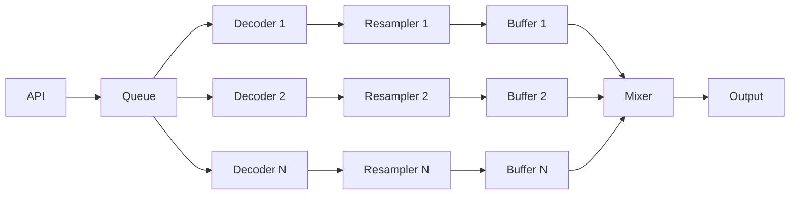
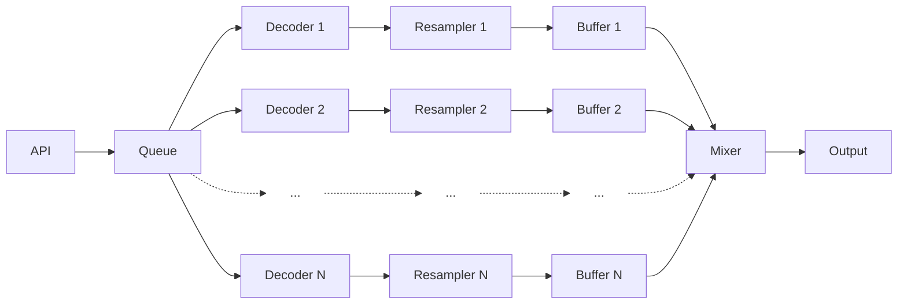

# Decoder Buffer Design

**Status:** NEW concept for integration into the system designs and specifications

## Scope

The concepts described herein apply primarily to the wkmp-ap Audio Player microservice.

## Overview

The Audio Player plays audio from source files that are encoded, often compressed.  The audio is decoded, converted to the working_sample_period when necessary, and buffered for playback as uncompressed stereo sample values.  Separate buffers are created for each [**[ENT-MP-030]**](REQ002-entity_definitions.md) passage.

The playback system reads audio from the buffers, applies [**[REQ-CTL-040]**](REQ001-requirements.md) volume, [**[XFD-OV-010]**](SPEC002-crossfade.md) crossfade and [**[REQ-XFD-030]**](REQ001-requirements.md) other amplitude modifications before sending the final computed stereo audio sample levels to the [**[SSP-OUT-010]**](SPEC013-single_stream_playback.md) output system.

A simplified view of the audio processing chain is:

API -> queue -> decoders -> resamplers -> buffers -> mixer -> output

## Operating Parameters

These defined values are stored in the global settings table of the database, where they are read once at startup for run-time use.  Changes of operating parameters' values may require a complete system restart for proper operation.

- working_sample_rate: the sample rate that all decoded audio is converted to before buffering.  Default value: 44100Hz.  When audio comes out of the decoder at the working_sample_rate, the sample rate conversion process shall be bypassed.

- output_ringbuffer_size: the maximum number of (stereo) samples that the output ring buffer can contain. Default value: 8192, equivalant to 185ms of audio at 44.1kHz.

- maximum_decode_streams: the maximum number of audio decoders that will operate on passages in the queue.  When the queue has more passages than this, only the passages closest to being played will  

(stereo) samples that a passage may contain.  Default value: 158760000, equivalent to one hour of audio at 44.1kHz.

## Dataflow

### API -> queue

The wkmp-ap audio player is given passage definitions to enqueue via the API, either from the user interface, the program director, or other sources.  This queue of passage definitions is served in a First In First Out (FIFO) order for decoding and buffering.

### Backpressure

Playback has two modes: Playing and Paused.  When in playing mode, audio data is fed from the buffers to the mixer and then to the output system.  When paused, the mixer outputs silence: a flat line, and no samples are consumed from the buffers. When no samples are consumed from the buffers, the buffers do not finish playing and so they are not removed from the queue.

When in Playing mode, the mixer operates on samples from one or more buffers, calculating values to pass to the output ring buffer.  When the buffer associated with a passage in the queue reaches its end point, the passage is removed from the queue.

----

**Document Version:** 1.0
**Created:** 2025-10-19
**Status:** NEW concept for integration into the system designs and specifications
