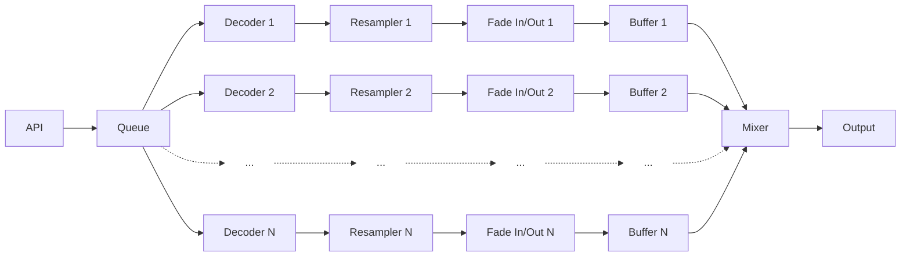

# Decoder Buffer Design

**🗂️ TIER 2 - DESIGN SPECIFICATION**

Defines HOW the decoder-buffer chain architecture works to process audio from encoded files to playback-ready buffers. Derived from [Requirements](REQ001-requirements.md) and [Single Stream Playback Architecture](SPEC013-single_stream_playback.md). See [Document Hierarchy](GOV001-document_hierarchy.md) and [Requirements Enumeration](GOV002-requirements_enumeration.md).

> **Related Documentation:** [Architecture](SPEC001-architecture.md) | [Single Stream Playback](SPEC013-single_stream_playback.md) | [Single Stream Design](SPEC014-single_stream_design.md) | [Crossfade Design](SPEC002-crossfade.md) | [Sample Rate Conversion](SPEC017-sample_rate_conversion.md)

---

## Scope

**[DBD-SC-010]** The concepts described herein apply primarily to the wkmp-ap Audio Player microservice.

## Overview

**[DBD-OV-010]** The Audio Player plays audio from source files that are encoded, often compressed. The audio is decoded, converted to the working_sample_rate when necessary, and buffered for playback as uncompressed stereo sample values.

**[DBD-OV-020]** Separate decoder-buffer chains are created for each **[ENT-MP-030]** passage in the queue, up to maximum_decode_streams.

**[DBD-OV-030]** The playback system reads audio from the buffers, applies **[REQ-CTL-040]** volume, **[XFD-OV-010]** crossfade and **[REQ-XFD-030]** other amplitude modifications before sending the final computed stereo audio sample levels to the **[SSP-OUT-010]** output system.

**[DBD-OV-040]** A simplified view of the audio processing chain is:



Note: This diagram shows logical processing stages. In the implemented architecture, each decoder-buffer chain is encapsulated in a `DecoderChain` object that integrates StreamingDecoder → StatefulResampler → Fader → Buffer into a unified pipeline. A single-threaded `DecoderWorker` processes all chains serially for optimal cache coherency [DBD-DEC-040]. See [Implementation Details](#implementation-architecture) below for the concrete architecture.

**[DBD-OV-050]** The system allocates maximum_decode_streams decoder-buffer chains. Each chain is assigned 1:1 to a passage in the queue, when the passage is maximum_decode_streams or less from the first position in the queue.

**[DBD-OV-060]** The first position in the queue is also referred to as the "now playing" passage.

**[DBD-OV-070]** The next position in the queue is also referred to as the "playing next" passage.

**[DBD-OV-080]** Note that each decoder-buffer chain is NOT associated with a particular position in the queue. Each decoder-buffer chain is assigned to a passage in the queue and remains associated with that passage as the passage advances toward the now playing queue position.

### Chain Assignment Lifecycle

**[DBD-LIFECYCLE-010]** Chain assignment occurs when:
1. A passage is enqueued AND a chain is available (immediate assignment)
2. A chain becomes available AND passages are waiting (deferred assignment - future enhancement)

**[DBD-LIFECYCLE-020]** Chain release occurs when:
1. Passage completes playback (mixer signals completion via crossfade or normal completion)
2. Passage is removed from queue before playback starts (user skip)
3. Passage is removed from queue for any other reason (error, cancellation, etc.)

**[DBD-LIFECYCLE-030]** Chain allocation strategy:
- Use lowest-numbered available chain (0, 1, 2, ...)
- Maintains visual consistency in developer UI
- Implemented via min-heap priority queue (BinaryHeap<Reverse<usize>>)

**[DBD-LIFECYCLE-040]** Chain tracking mechanism:
- PlaybackEngine maintains HashMap<QueueEntryId, ChainIndex> for passage→chain mapping
- Chain assignments persist throughout passage lifecycle (enqueue → playback → completion)
- BufferManager uses QueueEntryId as primary key for buffer operations
- get_buffer_chains() reports stable chain indices based on HashMap, not queue position

**[DBD-LIFECYCLE-050]** Passages without assigned chains:
- When all maximum_decode_streams chains are allocated, newly enqueued passages wait without chains
- These passages are queued but not visible in buffer chain monitor
- When a chain becomes available, waiting passages are assigned chains (future enhancement - currently requires re-evaluation of queue processing logic)

**[DBD-LIFECYCLE-060]** All passage enqueues must use uniform chain assignment regardless of source:
- All enqueue sources (API, database restore, Program Director, etc.) must receive chain assignments
- Chain assignment follows [DBD-LIFECYCLE-010] rules regardless of how passage entered queue
- Prevents "ghost passages" that appear in queue but not in buffer chain monitor
- Implementation ensures consistent state across queue restoration and API operations

**Enqueue Sources:**
- API endpoint (`POST /playback/enqueue`) → calls internal `enqueue_file()` method with chain assignment
- Database restoration on startup → calls `assign_chains_to_loaded_queue()` after queue load
- Queue reordering → preserves existing chain assignments across reload
- Program Director automatic selection → uses same internal enqueue method (future)

### Queue Restoration from Database

**[DBD-STARTUP-010]** On wkmp-ap startup, PlaybackEngine restores queue state from database:

1. **Load queue entries** from database (ORDER BY play_order ASC)
2. **Validate each entry:**
   - Check passage_guid exists in passages table
   - Check file_path exists on filesystem (resolve relative to root_folder setting)
   - If passage missing: Remove from queue + log warning "Queue entry {queue_entry_id} removed: passage {passage_guid} not found in database"
   - If file missing: Remove from queue + log warning "Queue entry {queue_entry_id} removed: file {file_path} not found on filesystem"
3. **Assign decoder chains** to valid entries per [DBD-LIFECYCLE-010]
4. **Rebuild runtime state:**
   - Populate HashMap<QueueEntryId, ChainIndex> for passage→chain mapping
   - Initialize decoder state for each assigned chain
5. **Emit event:** QueueChanged SSE event with trigger "startup_restore"

**[DBD-STARTUP-020]** Queue corruption recovery:
- If database queue table is corrupted (invalid schema, constraint violations, etc.): Clear queue entirely
- Log error: "Queue table corrupted, clearing all entries"
- Emit QueueChanged SSE event with trigger "corruption_recovery" and empty queue
- System continues with empty queue (user can re-enqueue passages via UI)

**[DBD-STARTUP-030]** Consistency guarantees:
- Eventual consistency acceptable: If crash occurred during enqueue, queue entry may be missing from database
- Users experience seamless recovery: Invalid entries removed transparently with log messages only
- No user notification required for individual entry removal (batch notification if >10 entries removed)

See [SPEC007 API-QUEUE-PERSIST-010](SPEC007-api_design.md#post-playbackenqueue) for enqueue persistence behavior.

## Related Documents

**[DBD-REL-010]** These documents define essential terms and concepts described herein. Please also read and understand these documents before taking action based on this document:
- [SPEC002 Crossfade](SPEC002-crossfade.md)
- [REQ002 Entity Definitions](REQ002-entity_definitions.md)
- [SPEC017 Sample Rate Conversion](SPEC017-sample_rate_conversion.md)
- [SPEC013 Single Stream Playback](SPEC013-single_stream_playback.md)
- [SPEC014 Single Stream Design](SPEC014-single_stream_design.md)
- [SPEC015 Playback Completion Fixes](SPEC015-playback_completion_fixes.md)

## Operating Parameters

**[DBD-PARAM-010]** Operating parameters are stored in the global settings table of the database and are classified by their modification behavior:

- **Structural parameters** (buffer sizes, timing intervals, capacity limits): Read once at engine startup. Changes require complete engine restart to take effect.
- **Runtime-modifiable parameters** (volume, device selection): Can be changed during operation via API without restart.

See [IMPL001 Database Schema - Settings Table](IMPL001-database_schema.md#settings) for database storage of operating parameters.

### Parameter Classification

All parameters in this section are **STRUCTURAL (RESTART REQUIRED)** unless explicitly marked as runtime-modifiable.

**Structural Parameters (Load-Once at Startup):**
- working_sample_rate ([DBD-PARAM-020])
- output_ringbuffer_size ([DBD-PARAM-030])
- maximum_decode_streams ([DBD-PARAM-050])
- decode_work_period ([DBD-PARAM-060])
- decode_chunk_size ([DBD-PARAM-065])
- playout_ringbuffer_size ([DBD-PARAM-070])
- playout_ringbuffer_headroom ([DBD-PARAM-080])
- decoder_resume_hysteresis_samples ([DBD-PARAM-085])
- mixer_min_start_level ([DBD-PARAM-088])
- pause_decay_factor ([DBD-PARAM-090])
- pause_decay_floor ([DBD-PARAM-100])
- audio_buffer_size ([DBD-PARAM-110])
- mixer_check_interval_ms ([DBD-PARAM-111])
- mixer_batch_size_low ([DBD-PARAM-112])
- mixer_batch_size_optimal ([DBD-PARAM-113])

**Runtime-Modifiable Parameters:**
- volume_level (see [IMPL001 Settings Table](IMPL001-database_schema.md#settings))
- audio_sink (see [IMPL001 Settings Table](IMPL001-database_schema.md#settings))

Note: This section documents decode/buffer-related structural parameters only. IMPL001 settings table includes additional runtime-modifiable configuration.

### working_sample_rate

**[DBD-PARAM-020]** **[STRUCTURAL - RESTART REQUIRED]** The sample rate that all decoded audio is converted to before buffering.

- **Database Setting:** `working_sample_rate` (desired/preferred sample rate, default: 44100 Hz)
- **Negotiation Behavior:** At startup, AudioOutput attempts to use the database-configured preferred rate. If the audio device doesn't support it, AudioOutput accepts the device's native sample rate instead.
- **Effective Rate:** The actual `working_sample_rate` used during operation is the device's native sample rate (e.g., 48000 Hz for typical Windows audio devices).
- **Resampling:** All decoded audio is resampled to match the effective `working_sample_rate` (device native rate) before buffering.
- **Bypass:** When audio comes out of the decoder at the same rate as the effective `working_sample_rate`, the sample rate conversion process is bypassed (passthrough mode).

### output_ringbuffer_size

**[DBD-PARAM-030]** **[STRUCTURAL - RESTART REQUIRED]** The capacity (in stereo frames) of the output ring buffer between the mixer thread and the audio callback.

- **Default value:** 8192 frames
- **Equivalent:** 186ms of audio at 44.1kHz
- **Valid range:** 2,048-262,144 frames (~46ms to 5.9s @ 44.1kHz)
- **Units:** Stereo frames (one stereo frame = left sample + right sample)
- **Architecture:** Lock-free SPSC ring buffer for real-time audio delivery
- **Database setting:** `output_ringbuffer_capacity`
- **Tuning:**
  - Smaller buffers: Lower latency, higher risk of underruns
  - Larger buffers: More stable, higher latency
  - Default (8192) provides 186ms buffer for VeryHigh stability confidence
- **History:** Originally specified as 88200 samples (2.0s) in SPEC016, reduced to 8192 frames (186ms) in production for optimal balance between stability and latency

### maximum_decode_streams

**[DBD-PARAM-050]** **[STRUCTURAL - RESTART REQUIRED]** The maximum number of audio decoders that will operate on passages in the queue.

- **Default value:** 12
- **Behavior:** When the queue has more passages than this, only the passages closest to being played will be decoded into buffers awaiting play. Other passages will start decoding when they advance to within maximum_decode_streams of the "now playing" first position in the queue

### decode_work_period

**[DBD-PARAM-060]** **[STRUCTURAL - RESTART REQUIRED]** The monotonic elapsed time interval (milliseconds) between decode job priority evaluation. See [SPEC023 Timing Type 2](SPEC023-timing_terminology.md#2-monotonic-elapsed-time-real-time-intervals).

- **Default value:** 5000ms
- **Behavior:** Once every decode_work_period the currently working decoder pauses **within its decode loop** (between chunks per [DBD-DEC-110]) to check the priority queue. The decoder must support incremental operation such that it can yield between chunks without losing state. If a higher priority job is pending, the current decoder's state is saved and the higher priority decoder is resumed.
- **Continuation:** If the currently working decoder is still the highest priority job, then it continues processing the next chunk
- **Completion:** When a decoding job reaches the end of the passage, or receives a buffer full indication from the playout buffer it is filling, it pauses and the next highest priority decoding job is resumed immediately
- **Purpose:** The decode_work_period serves to allow decodes to continue uninterrupted while still serving the highest priority jobs often enough to ensure their buffers do not run empty. This prevents low-priority long-duration decodes (e.g., 30-minute file) from starving high-priority decodes (e.g., "now playing" buffer).
- **Implementation Note:** Decoders check the priority queue at each chunk boundary (typically every ~1 second of decoded audio). The decode_work_period may cause priority checks to occur less frequently than chunk boundaries if set > 1000ms, but never more frequently.

### decode_chunk_size

**[DBD-PARAM-065]** **[STRUCTURAL - RESTART REQUIRED]** The number of samples OUTPUT FROM THE RESAMPLER for each chunk of decoded audio output from the decoder.

- **Default value:** 32000

When the audio file is encoded at the same sample rate as the resampler - fader - buffer - mixer - output is working at (aka the working_sample rate) then this is a 1:1 translation for the maximum (and typical) number of samples each in each chunk of audio sent from the decoder to the resampler.

When the audio file is encoded at a higher sample rate, for example 88200 Hz with a working_sample_rate of 44100 Hz, then the decoder _may_ send larger chunks to the resampler, twice as large in this example, because the decoder will be downsampling to smaller chunks for the rest of the processing chain.  Similarly, when the audio file is encoded at a lower sample rate than the working sample rate then the calculation: "decoder output actual maximum chunk size" = decode_chunk_size * "audio file sample rate" / working_sample_rate ; yields a smaller number.

This calculated "decoder output actual maximum chunk size" is the maximum number of samples the decoder is allowed to send to the resampler in a single chunk.  If the decoder has reached the end time of the passage with less samples to send than the maximum chunk size, then it will send just those remaining samples.  Usually the decoder accumulates samples until it reaches at or near the maximum chunk size before sending the chunk to the resampler.

### playout_ringbuffer_size

**[DBD-PARAM-070]** **[STRUCTURAL - RESTART REQUIRED]** The number of (stereo) samples that the decoded / resampled audio buffers contain.

- **Default value:** 661941 samples
- **Equivalent:** 15.01 seconds of audio at 44.1kHz
- **Memory:** At 8 bytes per sample, with 12 playout buffers total, that's 60MB of playout buffer

### playout_ringbuffer_headroom

**[DBD-PARAM-080]** **[STRUCTURAL - RESTART REQUIRED]** The number of (stereo) samples that the buffer reserves to handle additional samples that may arrive from the resampler after the decoder pauses due to a buffer full condition.

- **Default value:** 32768 samples
- **Equivalent:** 0.74 seconds of audio at 44.1kHz

### decoder_resume_hysteresis_samples

**[DBD-PARAM-085]** **[STRUCTURAL - RESTART REQUIRED]** The hysteresis gap (in stereo samples) between decoder pause and resume thresholds.

- **Default value:** 44100 samples
- **Equivalent:** 1.0 second of audio at 44.1kHz
- **Range:** 882-88200 samples (0.02-2.0 seconds)
- **Purpose:** Provides hysteresis between pause and resume thresholds to prevent rapid oscillation
- **Behavior:**
  - Decoder pauses when free_space ≤ playout_ringbuffer_headroom (4410 samples)
  - Decoder resumes when free_space ≥ decoder_resume_hysteresis_samples + playout_ringbuffer_headroom (48510 samples)
  - Using the sum ensures proper hysteresis gap even if headroom is increased
  - Actual gap = decoder_resume_hysteresis_samples (44100 samples = 1.0s)

### mixer_min_start_level

**[DBD-PARAM-088]** **[STRUCTURAL - RESTART REQUIRED]** The number of samples required to be in a chain's buffer before the mixer will start playing from it.

- **Default value:** 22050 samples
- **Equivalent:** 0.5 second of audio at 44.1kHz
- **Range:** 4410-220500 samples (0.1-5.0 seconds)
- **Purpose:** Protects against buffer empty during playback conditions.
- **Behavior:**
  - When a chain is eligible for playback, the mixer will check its buffer fill state before starting playback and wait until
    at least mixer_min_start_level samples are available in the buffer before starting.
  - Once started, the mixer may draw all available samples out of a chain's buffer and any underruns will be logged as errors
    and may be heard as gaps in the playback.
  - At end of passage playback it is expected that the mixer will draw all available samples from the buffer until it is completely
    empty.

### pause_decay_factor

**[DBD-PARAM-090]** **[STRUCTURAL - RESTART REQUIRED]** When in pause mode, instead of playing samples from the decoder-buffer chain(s), the mixer starts at the last played (stereo) sample values and recursively multiplies them by this pause_decay_factor at every subsequent sample.

- **Default value:** 0.96875 (31/32)
- **Purpose:** Creates an exponential decay to zero, hopefully reducing audible "pop" from the sudden stop of going to pause mode

### pause_decay_floor

**[DBD-PARAM-100]** **[STRUCTURAL - RESTART REQUIRED]** When the absolute value of the pause mode output sample values drop below this pause_decay_floor, the mixer no longer bothers doing the multiplication and simply outputs 0.0

- **Default value:** 0.0001778

### audio_buffer_size

**[DBD-PARAM-110]** **[STRUCTURAL - RESTART REQUIRED]** The audio output buffer size in frames per callback.

- **Default value:** 2208 frames
- **Equivalent:** 50.1ms of audio at 44.1kHz
- **Range:** 64-65536 frames
- **Purpose:** Controls the tradeoff between latency and system stability
- **Behavior:**
  - Smaller buffers: Lower latency but higher CPU usage and more susceptible to timing jitter
  - Larger buffers: Higher latency but more stable on slower systems or under high load
  - Buffer size determines how frequently the audio callback is invoked
- **Configuration:** Stored in database settings table (`audio_buffer_size`)
- **Application:** Applied to cpal StreamConfig as BufferSize::Fixed(audio_buffer_size)
- **Empirical Data (Intel Core i7-8650U @ 1.90GHz):**
  - Minimum stable at 5ms interval: 352 frames (8.0ms)
  - Minimum stable at 10ms interval: 736 frames (16.7ms)
  - Default uses 3x safety margin for maximum stability under variable load

### mixer_check_interval_ms

**[DBD-PARAM-111]** **[STRUCTURAL - RESTART REQUIRED]** The mixer thread check interval in milliseconds.

- **Default value:** 10 ms
- **Range:** 1-100 ms
- **Purpose:** Controls the frequency at which the mixer thread wakes to fill the output ring buffer
- **Behavior:**
  - Smaller intervals: More responsive but higher CPU usage due to frequent async/tokio overhead
  - Larger intervals: Lower CPU usage but requires larger batch sizes to maintain throughput
  - Trade-off with batch sizes: interval × batch_size must exceed audio consumption rate (44,032 frames/sec @ 44.1kHz)
- **Configuration:** Stored in database settings table (`mixer_check_interval_ms`)
- **Performance:** At 10ms interval with 256 frame batches: 25,600 frames/sec (exceeds 44,100 Hz working sample rate when buffer 50-75% full)
- **Related:** Works in conjunction with **[DBD-PARAM-113]** mixer_batch_size_optimal and **[DBD-PARAM-112]** mixer_batch_size_low
- **Empirical Data (Intel Core i7-8650U @ 1.90GHz):**
  - 5ms interval: Stable with 352+ frame buffer (Primary recommendation: 704 frames with 2x safety)
  - 10ms interval: Stable with 736+ frame buffer (Conservative recommendation: 2208 frames with 3x safety)
  - 20ms+ intervals: Unstable on test system
  - Default uses 10ms conservative interval for "VeryHigh" confidence stability under variable load

### Default Value Rationale

**[DBD-PARAM-120]** The default values for `audio_buffer_size` and `mixer_check_interval_ms` were determined through empirical buffer auto-tuning on representative hardware (Intel Core i7-8650U @ 1.90GHz, 4 cores).

**Design Principle:** Prioritize stability over latency for out-of-box experience.

**Choice Rationale:**
- **Primary recommendation (5ms interval, 704 frames, 16.0ms latency):**
  - Lowest stable configuration
  - Minimal latency (16.0ms acceptable for music playback)
  - Suitable for aggressive performance tuning
  - Confidence: High

- **Conservative recommendation (10ms interval, 2208 frames, 50.1ms latency) - SELECTED AS DEFAULT:**
  - 3x safety margin provides headroom for system load variation
  - 50.1ms latency still imperceptible for music listening (well below 100ms threshold)
  - Higher mixer interval (10ms) reduces CPU wake-up frequency
  - More stable under variable system load (background processes, CPU frequency scaling, etc.)
  - Confidence: VeryHigh
  - **Aligns with quality-absolute project charter (flawless audio playback)**

**Trade-offs Accepted:**
- 34ms additional latency (50.1ms vs 16.0ms) is imperceptible in music playback context
- Slightly higher memory usage (2208 vs 704 frames = ~12KB additional buffer per stream)
- Lower CPU wake-up frequency reduces overall system overhead

**Alternative Configurations:**
- Users on high-performance systems can tune down to 5ms/704 frames for minimum latency
- Users on lower-performance systems can run `tune-buffers` utility to find optimal values for their hardware
- Database settings allow runtime configuration without recompilation

### mixer_batch_size_low

**[DBD-PARAM-112]** **[STRUCTURAL - RESTART REQUIRED]** The number of frames the mixer fills per wake-up when the output ring buffer is below 50% capacity.

- **Default value:** 512 frames
- **Range:** 16-1024 frames
- **Purpose:** Aggressive recovery when output ring buffer is depleting
- **Behavior:**
  - Larger batches: Faster buffer recovery but higher lock hold time per mixer wake-up
  - Smaller batches: Lower lock hold time but slower recovery, may not keep pace with audio callback drain rate
  - Must be sized to match or exceed audio consumption rate during the check interval
- **Configuration:** Stored in database settings table (`mixer_batch_size_low`)
- **Performance:** With 2048-frame audio_buffer_size @ 44.1kHz and 10ms mixer_check_interval_ms:
  - Audio callback drains ~441 frames per 10ms interval
  - 512-frame batches provide adequate fill rate with margin for system jitter
  - At <50% buffer level (critical threshold), aggressive filling prevents underrun cascade

### mixer_batch_size_optimal

**[DBD-PARAM-113]** **[STRUCTURAL - RESTART REQUIRED]** The number of frames the mixer fills per wake-up when the output ring buffer is between 50-75% capacity.

- **Default value:** 256 frames
- **Range:** 16-512 frames
- **Purpose:** Steady-state operation maintaining optimal buffer fill level
- **Behavior:**
  - Larger batches: Higher throughput but risk overshooting 75% target
  - Smaller batches: More precise fill level control but higher async overhead
  - Should approximate audio consumption rate during the check interval
- **Configuration:** Stored in database settings table (`mixer_batch_size_optimal`)
- **Performance:** With 2048-frame audio_buffer_size @ 44.1kHz and 10ms mixer_check_interval_ms:
  - Audio callback drains ~441 frames per 10ms interval
  - 256-frame batches maintain buffer level without large swings
  - Provides ~58% fill rate match, preventing slow buffer depletion while avoiding overfill

### Mixer Batch Size Rationale

**[DBD-PARAM-114]** The default values for `mixer_batch_size_low` and `mixer_batch_size_optimal` were determined through analysis of output ring buffer underrun behavior with empirically-tuned `audio_buffer_size` and `mixer_check_interval_ms` settings.

**Design Principle:** Batch sizes must maintain output ring buffer fill level against audio callback drain rate.

**Critical Constraint:**
- Audio callback with `audio_buffer_size = 2048` frames @ 44.1kHz drains buffer every ~46.4ms
- Mixer with `mixer_check_interval_ms = 10ms` wakes 4.64 times per callback interval
- Each mixer wake must fill enough frames to prevent net depletion: 2048 ÷ 4.64 ≈ 441 frames minimum per wake

**Choice Rationale:**
- **mixer_batch_size_low = 512 frames:**
  - Exceeds minimum 441 frames/interval drain rate by 16%
  - Provides catch-up capacity when buffer drops below 50% (critical threshold)
  - Allows recovery from transient system delays (scheduler jitter, CPU frequency scaling)
  - Confidence: High

- **mixer_batch_size_optimal = 256 frames:**
  - Provides 58% of drain rate (256 ÷ 441)
  - Intentionally lower than drain rate to allow gradual buffer depletion from 75% toward 50% target
  - Prevents oscillation between batch_size_optimal and batch_size_low thresholds
  - Maintains buffer in 50-75% range under steady-state conditions
  - Confidence: Medium (may require field tuning based on actual usage patterns)

**Trade-offs Accepted:**
- Higher batch sizes increase lock hold time during mixer operations (acceptable for non-real-time mixer thread)
- Larger batches reduce async/tokio scheduling overhead compared to smaller more frequent fills
- Buffer level intentionally drifts between 50-75% rather than tightly regulating to single target

**Alternative Configurations:**
- Systems experiencing underruns despite default settings: Increase batch sizes or decrease mixer_check_interval_ms
- Systems with different audio_buffer_size values: Scale batch sizes proportionally (e.g., 4096-frame buffer → 1024/512 batch sizes)
- Database settings allow runtime configuration without recompilation

## Dataflow

### Backpressure

**[DBD-FLOW-010]** Playback has two modes: Playing and Paused.

**[DBD-FLOW-020]** When in playing mode, audio data is fed from the buffers to the mixer and then to the output system via the output ringbuffer.

**[DBD-FLOW-030]** When paused, the mixer outputs silence to the output ringbuffer: a flat line, and no samples are consumed from the buffers.

**[DBD-FLOW-040]** When no samples are consumed from the buffers, the buffers do not finish playing and so they are not removed from the queue.

**[DBD-FLOW-050]** When in Playing mode, the mixer operates on samples from one or more buffers, calculating values to pass to the output ring buffer.

**[DBD-FLOW-060]** When the buffer associated with a passage in the queue reaches its end point, the passage is removed from the queue and the next passage in the queue either starts playing if there was no **[XFD-OV-010]** crossfade between them, or continues playing if it already started as a crossfade.

### API → queue

**[DBD-FLOW-100]** The wkmp-ap audio player is given passage definitions to enqueue via the API, either from the user interface, the program director, or other sources.

**[DBD-FLOW-102]** The wkmp-ap audio player restores the persisted queue from the database once on startup.  As each passage is read from the persisted queue it is handled through the same processing chain as a passage enqueued through the API is handled.

**[DBD-FLOW-104]** The wkmp-ap audio player never enqueues new passages from any other sources other than the database at startup and the API.

**[DBD-FLOW-110]** This queue of passage definitions is served in a First In First Out (FIFO) order for decoding and buffering.

### Decoders

**[DBD-DEC-010]** Each passage defines a portion of an audio file to play.

**[DBD-DEC-020]** When a passage's position in the queue comes up within maximum_decode_streams of the first (now playing) position, an available decoder-buffer chain is assigned to it and it becomes eligible for decoding.

**[DBD-DEC-030]** Each passage gets a dedicated decoder instance which works through the audio file, pausing when its buffer is full, resuming as data is read from the buffer into the mixer.

**[DBD-DEC-035]** Once a passage is assigned to a decode-buffer chain, its decoder is never freed or reset, it works through the passage's audio file until the end time, yielding immediately to other waiting chains when its buffer is full or waiting for hysteresis and yielding to higher priority (closer to queue position 0) chains at decode_work_period intervals.

**[DBD-DEC-040]** Decoding is handled serially in priority order, only one decode runs at a time to preserve cache coherency and reduce maximum processor loads, to avoid spinning up the cooling fans.

**[DBD-DEC-045]** Buffer-fill-aware priority re-evaluation - The decoder worker MUST re-evaluate which buffer needs filling based on BOTH queue position (play_order) AND current buffer fill level.

**Re-evaluation Triggers:**
Re-evaluation occurs when any condition is met:
1. **Chain assignments changed:** New chain assigned, chain released (decode finished/error), or chain yielded/resumed
2. **Buffer full:** Currently filling buffer reaches hysteresis pause threshold (free_space ≤ playout_ringbuffer_headroom per [DBD-PARAM-080])
3. **Time elapsed:** decode_work_period ([DBD-PARAM-060], default 5000ms) has elapsed since last re-evaluation

**Chain Assignment Events (Trigger 1):**
- **New chain assigned:** Passage enqueued and assigned to available decoder/buffer chain
- **Chain released:** Passage decode finished (successful or error), passage removed from queue, or partial decode <50%
- **Chain yielded:** Active chain moved to yielded state (buffer full)
- **Chain resumed:** Yielded chain moved back to active state (buffer drained below resume threshold)

**Rationale:** Queue changes alone do not trigger re-evaluation (passages keep their chains as they advance in queue). Only actual changes to chain assignments/releases require priority re-evaluation, as these events change which buffers are actively filling.

**Priority Selection Algorithm (executed at each re-evaluation):**
1. **Identify needy buffers:** Select all active decoder chains whose buffers are below the resume threshold (free_space ≥ decoder_resume_hysteresis_samples + playout_ringbuffer_headroom per [DBD-PARAM-085])
2. **Prioritize by queue position:** Among needy buffers, select the chain with the lowest play_order (0 = currently playing, 1 = next, 2+ = queued)
3. **Process chunks:** Continue decoding selected chain until next re-evaluation trigger
4. **Re-evaluate:** When trigger occurs, repeat from step 1

**Real-time Buffer Dynamics:**
- Position 0 (currently playing) buffer is actively **draining** as the mixer reads samples for playback
- Position 1 (next) buffer may also be draining during crossfade overlap
- Position 2+ buffers are static (not draining) until they advance in queue
- Decoder must switch to filling position 0 or 1 immediately when their buffers drop below resume threshold, even if currently filling a lower-priority buffer

**Threshold-based Activation:**
- A buffer "needs filling" when: `free_space ≥ decoder_resume_hysteresis_samples + playout_ringbuffer_headroom`
- A buffer is "full enough to yield" when: `free_space ≤ playout_ringbuffer_headroom`
- Between these thresholds, buffer is eligible for continued filling

**Edge Cases:**
- If NO buffers need filling (all are above resume threshold or at hysteresis pause), decoder worker idles
- If multiple buffers at same play_order need filling (should not occur), select arbitrarily

**Rationale:**
- Currently playing passage (position 0) is draining continuously - must maintain maximum buffer depth to prevent underruns
- Next passage (position 1) may drain during crossfade - must be ready before crossfade starts
- Lower priority buffers (those with higher queue position numbers) fill opportunistically when higher priority buffers are sufficiently full
- Without fill-level awareness, decoder may fill position 2+ buffers while position 0 is dangerously low

**Historical Note:**
This requirement addresses a recurring defect where buffer filling rotated through all active chains regardless of fill level, causing position 0 (currently playing) and position 1 (next) buffers to under-fill while the decoder was busy filling static position 2+ buffers that were not being drained.

**[DBD-DEC-050]** Decoding starts from the beginning of the audio file, even if the start point is after that.

**[DBD-DEC-060]** Seek time estimation in compressed file decoding can be inaccurate, especially for variable bit rate encoded files.

**[DBD-DEC-070]** Once the audio data has been decoded, it is "exact sample accurate" repeatable and predictable.

**[DBD-DEC-080]** Timing for passage start, end, fade in, fade out, lead in and lead out is all handled with exact sample accuracy for repeatability and predictability.

#### Incremental Decoding Architecture

**[DBD-DEC-090]** Decoders MUST support streaming/incremental operation to minimize latency and enable cooperative multitasking between priority levels.

**[DBD-DEC-100]** All-at-once decoding (decoding an entire file into memory before writing to buffer) is PROHIBITED. This mode creates:
- Unacceptable startup delays (10+ seconds for long files)
- Memory pressure (entire file in RAM simultaneously)
- Priority inversion (low priority 30-minute decode blocks high priority work)
- Poor user experience (buffer fill displays 0% then jumps to 99%)
- Violation of decode_work_period cooperative scheduling requirements

**[DBD-DEC-110]** Chunk-based decoding process - Each decoder processes audio in chunks of approximately **1 second duration** or less:

1. **Decode chunk**: Process ~1 second worth of audio packets from source file
2. **Resample chunk** (if needed): Convert chunk to standard sample rate (44.1kHz)
3. **Apply fades to chunk** (if chunk intersects fade regions): Multiply samples by fade curve
4. **Append chunk to buffer**: Write processed chunk to passage buffer
5. **Yield point**: Check priority queue and decode_work_period timer
6. **Priority check**: If higher priority work is pending, save decoder state and yield
7. **Repeat**: Continue until passage complete or yielded to higher priority

**[DBD-DEC-120]** Chunk duration rationale:
- **~1 second**: Balances latency vs overhead
- **Minimum latency**: Buffer fills progressively, playback can start after first few chunks (~3 seconds)
- **Enables priority switching**: Decoder can yield to higher priority work every ~1 second
- **Prevents starvation**: "Now playing" decoder not blocked by long background decodes
- **Smooth monitoring**: Buffer fill percentage updates incrementally as chunks arrive

**[DBD-DEC-130]** Decoder state preservation requirements:
- When yielding to higher priority work, decoder state MUST be preserved
- State includes: file position, decoder context, timestamps, buffer write position
- Resumed decoder continues from exact packet/sample where it paused
- No re-processing of previously decoded audio when resuming

**[DBD-DEC-140]** Streaming decoder implementation requirements:
- Decoder maintains stateful iterator over compressed audio packets
- Each `decode_chunk()` call returns ~1 second of decoded samples
- Decoder tracks cumulative decode position internally
- Supports multiple pause/resume cycles without data loss

**[DBD-DEC-150]** Decoder yielding priorities - Decoders MUST yield control under the following conditions, in order of priority:

1. **Immediate yield on hysteresis**: When a decoder reaches buffer headroom limit (free_space ≤ playout_ringbuffer_headroom per [DBD-PARAM-080]) and enters hysteresis wait state, it MUST yield immediately (not wait for decode_work_period).
   - **Rationale**: Decoder is blocked waiting for mixer to drain buffer past resume threshold; no CPU benefit to keeping it "active"
   - **Behavior**: Decoder re-queues itself and allows other decoders with buffers needing samples to run
   - **Resume**: When buffer free_space ≥ decoder_resume_hysteresis_samples + playout_ringbuffer_headroom ([DBD-PARAM-085]), decoder is eligible to resume

2. **Time-based yield**: Every decode_work_period (default 5000ms per [DBD-PARAM-060]), decoder checks priority queue
   - **Purpose**: Fairness between decoders at same priority level (round-robin)
   - **Applies to**: Lower priority passages doing lengthy decode before reaching passage start time
   - **Behavior**: Decoder yields to allow other pending decode requests to make progress

3. **Priority-based yield**: If higher priority decode request is pending, current decoder yields immediately
   - **Comparison**: Higher priority = lower DecodePriority enum value (Immediate < Next < Prefetch)
   - **Behavior**: Current decoder state saved, higher priority decoder resumed
   - **Purpose**: Ensures "now playing" buffer never starves due to background prefetch

**[DBD-DEC-160]** Decoder scheduling algorithm:

```
while !decoder.is_finished() {
    // Decode next chunk (~1 second)
    let chunk = decoder.decode_chunk(1000)?;

    // Try to append to buffer
    match buffer.push_samples(chunk) {
        Ok(_) => { /* chunk appended successfully */ }
        Err(BufferFull) => {
            // [DBD-DEC-150.1] IMMEDIATE YIELD: Buffer full, entering hysteresis
            debug!("Buffer full, yielding to hysteresis");
            requeue_self_and_yield();
            return; // Allow other decoders to run
        }
    }

    // [DBD-DEC-150.3] Check for higher priority work
    if has_higher_priority_request() {
        warn!("Yielding to higher priority decoder");
        requeue_self_and_yield();
        return;
    }

    // [DBD-DEC-150.2] Time-based yield every decode_work_period
    if elapsed_since_last_yield() >= decode_work_period {
        if has_equal_or_lower_priority_requests() {
            debug!("Time-based yield (decode_work_period elapsed)");
            requeue_self_and_yield();
            return;
        }
        last_yield_time = now();
    }
}
```

**[DBD-DEC-170]** Hysteresis-aware decoder re-queueing:
- When decoder yields due to buffer full (hysteresis), it MUST re-queue with same priority
- Scheduler MUST NOT immediately re-select same decoder (would cause tight loop)
- Scheduler evaluates all pending decode requests, selects highest priority with buffer space available
- If no decoders have buffer space, scheduler waits for mixer drain event before resuming any decoder

### Resampling

**[DBD-RSMP-010]** When the audio data is not at the working_sample_rate, it is resampled to put it at the working_sample_rate before it is passed to the Fade In/Out handler.

**[DBD-RSMP-020]** When the audio data is at the working_sample_rate, it is passed straight through from the Decoder to the Fade In/Out handler.

### Fade In/Out handlers

**[DBD-FADE-010]** The Fade In/Out handler has several functions:

See [SPEC002 Volume Fade Curve Formulas](SPEC002-crossfade.md#volume-fade-curve-formulas) for fade curve implementations:
- [XFD-IMPL-091]: Linear fade
- [XFD-IMPL-092]: Exponential fade-in
- [XFD-IMPL-093]: Logarithmic fade-out
- [XFD-IMPL-094]: Cosine fade
- [XFD-IMPL-095]: Equal-power crossfade

SPEC016 applies curves before buffering (pre-buffer); SPEC002 defines curve formulas.

**[DBD-FADE-020]** Samples received before the passage start time are discarded, not buffered.

**[DBD-FADE-030]** When fade-in duration is > 0 then samples between the start time and the fade-in end point have the fade-in curve applied before they are buffered.

**[DBD-FADE-040]** Through the passage until the fade-out start point samples are buffered exactly as they are received.

**[DBD-FADE-050]** When fade-out duration is > 0 then samples between the fade-out point and the end time have the fade-out curve applied.

**[DBD-FADE-060]** When the end time sample has been received by the Fade In/Out handler, the Decoder is informed that the passage is complete and no further decoding is needed.

### Buffers

**[DBD-BUF-010]** The buffer of each decoder-buffer chain holds playout_ringbuffer_size stereo samples. As the parameter name implies, these are ring buffers.

**[DBD-BUF-020]** The ring buffer starts empty when its processing chain is assigned to work with a particular passage.

**[DBD-BUF-030]** Whenever the buffer is empty, the mixer cannot take samples out of it.

**[DBD-BUF-040]** If the mixer does attempt to take a sample from an empty buffer, the buffer returns the same value that the last successful "get next sample" call received along with a "buffer empty" status informing the mixer of the situation.

**[DBD-BUF-050]** Whenever the buffer has playout_ringbuffer_headroom or fewer samples of available free space (is nearly full), the decoder is told to pause decoding until more than playout_ringbuffer_headroom samples are available.

**[DBD-BUF-060]** When the sample corresponding to the passage end time is removed from the buffer, the buffer informs the queue that passage playout has completed; the passage should now be removed from the queue.

### Mixer

**[DBD-MIX-010]** The mixer implements several functions:

**[DBD-MIX-020]** Every output_refill_period refills the output ring buffer for cpal to output.

**[DBD-MIX-030]** Implements play and pause mode.

**[DBD-MIX-040]** When in play mode:
- Takes samples from the "now playing" passage buffer
- When in a lead-out / lead-in crossfade, also takes samples from the "playing next" passage buffer and adds them to the "now playing" sample values
- **Note:** Fade-in and fade-out curves have already been applied to samples by the Fader component ([DBD-FADE-030/050]) before buffering. The mixer reads **pre-faded audio samples** from buffers and simply sums them during crossfade overlap. No runtime fade curve calculations are performed by the mixer.
- Multiplies the sample values by the master volume level
- When "fading in after pause" also multiplies the mixed output by the resume fade-in curve (mixer-level fade, orthogonal to passage-level fades applied by Fader component)

**[DBD-MIX-041]** Crossfade mixing operation (during overlap):
```
// Both passages have fade curves already applied to buffered samples
sample_current = read_from_buffer(current_passage_buffer)  // Pre-faded by Fader
sample_next = read_from_buffer(next_passage_buffer)        // Pre-faded by Fader

// Simple addition - no fade curve calculations needed
mixed_sample = sample_current + sample_next

// Apply master volume and resume-from-pause fade (if active)
output_sample = mixed_sample * master_volume * resume_fade_level
```

**[DBD-MIX-042]** Architectural separation of concerns:
- **Fader component** ([DBD-FADE-030/050]): Applies passage-specific fade-in/fade-out curves to samples BEFORE buffering
- **Buffer component** ([DBD-BUF-010]): Stores pre-faded audio samples
- **Mixer component** ([DBD-MIX-040]): Reads pre-faded samples and sums during overlap; applies master volume

For crossfade timing calculation (WHEN crossfades occur), see [SPEC002 Crossfade Design - Implementation Algorithm](SPEC002-crossfade.md#implementation-algorithm) ([XFD-IMPL-010] through [XFD-IMPL-050]).

For fade vs lead point orthogonality, see [SPEC002 Fade Points vs Lead Points](SPEC002-crossfade.md#fade-points-vs-lead-points-orthogonal-concepts) ([XFD-ORTH-010] through [XFD-ORTH-025]).

SPEC016 defines HOW mixer implements crossfade overlap; SPEC002 defines WHEN overlap occurs.

**[DBD-MIX-050]** When in pause mode, outputs near flatline silence:
- Takes the last (stereo) sample values and repeats them with an exponential decay toward zero by multiplying the values by the pause_decay_factor at each sample sent to the output ring buffer
- **[DBD-MIX-051]** This reduces the "pop" effect that can occur from an instant transition to zero
- **[DBD-MIX-052]** Each entry to pause mode starts at the last playing mode (stereo) sample values and decays through the duration of the pause until the absolute value of the current sample value is less than the pause_decay_floor, at which point the mixer simply outputs zeroes

**[DBD-MIX-060]** When starting input from a new chain, the mixer will not begin drawing from the chain until its buffer has at least mixer_min_start_level **[DBD-PARAM-088]** samples in the buffer.

### Position Tracking and Event-Driven Architecture

**[DBD-MIX-070]** The mixer implements an event-driven position tracking system using position markers to signal when specific points in playback are reached.

**Architectural Principle:** Separation between calculation and execution layers:
- **PlaybackEngine (calculation layer):** Determines WHAT events should occur and WHEN (specific tick counts in passage timeline)
- **Mixer (execution layer):** Knows playback reality (frames delivered to output device), signals when events actually occur

**[DBD-MIX-071]** Position markers are set by PlaybackEngine at specific tick counts and checked by the mixer during mixing operations:

```rust
// PlaybackEngine calculates WHEN event should occur
let crossfade_start_tick = end_tick - crossfade_duration_tick;

// Engine adds marker to mixer
mixer.add_marker(PositionMarker {
    tick: crossfade_start_tick,
    passage_id: current_passage_id,
    event_type: MarkerEvent::StartCrossfade { next_passage_id },
});

// Mixer signals when tick reached (during mix operation)
let events = mixer.mix_single(&mut buffer, &mut output)?;
// Returns: vec![MarkerEvent::StartCrossfade { next_passage_id }]
```

**[DBD-MIX-072]** Marker system components:

1. **PositionMarker struct:**
   - `tick: i64` - Tick count in passage timeline (sample position in original file)
   - `passage_id: Uuid` - Which passage this marker applies to
   - `event_type: MarkerEvent` - What event to signal when tick reached

2. **MarkerEvent enum:**
   - `PositionUpdate { position_ms }` - Periodic position updates for UI
   - `StartCrossfade { next_passage_id }` - Begin crossfade to next passage
   - `SongBoundary { new_song_id }` - Multi-song passage boundary crossing
   - `PassageComplete` - Passage has finished playing

3. **Mixer tracking state:**
   - `current_tick: i64` - Current tick count in current passage
   - `current_passage_id: Option<Uuid>` - Currently playing passage
   - `frames_written: u64` - Total frames delivered to output device

**[DBD-MIX-073]** Marker storage and retrieval:
- Markers stored in min-heap (BinaryHeap<Reverse<PositionMarker>>) sorted by tick
- Soonest marker always at top (O(1) peek, O(log n) insertion/removal)
- Checked during every mix operation (mix_single, mix_crossfade)
- When current_tick >= marker.tick: emit event and remove marker

**[DBD-MIX-074]** Marker lifecycle:
- **Add:** PlaybackEngine adds markers when calculating timing (crossfade start, position updates, etc.)
- **Check:** Mixer checks markers after advancing current_tick each mix operation
- **Emit:** When marker reached, mixer returns MarkerEvent in result Vec
- **Clear:** Markers cleared when passage changes or when no longer relevant

**[DBD-MIX-075]** Event-driven advantages over timer-based polling:
- Sample-accurate event triggering (not approximate 100ms intervals)
- No polling overhead (events only when markers reached)
- Decoupled timing calculation (engine computes, mixer executes)
- Mixer uniquely positioned to know playback reality (frames to output device)

**[DBD-MIX-076]** Crossfade timing example (critical use case):

```rust
// PlaybackEngine calculates crossfade timing
let current_end_tick = passage.end_tick;
let crossfade_duration_tick = crossfade_duration_frames;
let crossfade_start_tick = current_end_tick - crossfade_duration_tick;

// Engine adds crossfade start marker
mixer.add_marker(PositionMarker {
    tick: crossfade_start_tick,
    passage_id: current_passage_id,
    event_type: MarkerEvent::StartCrossfade {
        next_passage_id: next_passage.queue_entry_id
    },
});

// Mixer continues mixing current passage
// When current_tick reaches crossfade_start_tick:
//   1. Mixer emits StartCrossfade event
//   2. Engine receives event
//   3. Engine switches mixer to crossfade mode
//   4. Mixer begins summing current + next passage buffers
```

**[DBD-MIX-077]** Position update marker pattern:

```rust
// PlaybackEngine sets position update markers periodically
let update_interval_ticks = (update_interval_ms * sample_rate) / 1000;
let next_update_tick = current_tick + update_interval_ticks;

mixer.add_marker(PositionMarker {
    tick: next_update_tick,
    passage_id: current_passage_id,
    event_type: MarkerEvent::PositionUpdate {
        position_ms: (next_update_tick * 1000) / sample_rate
    },
});

// When marker reached, engine broadcasts position to UI via SSE
```

**[DBD-MIX-078]** Mixer position tracking responsibilities:
- Track current_tick (sample count in passage timeline)
- Track frames_written (total frames to output device)
- Check markers after each mix operation
- Return events when markers reached
- **NOT responsible for:** Calculating WHEN events should occur (engine's job)

### Output

**[DBD-OUT-010]** The mixer creates a single output stream which is fed to the output ring buffer for consumption by the cpal audio output library.

## Sample Format

**[DBD-FMT-010]** All stages from the decoder output to the mixer output work with stereo f32 sample values (interleaved: [L, R, L, R, ...]).

See [SPEC013 Decoding Flow - SSP-DEC-040](SPEC013-single_stream_playback.md#core-components) for interleaved stereo f32 format description.

**[DBD-FMT-020]** This is the preferred format both for the symphonia decoder and for the cpal output handler.

## Implementation Architecture

**[DBD-IMPL-010]** The decoder-buffer pipeline is implemented using a single-threaded worker architecture for optimal cache coherency and simplified state management.

### DecoderChain

**[DBD-IMPL-020]** Each decoder-buffer chain is encapsulated in a `DecoderChain` object (`src/playback/pipeline/decoder_chain.rs`) that integrates the full pipeline:

1. **StreamingDecoder** - Chunk-based audio decoding using Symphonia
2. **StatefulResampler** - Sample rate conversion with preserved filter state
3. **Fader** - Sample-accurate fade-in/fade-out application
4. **BufferManager** - Lock-free ring buffer management

**[DBD-IMPL-030]** DecoderChain maintains state across chunks:
- Decoder position and EOF detection
- Resampler filter coefficients (prevents phase discontinuities)
- Fader frame position (sample-accurate crossfading)
- Total frames pushed (for buffer finalization)

**[DBD-IMPL-040]** DecoderChain processing returns structured results:
- `Processed { frames_pushed }` - Chunk successfully processed
- `BufferFull { frames_pushed }` - Yield required (buffer at capacity)
- `Finished { total_frames }` - Decoding complete

### DecoderWorker

**[DBD-IMPL-050]** A single-threaded `DecoderWorker` (`src/playback/decoder_worker.rs`) processes all decoder chains serially, implementing [DBD-DEC-040] serial decoding for cache coherency.

**[DBD-IMPL-060]** Worker state machine:
- **Pending Requests** - Priority queue of decode requests (Immediate > Next > Prefetch)
- **Active Chains** - Chains currently being processed
- **Yielded Chains** - Chains waiting for buffer space

**[DBD-IMPL-070]** Worker loop operation (single iteration):
1. **Resume** - Check yielded chains, move to active if buffer drained
2. **Start** - Create DecoderChains for pending requests
3. **Process** - Process one chunk from one active chain
4. **Yield** - Move chain to yielded set if buffer full

**[DBD-IMPL-080]** Serial processing benefits:
- Cache coherency - Single decode operation at a time reduces cache misses
- Simplified state - No locking required between chains
- Predictable performance - Deterministic processing order
- Lower CPU load - No thread pool overhead or contention

### Pipeline Components

**[DBD-IMPL-090]** Fader module (`src/playback/pipeline/fader.rs`):
- Maintains frame position across chunks
- Zero-duration pass-through mode [XFD-OV-020]
- Sample-accurate fade timing [DBD-DEC-080]

**[DBD-IMPL-100]** StatefulResampler (`src/audio/resampler.rs`):
- Wraps rubato `FastFixedIn` with state preservation
- Pass-through mode when input_rate == output_rate
- Eliminates phase discontinuities between chunks

**[DBD-IMPL-110]** Architecture replaced:
- Obsolete: `DecoderPool` (multi-threaded pool architecture)
- Obsolete: `SerialDecoder` (complex threading with yield loops)
- Removed: 2,128 lines of threading complexity
- Net reduction: ~1,000 lines of code

---

**Document Version:** 1.8
**Created:** 2025-10-19
**Last Updated:** 2025-11-02
**Status:** Current
**Tier:** 2 - Design Specification
**Document Code:** DBD (Decoder Buffer Design)

**Change Log:**
- v1.8 (2025-11-02): Removed redundant DBD-PARAM-040 (output_refill_period)
  - Removed [DBD-PARAM-040] output_refill_period parameter definition and documentation
  - Rationale: Redundant with mixer_check_interval_ms ([DBD-PARAM-111]) which is actively used
  - mixer_check_interval_ms controls mixer thread wake interval (default 10ms)
  - output_refill_period was theoretical parameter that was never implemented
  - Parameter count: 16 → 15 structural parameters
- v1.7 (2025-11-02): Repurposed DBD-PARAM-030 for production ring buffer
  - Updated [DBD-PARAM-030] output_ringbuffer_size: now actively used for mixer→callback ring buffer
  - Changed default: 88200 samples (2.0s) → 8192 frames (186ms)
  - Changed units: samples → stereo frames
  - Changed valid range: [4410, 1000000] samples → [2048, 262144] frames
  - Added comprehensive tuning guidance and history note
  - Semantic alignment: SPEC016's "output ring buffer" IS the production ring buffer, just scaled differently for stability
  - Parameter status changed from UNUSED to ACTIVELY USED
- v1.6 (2025-11-02): Clarified parameter load-once vs runtime-modifiable distinction
  - Updated [DBD-PARAM-010] to explicitly distinguish structural (restart-required) from runtime-modifiable parameters
  - Added Parameter Classification section listing all 16 structural parameters and 2 runtime-modifiable parameters
  - Tagged all parameter definitions with [STRUCTURAL - RESTART REQUIRED] classification
  - Addresses documentation gap: structural parameters (buffer sizes, timing intervals, capacity limits) require engine restart
  - Runtime-modifiable parameters (volume_level, audio_sink) documented in IMPL001 settings table
- v1.5 (2025-01-30): Added event-driven position tracking architecture
  - Added Position Tracking and Event-Driven Architecture section
  - Added [DBD-MIX-070] through [DBD-MIX-078] requirements
  - Documented position marker system (calculation vs. execution layer separation)
  - Documented MarkerEvent types and PositionMarker struct
  - Documented marker storage (BinaryHeap min-heap) and lifecycle
  - Provided crossfade timing and position update marker examples
  - Eliminates timer-based polling (100ms intervals) in favor of sample-accurate event-driven architecture
  - Addresses architectural refinement from PLAN014 mixer refactoring (REQ-MIX-008)
- v1.4 (2025-01-30): Clarified resume-from-pause fade terminology
  - Updated [DBD-MIX-040] to distinguish mixer-level fade (resume from pause) from passage-level fades (applied by Fader)
  - Clarified that "fading in after pause" applies resume fade-in curve to mixed output (orthogonal to passage fades)
  - Addresses terminology ambiguity identified in PLAN014 mixer refactoring (REQ-MIX-005)
- v1.3 (2025-10-25): Clarified mixer crossfade behavior and architectural separation
  - Enhanced [DBD-MIX-040] with note explaining Fader applies curves BEFORE buffering
  - Added [DBD-MIX-041] pseudocode showing mixer reads pre-faded samples and sums them
  - Added [DBD-MIX-042] documenting architectural separation: Fader → Buffer → Mixer
  - Clarified that mixer performs NO runtime fade curve calculations during crossfade
  - Added cross-references to SPEC002 fade vs lead orthogonality section
  - Addresses specification gap identified during SPEC018 terminology review
- v1.2 (2025-10-21): Documented new DecoderWorker/DecoderChain architecture
  - Added Implementation Architecture section
  - Added [DBD-IMPL-010] through [DBD-IMPL-110] requirements
  - Documented DecoderChain pipeline encapsulation
  - Documented DecoderWorker single-threaded serial processing
  - Documented Fader and StatefulResampler components
  - Updated overview note to reference new architecture
  - Removed references to obsolete DecoderPool/SerialDecoder (2,128 lines removed)
- v1.1 (2025-10-20): Added Chain Assignment Lifecycle section
  - Added [DBD-LIFECYCLE-010] through [DBD-LIFECYCLE-050] requirements
  - Clarified when chains are assigned (on enqueue)
  - Clarified when chains are released (completion, skip, removal)
  - Specified lowest-numbered chain allocation strategy
  - Documented chain tracking mechanism (HashMap-based persistence)
  - Addressed documentation gaps identified in chain persistence fix
- v1.0 (2025-10-19): Initial specification with requirement IDs
  - Renamed from NEW-decoder_buffer_design.md to SPEC016-decoder_buffer_design.md
  - Applied GOV001 tier designation (Tier 2 - Design Specification)
  - Applied GOV002 requirement enumeration scheme (DBD document code)
  - Added all requirement IDs ([DBD-XXX-NNN] format)
  - Added Related Documentation section
  - Added proper metadata and change log
  - Integrated into WKMP documentation hierarchy

**Maintained By:** Audio engineer, technical lead

----
End of document - Decoder Buffer Design
