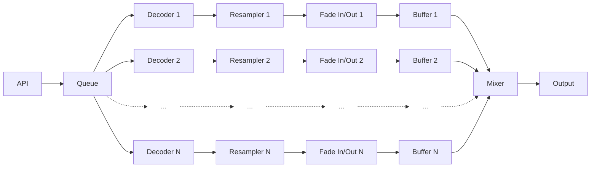

# Decoder Buffer Design

**🗂️ TIER 2 - DESIGN SPECIFICATION**

Defines HOW the decoder-buffer chain architecture works to process audio from encoded files to playback-ready buffers. Derived from [Requirements](REQ001-requirements.md) and [Single Stream Playback Architecture](SPEC013-single_stream_playback.md). See [Document Hierarchy](GOV001-document_hierarchy.md) and [Requirements Enumeration](GOV002-requirements_enumeration.md).

> **Related Documentation:** [Architecture](SPEC001-architecture.md) | [Single Stream Playback](SPEC013-single_stream_playback.md) | [Single Stream Design](SPEC014-single_stream_design.md) | [Crossfade Design](SPEC002-crossfade.md) | [Sample Rate Conversion](SPEC017-sample_rate_conversion.md)

---

## Scope

**[DBD-SC-010]** The concepts described herein apply primarily to the wkmp-ap Audio Player microservice.

## Overview

**[DBD-OV-010]** The Audio Player plays audio from source files that are encoded, often compressed. The audio is decoded, converted to the working_sample_rate when necessary, and buffered for playback as uncompressed stereo sample values.

**[DBD-OV-020]** Separate decoder-buffer chains are created for each **[ENT-MP-030]** passage in the queue, up to maximum_decode_streams.

**[DBD-OV-030]** The playback system reads audio from the buffers, applies **[REQ-CTL-040]** volume, **[XFD-OV-010]** crossfade and **[REQ-XFD-030]** other amplitude modifications before sending the final computed stereo audio sample levels to the **[SSP-OUT-010]** output system.

**[DBD-OV-040]** A simplified view of the audio processing chain is:

Note: This diagram shows logical processing stages. In the implemented architecture (see [SPEC014 Single Stream Design](SPEC014-single_stream_design.md)), Decoder, Resampler, and Fade Handler are all performed within DecoderPool worker threads. See [SPEC013 Single Stream Playback](SPEC013-single_stream_playback.md) and [SPEC014](SPEC014-single_stream_design.md) for component-level architecture.

**[DBD-OV-050]** The system allocates maximum_decode_streams decoder-buffer chains. Each chain is assigned 1:1 to a passage in the queue, when the passage is maximum_decode_streams or less from the first position in the queue.

**[DBD-OV-060]** The first position in the queue is also referred to as the "now playing" passage.

**[DBD-OV-070]** The next position in the queue is also referred to as the "playing next" passage.

**[DBD-OV-080]** Note that each decoder-buffer chain is NOT associated with a particular position in the queue. Each decoder-buffer chain is assigned to a passage in the queue and remains associated with that passage as the passage advances toward the now playing queue position.

### Terminology

**Decoder-buffer chain** (design concept) = **PassageBuffer** (core data structure) wrapped in **ManagedBuffer** (lifecycle management).

See [SPEC013 Single Stream Playback](SPEC013-single_stream_playback.md) and [REV004 Incremental Buffer Implementation](REV004-incremental_buffer_implementation.md) for implementation details.

## Related Documents

**[DBD-REL-010]** These documents define essential terms and concepts described herein. Please also read and understand these documents before taking action based on this document:
- [SPEC002 Crossfade](SPEC002-crossfade.md)
- [REQ002 Entity Definitions](REQ002-entity_definitions.md)
- [SPEC017 Sample Rate Conversion](SPEC017-sample_rate_conversion.md)
- [SPEC013 Single Stream Playback](SPEC013-single_stream_playback.md)
- [SPEC014 Single Stream Design](SPEC014-single_stream_design.md)
- [SPEC015 Playback Completion Fixes](SPEC015-playback_completion_fixes.md)

## Operating Parameters

**[DBD-PARAM-010]** These defined values are stored in the global settings table of the database, where they are read once at startup for run-time use. Changes of operating parameters' values may require a complete system restart for proper operation.

See [IMPL001 Database Schema - Settings Table](IMPL001-database_schema.md#settings) for database storage of operating parameters.

Note: This section lists decode/buffer-related parameters only. IMPL001 settings table includes additional configuration (volume_level, audio_sink, event intervals, etc.).

### working_sample_rate

**[DBD-PARAM-020]** The sample rate that all decoded audio is converted to before buffering.

- **Default value:** 44100Hz
- **Behavior:** When audio comes out of the decoder at the working_sample_rate, the sample rate conversion process shall be bypassed

### output_ringbuffer_size

**[DBD-PARAM-030]** The maximum number of (stereo) samples that the output ring buffer (between the mixer and the output) can contain.

- **Default value:** 8192 samples
- **Equivalent:** 185ms of audio at 44.1kHz

### output_refill_period

**[DBD-PARAM-040]** The number of wall clock milliseconds between mixer checks of the output ring buffer state.

- **Default value:** 90ms
- **Behavior:** Each output_refill_period the mixer passes enough (stereo) samples to fill the output ring buffer from the active decoder-buffer chain(s) and its mixer algorithms
- **Equivalent:** Just under half of the output ring buffer capacity

### maximum_decode_streams

**[DBD-PARAM-050]** The maximum number of audio decoders that will operate on passages in the queue.

- **Default value:** 12
- **Behavior:** When the queue has more passages than this, only the passages closest to being played will be decoded into buffers awaiting play. Other passages will start decoding when they advance to within maximum_decode_streams of the "now playing" first position in the queue

### decode_work_period

**[DBD-PARAM-060]** The number of wall clock milliseconds between decode job priority evaluation.

- **Default value:** 5000ms
- **Behavior:** Once every decode_work_period the currently working decoder is paused and the list of pending decode jobs is evaluated to determine the highest priority job and switch to decoding it
- **Continuation:** If the currently working decoder is still the highest priority job, then it continues
- **Completion:** When a decoding job reaches the end of the passage, or receives a buffer full indication from the playout buffer it is filling, it pauses and the next highest priority decoding job is resumed immediately
- **Purpose:** The decode_work_period serves to allow decodes to continue uninterrupted while still serving the highest priority jobs often enough to ensure their buffers do not run empty

### playout_ringbuffer_size

**[DBD-PARAM-070]** The number of (stereo) samples that the decoded / resampled audio buffers contain.

- **Default value:** 661941 samples
- **Equivalent:** 15.01 seconds of audio at 44.1kHz
- **Memory:** At 8 bytes per sample, with 12 playout buffers total, that's 60MB of playout buffer

### playout_ringbuffer_headroom

**[DBD-PARAM-080]** The number of (stereo) samples that the buffer reserves to handle additional samples that may arrive from the resampler after the decoder pauses due to a buffer full condition.

- **Default value:** 441 samples
- **Equivalent:** 0.01 seconds of audio at 44.1kHz

### pause_decay_factor

**[DBD-PARAM-090]** When in pause mode, instead of playing samples from the decoder-buffer chain(s), the mixer starts at the last played (stereo) sample values and recursively multiplies them by this pause_decay_factor at every subsequent sample.

- **Default value:** 0.96875 (31/32)
- **Purpose:** Creates an exponential decay to zero, hopefully reducing audible "pop" from the sudden stop of going to pause mode

### pause_decay_floor

**[DBD-PARAM-100]** When the absolute value of the pause mode output sample values drop below this pause_decay_floor, the mixer no longer bothers doing the multiplication and simply outputs 0.0

- **Default value:** 0.0001778

## Dataflow

### Backpressure

**[DBD-FLOW-010]** Playback has two modes: Playing and Paused.

**[DBD-FLOW-020]** When in playing mode, audio data is fed from the buffers to the mixer and then to the output system via the output ringbuffer.

**[DBD-FLOW-030]** When paused, the mixer outputs silence to the output ringbuffer: a flat line, and no samples are consumed from the buffers.

**[DBD-FLOW-040]** When no samples are consumed from the buffers, the buffers do not finish playing and so they are not removed from the queue.

**[DBD-FLOW-050]** When in Playing mode, the mixer operates on samples from one or more buffers, calculating values to pass to the output ring buffer.

**[DBD-FLOW-060]** When the buffer associated with a passage in the queue reaches its end point, the passage is removed from the queue and the next passage in the queue either starts playing if there was no **[XFD-OV-010]** crossfade between them, or continues playing if it already started as a crossfade.

### API → queue

**[DBD-FLOW-100]** The wkmp-ap audio player is given passage definitions to enqueue via the API, either from the user interface, the program director, or other sources.

**[DBD-FLOW-110]** This queue of passage definitions is served in a First In First Out (FIFO) order for decoding and buffering.

### Decoders

**[DBD-DEC-010]** Each passage defines a portion of an audio file to play.

**[DBD-DEC-020]** When a passage's position in the queue comes up within maximum_decode_streams of the first (now playing) position, an available decoder-buffer chain is assigned to it and it becomes eligible for decoding.

**[DBD-DEC-030]** Each passage gets a dedicated decoder instance which works through the audio file, pausing when its buffer is full, resuming as data is read from the buffer into the mixer.

**[DBD-DEC-040]** Decoding is handled serially in priority order, only one decode runs at a time to preserve cache coherency and reduce maximum processor loads, to avoid spinning up the cooling fans.

**[DBD-DEC-050]** Decoding starts from the beginning of the audio file, even if the start point is after that.

**[DBD-DEC-060]** Seek time estimation in compressed file decoding can be inaccurate, especially for variable bit rate encoded files.

**[DBD-DEC-070]** Once the audio data has been decoded, it is "exact sample accurate" repeatable and predictable.

**[DBD-DEC-080]** Timing for passage start, end, fade in, fade out, lead in and lead out is all handled with exact sample accuracy for repeatability and predictability.

### Resampling

**[DBD-RSMP-010]** When the audio data is not at the working_sample_rate, it is resampled to put it at the working_sample_rate before it is passed to the Fade In/Out handler.

**[DBD-RSMP-020]** When the audio data is at the working_sample_rate, it is passed straight through from the Decoder to the Fade In/Out handler.

### Fade In/Out handlers

**[DBD-FADE-010]** The Fade In/Out handler has several functions:

See [SPEC002 Volume Fade Curve Formulas](SPEC002-crossfade.md#volume-fade-curve-formulas) for fade curve implementations:
- [XFD-IMPL-091]: Linear fade
- [XFD-IMPL-092]: Exponential fade-in
- [XFD-IMPL-093]: Logarithmic fade-out
- [XFD-IMPL-094]: Cosine fade
- [XFD-IMPL-095]: Equal-power crossfade

SPEC016 applies curves before buffering (pre-buffer); SPEC002 defines curve formulas.

**[DBD-FADE-020]** Samples received before the passage start time are discarded, not buffered.

**[DBD-FADE-030]** When fade-in duration is > 0 then samples between the start time and the fade-in end point have the fade-in curve applied before they are buffered.

**[DBD-FADE-040]** Through the passage until the fade-out start point samples are buffered exactly as they are received.

**[DBD-FADE-050]** When fade-out duration is > 0 then samples between the fade-out point and the end time have the fade-out curve applied.

**[DBD-FADE-060]** When the end time sample has been received by the Fade In/Out handler, the Decoder is informed that the passage is complete and no further decoding is needed.

### Buffers

**[DBD-BUF-010]** The buffer of each decoder-buffer chain holds playout_ringbuffer_size stereo samples. As the parameter name implies, these are ring buffers.

**[DBD-BUF-020]** The ring buffer starts empty when its processing chain is assigned to work with a particular passage.

**[DBD-BUF-030]** Whenever the buffer is empty, the mixer cannot take samples out of it.

**[DBD-BUF-040]** If the mixer does attempt to take a sample from an empty buffer, the buffer returns the same value that the last successful "get next sample" call received along with a "buffer empty" status informing the mixer of the situation.

**[DBD-BUF-050]** Whenever the buffer has playout_ringbuffer_headroom or fewer samples of available free space (is nearly full), the decoder is told to pause decoding until more than playout_ringbuffer_headroom samples are available.

**[DBD-BUF-060]** When the sample corresponding to the passage end time is removed from the buffer, the buffer informs the queue that passage playout has completed; the passage should now be removed from the queue.

### Mixer

**[DBD-MIX-010]** The mixer implements several functions:

**[DBD-MIX-020]** Every output_refill_period refills the output ring buffer for cpal to output.

**[DBD-MIX-030]** Implements play and pause mode.

**[DBD-MIX-040]** When in play mode:
- Takes samples from the "now playing" passage buffer
- When in a lead-out / lead-in crossfade, also takes samples from the "playing next" passage buffer and adds them to the "now playing" sample values
- Multiplies the sample values by the master volume level
- When "fading in after pause" also multiplies the sample values by the current fade in curve value

For crossfade timing calculation (WHEN crossfades occur), see [SPEC002 Crossfade Design - Implementation Algorithm](SPEC002-crossfade.md#implementation-algorithm) ([XFD-IMPL-010] through [XFD-IMPL-050]).

SPEC016 defines HOW mixer implements crossfade overlap; SPEC002 defines WHEN overlap occurs.

**[DBD-MIX-050]** When in pause mode, outputs near flatline silence:
- Takes the last (stereo) sample values and repeats them with an exponential decay toward zero by multiplying the values by the pause_decay_factor at each sample sent to the output ring buffer
- **[DBD-MIX-051]** This reduces the "pop" effect that can occur from an instant transition to zero
- **[DBD-MIX-052]** Each entry to pause mode starts at the last playing mode (stereo) sample values and decays through the duration of the pause until the absolute value of the current sample value is less than the pause_decay_floor, at which point the mixer simply outputs zeroes

### Output

**[DBD-OUT-010]** The mixer creates a single output stream which is fed to the output ring buffer for consumption by the cpal audio output library.

## Sample Format

**[DBD-FMT-010]** All stages from the decoder output to the mixer output work with stereo f32 sample values (interleaved: [L, R, L, R, ...]).

See [SPEC013 Decoding Flow - SSP-DEC-040](SPEC013-single_stream_playback.md#core-components) for interleaved stereo f32 format description.

**[DBD-FMT-020]** This is the preferred format both for the symphonia decoder and for the cpal output handler.

---

**Document Version:** 1.0
**Created:** 2025-10-19
**Status:** Current
**Tier:** 2 - Design Specification
**Document Code:** DBD (Decoder Buffer Design)

**Change Log:**
- v1.0 (2025-10-19): Initial specification with requirement IDs
  - Renamed from NEW-decoder_buffer_design.md to SPEC016-decoder_buffer_design.md
  - Applied GOV001 tier designation (Tier 2 - Design Specification)
  - Applied GOV002 requirement enumeration scheme (DBD document code)
  - Added all requirement IDs ([DBD-XXX-NNN] format)
  - Added Related Documentation section
  - Added proper metadata and change log
  - Integrated into WKMP documentation hierarchy

**Maintained By:** Audio engineer, technical lead

----
End of document - Decoder Buffer Design
