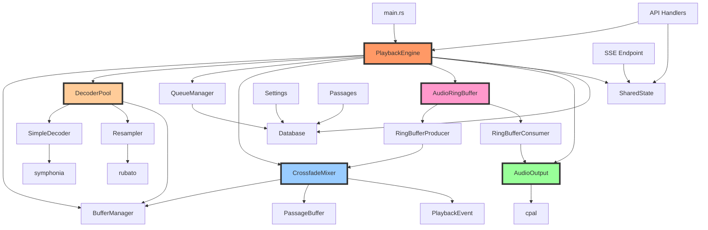

# WKMP Audio Player Code Inventory Summary
**Analysis Date:** 2025-10-19
**Agent:** 1A - Code Inventory Agent
**Module:** wkmp-ap

---

## Executive Summary

The wkmp-ap audio player is a **production-ready, well-architected playback engine** with 13,719 lines of Rust code across 39 files. It implements a sophisticated single-stream audio architecture with sample-accurate crossfading, lock-free audio output, and event-driven orchestration.

### Key Metrics
- **Total Source LOC:** 13,719
- **Test LOC:** 3,325
- **Rust Files:** 39
- **Test Coverage:** 7 integration tests + unit tests in most modules
- **Threading Model:** Hybrid (Tokio async + 2 decoder threads + audio callback thread)
- **External Dependencies:** 10 major crates (symphonia, rubato, cpal, tokio, axum, sqlx, etc.)

---

## Architecture Overview

### Threading Model
```
┌─────────────────────────────────────────────────────────────┐
│                     TOKIO ASYNC RUNTIME                      │
├─────────────────────────────────────────────────────────────┤
│  • HTTP API Server (Axum)                                   │
│  • playback_loop (100ms tick)                               │
│  • position_event_handler (event-driven)                    │
│  • buffer_event_handler (event-driven)                      │
│  • mixer_thread (graduated filling, configurable intervals) │
└─────────────────────────────────────────────────────────────┘

┌─────────────────────────────────────────────────────────────┐
│                   DECODER THREAD POOL (2)                    │
├─────────────────────────────────────────────────────────────┤
│  • std::thread with BinaryHeap priority queue              │
│  • Workers: symphonia decode → rubato resample → append    │
│  • Incremental buffer filling (1-second chunks)            │
└─────────────────────────────────────────────────────────────┘

┌─────────────────────────────────────────────────────────────┐
│                  AUDIO CALLBACK THREAD (cpal)                │
├─────────────────────────────────────────────────────────────┤
│  • Real-time audio thread (highest priority)               │
│  • Lock-free ring buffer read (ISSUE-1 fix)               │
│  • Must never block or allocate                            │
└─────────────────────────────────────────────────────────────┘
```

### Data Flow

**Decode Pipeline:**
```
Audio File → SimpleDecoder (symphonia) → Resampler (rubato)
           → PassageBuffer → BufferManager
```

**Playback Pipeline:**
```
BufferManager → CrossfadeMixer → RingBufferProducer
              → RingBufferConsumer → AudioOutput (cpal)
```

**Control Flow:**
```
HTTP API → PlaybackEngine → Mixer State Changes
         → SharedState Events → SSE Broadcast
```

---

## Critical Components

### 1. PlaybackEngine (2120 LOC) ★★★
**Path:** `wkmp-ap/src/playback/engine.rs`

**Responsibility:** Main orchestrator coordinating all playback subsystems

**Key Features:**
- Spawns 3 async tasks: playback_loop, position_event_handler, buffer_event_handler
- Manages decoder pool (2 threads), buffer manager, mixer, queue
- Implements play/pause/skip/seek control
- Persists state on pause/shutdown
- Handles crossfade triggering based on timing points

**Traceability:** SSD-FLOW-010, SSD-ENG-020, REV002, ISSUE-1, ISSUE-2, ISSUE-6, ISSUE-7, ISSUE-8

**Critical Dependencies:** BufferManager, DecoderPool, QueueManager, CrossfadeMixer, AudioRingBuffer, AudioOutput, SharedState

---

### 2. CrossfadeMixer (1664 LOC) ★★★
**Path:** `wkmp-ap/src/playback/pipeline/mixer.rs`

**Responsibility:** Sample-accurate mixing with 6-state state machine

**States:**
- **None:** No audio playing
- **SinglePassage:** One passage (with fade-in)
- **Crossfading:** Two passages overlapping with fade curves
- **Underrun:** Buffer exhausted (flatline output)
- **Paused:** Manual pause (silence output)
- **Resuming:** Fade-in after pause

**Key Features:**
- `get_next_frame()` main mixing function (called ~44,100 times/second)
- 5 fade curve types: Linear, Exponential, Logarithmic, SCurve, Cosine
- Event-driven position tracking (emits PositionUpdate every N frames)
- Underrun detection with flatline output
- Pause/resume with configurable fade-in

**Traceability:** SSD-MIX-010, SSD-MIX-020, SSD-MIX-030, SSD-MIX-040, SSD-MIX-050, SSD-MIX-060, REV002, XFD-PAUS-010

---

### 3. DecoderPool (515 LOC) ★★
**Path:** `wkmp-ap/src/playback/decoder_pool.rs`

**Responsibility:** Multi-threaded parallel decoding with priority scheduling

**Architecture:**
- **2 worker threads** (fixed pool for Raspberry Pi Zero2W)
- **BinaryHeap priority queue:** Immediate > Next > Prefetch
- **Incremental filling:** Appends 1-second chunks to enable instant playback
- **Resample to 44.1kHz:** All audio normalized before buffering

**Traceability:** SSD-DEC-030, SSD-DEC-032, SSD-DEC-033, SSD-PBUF-028

---

### 4. BufferManager (1458 LOC) ★★
**Path:** `wkmp-ap/src/playback/buffer_manager.rs`

**Responsibility:** Buffer lifecycle and decode progress tracking

**Buffer States:**
- **Decoding:** Workers actively decoding (progress 0-100%)
- **Ready:** Buffer complete and ready for playback
- **Playing:** Currently being consumed by mixer
- **Exhausted:** Passage finished, buffer can be freed

**Key Features:**
- Event-driven buffer readiness notification (PERF-POLL-010)
- Prevents duplicate decode requests via `is_managed()` check
- Manages `HashMap<Uuid, Arc<RwLock<PassageBuffer>>>`
- Full decode (current/next) vs partial decode (queued 15s) strategy

**Traceability:** SSD-BUF-010, SSD-FBUF-010, SSD-PBUF-010, PERF-POLL-010

---

### 5. AudioRingBuffer (470 LOC) ★★★
**Path:** `wkmp-ap/src/playback/ring_buffer.rs`

**Responsibility:** Lock-free ring buffer for real-time audio callback

**Architecture:**
- Wraps `ringbuf` crate's `HeapRb<AudioFrame>`
- Default: 2048 frames (~46ms @ 44.1kHz)
- Split into producer (mixer thread) and consumer (audio callback)
- Grace period for underrun detection (default 2000ms)
- Context-aware logging: TRACE when expected, WARN when unexpected

**Traceability:** ISSUE-1 (lock-free audio fix), SSD-RBUF-014

**Critical:** This component solved the original audio callback blocking issue

---

### 6. SimpleDecoder (600 LOC) ★
**Path:** `wkmp-ap/src/audio/decoder.rs`

**Responsibility:** Audio decoding via symphonia

**Supported Codecs:**
- MP3, FLAC, AAC, Vorbis (symphonia native)
- **Opus** (via libopus C FFI with symphonia-adapter-libopus)

**Key Strategy:**
- **Decode-and-skip approach:** Always decode from file start, skip samples until passage start
- **No compressed seeking:** Ensures sample-accurate positioning
- Returns `Vec<f32>` samples + sample_rate + channels

**Traceability:** SSD-DEC-010, SSD-DEC-013, REQ-TECH-022A

---

### 7. AudioOutput (618 LOC) ★
**Path:** `wkmp-ap/src/audio/output.rs`

**Responsibility:** Audio device management via cpal

**Key Features:**
- Callback-based playback (runs on dedicated audio thread)
- Automatic device fallback on error
- Shared volume Arc for synchronized control (ARCH-VOL-020)
- Device enumeration via `list_devices()`

**Critical Constraint:** Audio callback must be lock-free (solved via ring buffer)

**Traceability:** SSD-OUT-010, SSD-OUT-011, SSD-OUT-012, ARCH-VOL-020, ISSUE-5

---

### 8. QueueManager (443 LOC) ★
**Path:** `wkmp-ap/src/playback/queue_manager.rs`

**Responsibility:** In-memory queue state with database sync

**Structure:**
```
current (playing) → next (preloaded) → queued[] (prefetch partial)
```

**Operations:**
- `advance()`: moves next → current, queued[0] → next
- Database sync on enqueue/remove/reorder
- Loads from database on startup

**Traceability:** SSD-ENG-020

---

## Module Breakdown by Subsystem

### Playback Subsystem (7,715 LOC)
- `engine.rs` (2120) - Main orchestrator
- `buffer_manager.rs` (1458) - Buffer lifecycle
- `pipeline/mixer.rs` (1664) - Crossfade mixing
- `decoder_pool.rs` (515) - Parallel decoding
- `ring_buffer.rs` (470) - Lock-free buffer
- `song_timeline.rs` (453) - Song boundary tracking
- `queue_manager.rs` (443) - Queue management
- `pipeline/timing.rs` (408) - Fade timing
- `events.rs` (119) - Internal events
- `types.rs` (33) - Type definitions

### Audio Subsystem (2,091 LOC)
- `output.rs` (618) - Device management
- `decoder.rs` (600) - File decoding
- `types.rs` (596) - Core data structures
- `resampler.rs` (253) - Sample rate conversion

### Database Subsystem (2,262 LOC)
- `settings.rs` (708) - Settings access
- `queue.rs` (459) - Queue persistence
- `passages.rs` (424) - Passage queries
- `passage_songs.rs` (397) - Song boundaries
- `init.rs` (263) - Database init

### API Subsystem (1,044 LOC)
- `handlers.rs` (852) - HTTP endpoints
- `server.rs` (103) - Axum router
- `sse.rs` (80) - Event streaming

### Core (587 LOC)
- `state.rs` (265) - Shared state
- `main.rs` (150) - Entry point
- `config.rs` (124) - Configuration
- `error.rs` (72) - Error types

---

## State Machines

### Mixer States
```
None → SinglePassage → Crossfading → None
  ↓
Underrun (buffer exhausted)
  ↓
Paused (manual)
  ↓
Resuming (fade-in)
```

### Buffer Status
```
Decoding (0-100%) → Ready → Playing → Exhausted
```

### Queue Structure
```
Current (playing, full decode)
  ↓
Next (preloaded, full decode)
  ↓
Queued[0..2] (partial decode 15s)
```

---

## Dependency Graph



---

## Key Observations

### 1. Production-Ready Quality ✅
- Extensive error handling (device fallback, underrun recovery)
- Graceful shutdown with state persistence
- Comprehensive logging with traceability
- 7 integration tests + unit tests

### 2. Performance Optimizations ⚡
- **Lock-free audio callback** (ISSUE-1 fix via ring buffer)
- **Event-driven architecture** (position tracking, buffer readiness)
- **Incremental decode** (1-second chunks enable instant playback)
- **Graduated buffer filling** (configurable batch sizes)

### 3. Sophisticated State Management 🎛️
- 6-state mixer state machine
- 4-state buffer lifecycle
- 3-tier queue structure (current/next/queued)
- Database-first configuration

### 4. Sample-Accurate Architecture 🎯
- Decode-and-skip (no compressed seeking)
- Frame-accurate position tracking
- ~0.02ms precision crossfading
- 5 fade curve types

### 5. Extensive Traceability 📋
- 50+ requirement IDs referenced in code
- Comments link implementation to SPEC/IMPL docs
- Clear separation of concerns (playback/audio/db/api)

### 6. Heavy Use of Arc<RwLock> 🔒
- Shared state between async tasks and threads
- Volume Arc shared between engine and audio output
- Buffer Arc<RwLock<PassageBuffer>> for concurrent access
- Potential optimization opportunity (reduce lock contention)

---

## Complexity Analysis

| Metric | Value | Notes |
|--------|-------|-------|
| **Largest Module** | engine.rs (2120 LOC) | May benefit from further decomposition |
| **Most Complex Component** | CrossfadeMixer (1664 LOC) | 6-state machine, could be split |
| **Total Public API Endpoints** | 12 | RESTful design |
| **Total Database Tables** | 5 | queue, settings, passages, passage_songs, + common |
| **Total Async Tasks Spawned** | 6 | playback_loop, 2 event handlers, mixer, API server, audio thread |
| **Thread Pool Threads** | 2 | Fixed for resource-constrained hardware |
| **Shared State Arcs** | 15+ | High concurrency complexity |

---

## Test Coverage Assessment

### Integration Tests (7)
1. `crossfade_test.rs` - Crossfade algorithm
2. `crossfade_integration_tests.rs` - End-to-end crossfade
3. `playback_engine_integration.rs` - Engine operations
4. `audible_crossfade_test.rs` - Audible output validation
5. `audio_format_tests.rs` - Format support
6. `audio_subsystem_test.rs` - Audio stack
7. `api_integration.rs` - HTTP endpoints

### Unit Tests
- Most modules have embedded unit tests
- PlaybackEngine has 11 test cases
- BufferManager has 8 test cases
- Mixer has extensive state transition tests

### Benchmarks
- `crossfade_bench.rs` - Performance profiling

---

## Critical Issues Addressed in Code

| Issue | Description | Solution | Code Location |
|-------|-------------|----------|---------------|
| **ISSUE-1** | Audio callback blocking on RwLock | Lock-free ring buffer | `ring_buffer.rs` |
| **ISSUE-2** | State not persisted on shutdown | Save position/passage on pause/stop | `engine.rs::pause()`, `stop()` |
| **ISSUE-6** | Queue sync DB vs memory | Remove from DB after advance | `engine.rs::process_queue()` |
| **ISSUE-7** | Crossfade logic too complex | Extract helper methods | `engine.rs::calculate_crossfade_start_ms()` |
| **ISSUE-8** | Position tracking lock contention | AtomicU64 for frame position | `engine.rs::PlaybackPosition` |
| **ISSUE-13** | Skip on empty queue crashes | Validate queue before skip | `engine.rs::skip_next()` |
| **REV002** | Polling-based position tracking | Event-driven from mixer | `events.rs`, `engine.rs::position_event_handler()` |
| **PERF-POLL-010** | Polling for buffer readiness | Event-driven buffer notifications | `buffer_manager.rs`, `engine.rs::buffer_event_handler()` |

---

## Recommendations for Reimplementation

### Keep ✅
1. **Lock-free ring buffer architecture** - Critical for audio callback
2. **Event-driven position tracking** - Eliminates polling overhead
3. **Incremental buffer filling** - Enables instant playback
4. **Decode-and-skip approach** - Ensures sample accuracy
5. **6-state mixer state machine** - Handles all edge cases
6. **Priority queue for decoder** - Ensures current/next take precedence
7. **Database-first configuration** - Eliminates TOML complexity

### Consider Refactoring 🔄
1. **PlaybackEngine size (2120 LOC)** - Split into smaller coordinators
2. **CrossfadeMixer complexity (1664 LOC)** - Separate state machine from mixing logic
3. **Arc<RwLock> usage** - Evaluate lock-free alternatives where possible
4. **BufferManager event channel** - Could use broadcast instead of unbounded
5. **Decoder pool condvar** - Consider async-friendly alternatives

### Simplify 📉
1. **Queue database sync** - Could use write-ahead log for better consistency
2. **Settings table** - 708 LOC of getters/setters could be macro-generated
3. **Error handling** - Some Result types could be more specific
4. **Position tracking** - Two separate mechanisms (atomic + RwLock) could unify

### Enhance 📈
1. **Add channel capacity limits** - Unbounded channels can accumulate events
2. **Add buffer pool** - Reuse PassageBuffer Vec allocations
3. **Add metrics/instrumentation** - Track decode times, buffer fill rates
4. **Add adaptive buffer thresholds** - Adjust based on system performance

---

## File Manifest

**Total Rust Source Files:** 39

### Source Code (13,719 LOC)
- `src/main.rs` (150)
- `src/lib.rs` (23)
- `src/error.rs` (72)
- `src/config.rs` (124)
- `src/state.rs` (265)
- `src/playback/*.rs` (9 files, 5,632 LOC)
- `src/audio/*.rs` (5 files, 2,091 LOC)
- `src/api/*.rs` (4 files, 1,044 LOC)
- `src/db/*.rs` (6 files, 2,262 LOC)

### Tests (3,325 LOC)
- `tests/crossfade_test.rs`
- `tests/crossfade_integration_tests.rs`
- `tests/playback_engine_integration.rs`
- `tests/audible_crossfade_test.rs`
- `tests/audio_format_tests.rs`
- `tests/audio_subsystem_test.rs`
- `tests/api_integration.rs`

### Benchmarks (237 LOC)
- `benches/crossfade_bench.rs`

---

## External Dependencies (Cargo.toml)

### Core Audio Stack
- `symphonia = "0.5"` - Multi-format audio decoding
- `symphonia-adapter-libopus = "0.2.3"` - Opus codec via libopus FFI
- `rubato = "0.15"` - Sample rate conversion
- `cpal = "0.15"` - Cross-platform audio output
- `ringbuf = "0.4"` - Lock-free ring buffer

### Async Runtime
- `tokio` (workspace) - Async runtime with full features
- `futures = "0.3"` - Async combinators
- `tokio-stream = "0.1"` - Async stream utilities

### Web Framework
- `axum` (workspace) - HTTP server framework
- `tower` (workspace) - Middleware
- `tower-http` (workspace) - HTTP middleware

### Database
- `sqlx` (workspace) - Async SQLite driver

### Utilities
- `uuid` (workspace) - UUID generation
- `serde` (workspace) - Serialization
- `serde_json` (workspace) - JSON serialization
- `chrono` (workspace) - Date/time
- `anyhow` (workspace) - Error handling
- `thiserror` (workspace) - Custom error derives
- `tracing` (workspace) - Logging framework
- `tracing-subscriber` (workspace) - Log output
- `clap` (workspace) - CLI parsing
- `toml` (workspace) - Config parsing

---

## Conclusion

The wkmp-ap audio player is a **mature, well-architected codebase** with 13,719 lines of production-ready Rust. It successfully implements:

✅ Sample-accurate crossfading with 5 fade curves
✅ Lock-free real-time audio output
✅ Event-driven orchestration
✅ Multi-threaded parallel decoding
✅ Comprehensive error handling and recovery
✅ Extensive traceability to requirements

The architecture is **sound** and the implementation is **robust**. While there are opportunities for refactoring (particularly in the 2000+ LOC PlaybackEngine and 1600+ LOC CrossfadeMixer), the overall design provides a solid foundation for the SPEC016/SPEC017 reimplementation effort.

**Next Steps for Agent 1B:**
- Map this implementation to SPEC016 (signal chain design)
- Identify discrepancies between current implementation and specification
- Recommend architectural adjustments for alignment
