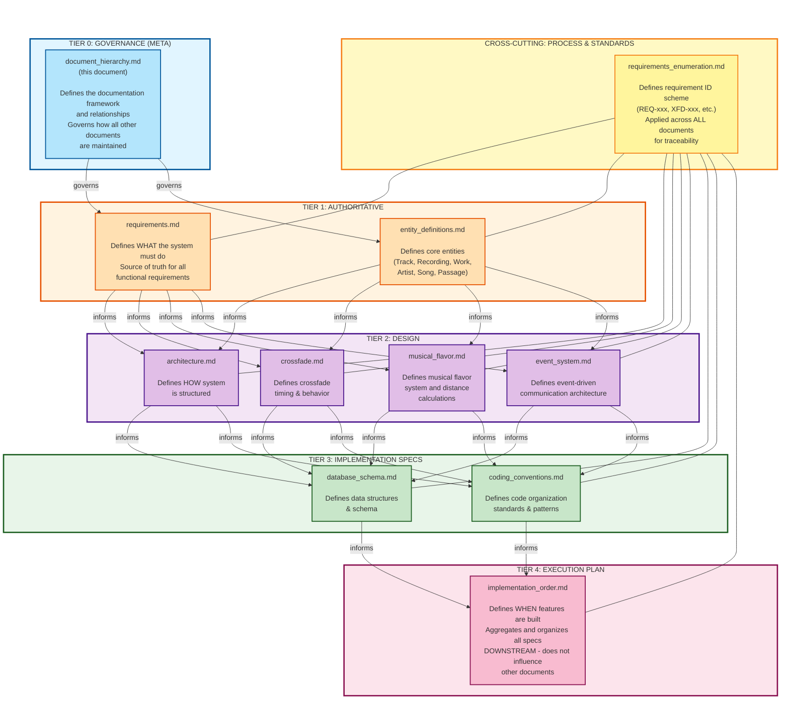

# McRhythm Document Hierarchy

> **All project documents reference this hierarchy specification**

---

**⚖️ TIER 0 - GOVERNANCE (META)**

This document defines the documentation framework itself. It sits outside the content hierarchy, establishing the rules for how all other documents relate and are maintained.

**Self-Reference Note:** This document is meta-documentation - it defines the hierarchy and includes itself in that definition at Tier 0 (Governance). It is not part of the requirements/design/implementation content flow; rather, it governs that flow.

---

## Document Classification

McRhythm project documentation is organized into a strict hierarchy that governs how information flows between documents and when each document should be updated.

### Document Hierarchy Diagram



## Document Purposes and Update Policies

### Tier 0: Governance (Meta)

#### document_hierarchy.md
**Purpose:** Defines the documentation framework and governance rules

**Contains:**
- Document tier classifications
- Update policies for each document
- Information flow rules (upward/downward)
- Change control processes
- Document maintenance procedures

**Update Policy:**
- ✅ Update when document structure changes (new docs added, tiers reorganized)
- ✅ Update when governance processes evolve
- ✅ Update when document relationships need clarification
- ⚠️ This document governs others; changes here affect the entire documentation system

**Change Control:**
- Changes require review by technical lead and documentation lead
- Major changes (new tiers, flow rules) require team consensus
- Document is self-referential but must remain logically consistent

**Maintained By:** Technical lead, documentation lead

---

### Tier 1: Authoritative Requirements

#### requirements.md
**Purpose:** Defines WHAT McRhythm must do from a product/user perspective

**Contains:**
- Functional requirements (features, behaviors)
- Non-functional requirements (performance, constraints)
- User workflows and use cases
- Version feature matrices (Full/Lite/Minimal)

**Update Policy:**
- ✅ Update when product requirements change (stakeholder-driven)
- ✅ Update when user needs evolve
- ❌ DO NOT update based on design or implementation documents
- ❌ DO NOT update to match implementation convenience

**Change Control:**
- Requirements changes must be intentional
- Driven by product decisions, not technical convenience
- If design/implementation reveals requirement gaps, explicitly review and decide whether to update requirements

**Maintained By:** Product owner, stakeholders, with technical input

#### entity_definitions.md
**Purpose:** Defines core entity terminology used across all McRhythm documentation

**Contains:**
- Track, Recording, Work, Artist definitions (MusicBrainz entities)
- Song definition (McRhythm-specific: Recording + Artist(s))
- Passage definition (McRhythm-specific: span of audio with timing points)
- Entity relationships and cardinality rules
- McRhythm-specific entity constraints

**Update Policy:**
- ✅ Update when product terminology evolves
- ✅ Update when new entity types are added
- ❌ DO NOT update based on implementation details
- ❌ Definitions are authoritative; implementation adapts to them

**Change Control:**
- Terminology changes must be intentional (affects entire codebase)
- Driven by product clarity needs, not implementation convenience
- New entity types require explicit review of impact on all documents

**Maintained By:** Product owner, technical lead

**Related to:**
- requirements.md references these definitions
- database_schema.md implements these entities as tables
- All documents use this terminology consistently

---

### Tier 2: Design Specifications

These documents define HOW requirements are satisfied through design decisions.

#### architecture.md
**Purpose:** Defines system structure, components, and interactions

**Contains:**
- Component architecture
- Communication patterns
- Technology stack decisions
- Concurrency model
- Platform abstractions

**Update Policy:**
- ✅ Update to satisfy requirements.md
- ✅ Update when design decisions change
- ✅ May inform new requirements (via proper change control)
- ❌ DO NOT contradict requirements.md without explicit requirement change

**Maintained By:** Technical lead, architects

#### crossfade.md
**Purpose:** Defines crossfade timing system and behavior

**Contains:**
- Six timing point definitions
- Fade curve specifications (exponential, cosine, linear)
- Crossfade behavior cases
- Volume calculation formulas

**Update Policy:**
- ✅ Update to satisfy playback requirements from requirements.md
- ✅ Update when timing/fade algorithms are refined
- ✅ May propose requirement changes if audio behavior needs adjustment
- ❌ Must remain consistent with requirements.md playback behaviors

**Maintained By:** Audio engineer, technical lead

#### musical_flavor.md
**Purpose:** Defines musical flavor characterization and distance calculation system

**Contains:**
- AcousticBrainz data structure
- Distance calculation formulas
- Flavor mapping rules (single-song, multi-song, zero-song passages)
- Usage in selection algorithm

**Update Policy:**
- ✅ Update to satisfy selection requirements from requirements.md
- ✅ Update when flavor algorithms are refined
- ✅ May propose requirement changes if selection behavior needs adjustment
- ❌ Must remain consistent with requirements.md selection system

**Maintained By:** Algorithm designer, technical lead

#### event_system.md
**Purpose:** Defines event-driven communication architecture

**Contains:**
- EventBus design and implementation
- Event type enumeration (McRhythmEvent)
- Communication pattern selection (broadcast vs channels vs shared state)
- Event flows and examples
- Testing patterns for event-driven code

**Update Policy:**
- ✅ Update to satisfy multi-user and real-time requirements from requirements.md
- ✅ Update when new event types are needed
- ✅ Update when communication patterns evolve
- ❌ Must support requirements.md features, not drive them

**Maintained By:** Software architect, technical lead

---

### Tier 3: Implementation Specifications

These documents translate design into concrete implementation details.

#### database_schema.md
**Purpose:** Defines data structures and database schema

**Contains:**
- Table definitions
- Relationships and foreign keys
- Indexes and triggers
- Data type specifications
- Migration strategy

**Update Policy:**
- ✅ Update to support requirements.md and design documents
- ✅ Update when data model needs refinement
- ✅ May inform design document updates if schema reveals design issues
- ❌ Schema is derived FROM requirements/design, not vice versa

**Maintained By:** Database engineer, backend developers

#### coding_conventions.md
**Purpose:** Defines code organization, style, and quality standards

**Contains:**
- Module organization patterns
- Code style guidelines
- Testing requirements
- Documentation standards
- Requirement traceability conventions

**Update Policy:**
- ✅ Update to support requirements.md and design patterns
- ✅ Update when coding standards evolve
- ✅ Update based on team decisions and best practices
- ❌ Conventions serve the architecture, not vice versa

**Maintained By:** Technical lead, development team

---

### Tier 4: Execution Plan

#### implementation_order.md
**Purpose:** Defines WHEN features are built and in what sequence

**Contains:**
- Phase-by-phase implementation plan
- Task breakdown with dependencies
- References to all upstream specifications
- Requirement ID and coding convention mappings
- Critical path and blockers

**Update Policy:**
- ✅ ALWAYS update when any upstream document changes
- ✅ Update when implementation sequence needs adjustment
- ✅ Update when blockers are resolved
- ❌ NEVER update upstream documents based on this document
- ❌ This is a DOWNSTREAM AGGREGATOR only

**Maintained By:** Project manager, technical lead

---

### Cross-Cutting: Process & Standards

#### requirements_enumeration.md
**Purpose:** Defines requirement ID scheme for traceability

**Contains:**
- ID format specifications (DOC-CAT-NNN)
- Document codes (REQ, ARCH, XFD, FLV, DB, etc.)
- Category codes for each document
- Numbering guidelines and hierarchy
- Usage examples

**Update Policy:**
- ✅ Update when new documents are added
- ✅ Update when ID scheme needs refinement
- ✅ Applied TO all documents, but doesn't define their content
- ❌ Provides structure, not substance

**Maintained By:** Technical lead, documentation lead

---

## Information Flow Rules

### Governance Flow (Meta-level)
```
document_hierarchy.md (Tier 0)
    ↓ governs structure and policies for ↓
All other documents (Tiers 1-4, Cross-cutting)
```

**Rule:** document_hierarchy.md governs all other documents but is not influenced by their content. It defines the framework; they provide the substance.

### Downward Flow (Normal)
```
requirements.md + entity_definitions.md (Tier 1)
    ↓ Design satisfies requirements and uses terminology
architecture.md, crossfade.md, musical_flavor.md, event_system.md (Tier 2)
    ↓ Implementation specs support design
database_schema.md, coding_conventions.md (Tier 3)
    ↓ Execution plan aggregates all specs
implementation_order.md (Tier 4)
```

**Rule:** Lower-tier documents are updated when higher-tier documents change.

### Upward Flow (Controlled)
```
implementation_order.md (Tier 4)
    ↑ Discovers gap/issue
database_schema.md, coding_conventions.md (Tier 3)
    ↑ May reveal design issue
architecture.md, crossfade.md, musical_flavor.md, event_system.md (Tier 2)
    ↑ May reveal requirement or terminology gap (via change control)
requirements.md + entity_definitions.md (Tier 1)
    ↑ Does NOT affect (governance is separate)
document_hierarchy.md (Tier 0)
```

**Rule:** Upward flow requires explicit review and approval. Implementation discoveries don't automatically change requirements or governance.

### Cross-Tier References

**Allowed:**
- Design documents (Tier 2) MAY reference each other
  - Example: architecture.md references crossfade.md for audio engine design
  - Example: event_system.md references architecture.md for component communication

- Implementation specs (Tier 3) MAY reference Tier 2 documents
  - Example: coding_conventions.md references event_system.md for async patterns
  - Example: database_schema.md references musical_flavor.md for vector storage

**Not Allowed:**
- Tier 1 (requirements.md) NEVER references lower-tier documents
- Tier 4 (implementation_order.md) NEVER influences higher-tier documents

## Change Control Process

### Requirements Changes (Tier 1)

1. **Identify Need:** Implementation/design reveals requirement gap or conflict
2. **Document Issue:** Create issue describing the gap with context
3. **Review:** Product owner + technical lead review
4. **Decision:** Accept as requirement change OR reject (design must adapt)
5. **Update:** If accepted, update requirements.md with change tracking
6. **Cascade:** Update all affected downstream documents

**Example:**
```
Issue: Multi-song passage probability calculation is undefined
Review: Is this a requirement gap or implementation detail?
Decision: Requirement gap - must define product behavior
Update: Add REQ-PROB-050 to requirements.md specifying calculation
Cascade: Update implementation_order.md to remove blocker
```

### Design Changes (Tier 2)

1. **Identify Need:** Implementation reveals design issue
2. **Verify:** Does this violate requirements.md? (If yes, see Requirements Changes)
3. **Propose:** Document design change with rationale
4. **Review:** Technical lead + relevant stakeholders review
5. **Update:** Update design document(s)
6. **Cascade:** Update Tier 3 & 4 documents

**Example:**
```
Issue: GStreamer pipeline design doesn't handle FLAC crossfades efficiently
Verify: Doesn't violate playback requirements, just performance
Propose: Modify pipeline architecture for better buffering
Update: Modify architecture.md audio engine section
Cascade: Update implementation_order.md phase 3 tasks
```

### Implementation Spec Changes (Tier 3)

1. **Identify Need:** Implementation detail needs adjustment
2. **Verify:** Does this violate design or requirements? (If yes, escalate)
3. **Update:** Update implementation spec document
4. **Cascade:** Update implementation_order.md

**Example:**
```
Issue: SQLite JSON1 query performance issue
Verify: Doesn't violate data model requirements
Update: Modify database_schema.md to add indexes
Cascade: Update implementation_order.md with optimization task
```

## Document Maintenance Checklist

### When Creating New Features

- [ ] Start with requirements.md: Does this satisfy a requirement?
- [ ] Update design docs (Tier 2): How will this be designed?
- [ ] Update implementation specs (Tier 3): What concrete details are needed?
- [ ] Update implementation_order.md (Tier 4): When/where in the plan?
- [ ] Add requirement IDs following requirements_enumeration.md

### When Discovering Issues

- [ ] Identify tier: Is this requirement/design/implementation issue?
- [ ] Follow upward flow if needed: Does higher tier need updating?
- [ ] Get approval before updating higher-tier documents
- [ ] Update affected document(s)
- [ ] Cascade changes downward to all affected documents

### When Reviewing Pull Requests

- [ ] Verify code satisfies requirements.md
- [ ] Verify code follows architecture.md design
- [ ] Verify code follows coding_conventions.md
- [ ] Verify requirement IDs are present (per requirements_enumeration.md)
- [ ] Check if implementation_order.md needs updating

## Common Pitfalls to Avoid

❌ **Don't:** Update requirements.md because implementation is easier a different way<br/>
✅ **Do:** Update design/implementation to satisfy requirements as written, or formally propose requirement change

❌ **Don't:** Let implementation_order.md define new requirements<br/>
✅ **Do:** Use implementation_order.md to discover requirement gaps, then update requirements.md

❌ **Don't:** Update architecture.md to match what was accidentally implemented<br/>
✅ **Do:** Fix implementation to match architecture, or formally update architecture with review

❌ **Don't:** Create circular references between documents<br/>
✅ **Do:** Follow strict hierarchy: higher tiers inform lower tiers, never reverse

❌ **Don't:** Skip change control for "small" requirement changes<br/>
✅ **Do:** All requirement changes go through review, no matter how small

## Document Update Summary

| Document | Tier | Updates When | Influences | Updated By |
|----------|------|--------------|------------|------------|
| document_hierarchy.md | 0 (Meta) | Documentation structure changes | Governs all documents | Tech lead, doc lead |
| requirements.md | 1 | Product needs change | All content documents | Product owner |
| entity_definitions.md | 1 | Entity terminology changes | Tier 2, 3, 4 | Product owner, tech lead |
| architecture.md | 2 | Design decisions change | Tier 3, 4 | Tech lead |
| crossfade.md | 2 | Audio design changes | Tier 3, 4 | Audio engineer |
| musical_flavor.md | 2 | Flavor algorithm changes | Tier 3, 4 | Algorithm designer |
| event_system.md | 2 | Communication design changes | Tier 3, 4 | Architect |
| database_schema.md | 3 | Data model changes | Tier 4 | DB engineer |
| coding_conventions.md | 3 | Standards evolve | Tier 4 | Tech lead |
| implementation_order.md | 4 | Any upstream change | None (downstream only) | Project manager |
| requirements_enumeration.md | Cross-cutting | ID scheme changes | ID format in all docs | Doc lead |

## Quick Reference: "Should I Update This Document?"

### I found a gap/issue in document_hierarchy.md
→ Does this affect documentation structure/governance? → Review with tech lead and doc lead
→ Major changes (new tiers, flow rules) → Requires team consensus
→ This affects the entire documentation system, proceed carefully

### I found a gap/issue in implementation_order.md
→ Update implementation_order.md directly (it's downstream)

### I found a gap/issue in database_schema.md or coding_conventions.md
→ Can I fix it without changing design? Yes → Update directly
→ Does it affect design? → Review with tech lead, may need Tier 2 update

### I found a gap/issue in architecture.md, crossfade.md, musical_flavor.md, or event_system.md
→ Can I fix it without changing requirements? Yes → Update with review
→ Does it affect requirements? → Must go through requirements change control

### I found a gap/issue in requirements.md
→ MUST go through formal change control with product owner
→ This is a product decision, not a technical decision

### requirements_enumeration.md needs updating
→ Update when adding new documents or categories
→ Inform all document maintainers of ID scheme changes

---

**Document Version:** 1.0
**Last Updated:** 2025-10-05
**Maintained By:** Technical Lead

For questions about document hierarchy or update procedures, consult the technical lead or refer to this specification.

----
End of document - McRhythm Document Hierarchy
