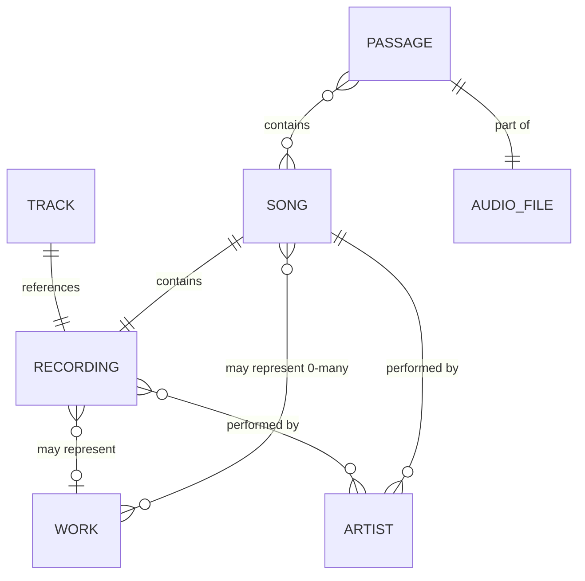

# Entity Definitions

**📜 TIER 1 - AUTHORITATIVE SOURCE DOCUMENT (Component)**

Defines core entity terminology used throughout McRhythm documentation. Part of [requirements.md](requirements.md). See [Document Hierarchy](document_hierarchy.md).

**Update Policy:** ✅ Product terminology decisions | ❌ NOT derived from design/implementation

> **Related Documentation:** [Requirements](requirements.md) | [Musical Flavor](musical_flavor.md) | [Database Schema](database_schema.md)

## Entities

- **[ENT-MB-010]** Track: a specific recording on a particular release.  Has a MBID (MusicBrainz unique identifier), definition is [harmonized with MusicBrainz](https://musicbrainz.org/doc/Track).
- **[ENT-MB-020]** Recording: the unique distinct piece of audio underlying a track. Has a MBID, definition is [harmonized with MusicBrainz](https://musicbrainz.org/doc/Recording).
- **[ENT-MB-030]** Work: one or more recordings can exist of each work. Has a MBID, definition is [harmonized with MusicBrainz](https://musicbrainz.org/doc/Work) definition of discrete works.
- **[ENT-MB-040]** Artist: the artist(s) credited with creating a recording. Has a MBID, definition is [harmonized with MusicBrainz](https://musicbrainz.org/doc/Recording#Artist) definition of "The artist(s) that the recording is primarily credited to."
- **[ENT-MCR-010]** Song: A combination of a recording, zero or more associated works, and one or more artists, each with an assigned weight.
  - The sum of artist weights for a song must equal 1.0.
  - These weights are used in probability and cooldown calculations.
  - Each song may appear in one or more passages.
  - Work association:
    - **Common case**: One work per song (original composition)
    - **Zero works**: Improvisations, sound effects, non-musical passages
    - **Multiple works**: Mashups, medleys combining multiple source works
- **[ENT-MCR-020]** Audio File: A file on disk containing audio data in formats such as MP3, FLAC, OGG, M4A, or WAV.
  - Each audio file may contain one or more passages.
  - Audio files are stored in user-designated music library directories.
- **[ENT-MCR-030]** Passage: A defined span of audio, plus optional metadata
  - In McRhythm a passage is a defined part of an audio file with start, fade-in, lead-in,
    lead-out, fade-out, end points in time defined, as described in [Crossfade Design](crossfade.md#overview).
  - Multiple passages defined within an audio file may, or may not, overlap each other in time.
  - A passage may contain zero or more specific Songs.
  - At the time of Passage creation, for each Recording within the Passage, a specific Song associated with that Recording is noted.
  - Passage metadata may optionally include:
    - A title for the passage
    - References to one or more images associated with the passage

## Entity Relationships

- **[ENT-REL-010]** Track references Recording
- **[ENT-REL-020]** Recording may represent Work
- **[ENT-REL-030]** Recording performed by Artist(s)
- **[ENT-REL-040]** Song contains Recording
- **[ENT-REL-045]** Song may represent zero, one, or multiple Works
- **[ENT-REL-050]** Song performed by Artist(s)
- **[ENT-REL-060]** Passage contains Song(s)
- **[ENT-REL-070]** Passage is part of Audio File

## Cardinality Rules

- **[ENT-CARD-010]** Track → Recording: One-to-one (each track references exactly one recording)
- **[ENT-CARD-020]** Recording → Work: Many-to-zero-or-one (a recording may or may not represent a work; multiple recordings can represent the same work)
- **[ENT-CARD-030]** Recording → Artist: Many-to-many (recordings can have multiple artists; artists perform multiple recordings)
- **[ENT-CARD-040]** Song → Recording: One-to-one (each song contains exactly one recording)
- **[ENT-CARD-045]** Song → Work: Many-to-many (a song may represent zero, one, or multiple works; multiple songs can represent the same work)
  - **Common case**: One work per song (original composition)
  - **Zero works**: Improvisations, sound effects, non-musical passages
  - **Multiple works**: Mashups, medleys combining multiple source works
- **[ENT-CARD-050]** Song → Artist: One-to-many (each song has one or more artists, each with a weight)
- **[ENT-CARD-060]** Passage → Song: Many-to-many (passages can contain multiple songs; songs appear in multiple passages)
- **[ENT-CARD-070]** Passage → Audio File: Many-to-one (multiple passages can be defined within one audio file)

## McRhythm-Specific Constraints

- **[ENT-CONST-010]** Passage with zero songs: Allowed, but excluded from automatic selection (can only be manually queued)
- **[ENT-CONST-020]** Passage with multiple songs: The passage's Musical Flavor is the weighted centroid of the Flavors of the Recordings contained within its Songs. The weight for each Recording's Flavor is directly proportional to that Recording's runtime within the passage. See [Musical Flavor - Weighted Centroid Calculation](musical_flavor.md#more-than-one-recording-per-passage-calculation) and [Musical Taste - Weighted Taste](musical_taste.md#weighted-taste) for algorithm details.
- **[ENT-CONST-030]** Song identity: Defined by unique (Recording, Work, weighted Artist set) combination
  - Same recording of the same work performed by different artists (or the same artists with different weights) = different songs
  - Different recordings of same work by same artist = different songs

----
End of document - Entity Definitions
