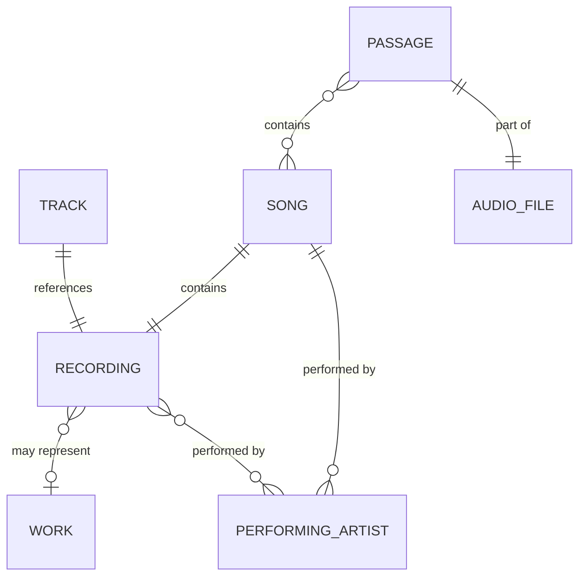

# Entity Definitions

**📜 TIER 1 - AUTHORITATIVE SOURCE DOCUMENT (Component)**

Defines core entity terminology used throughout McRhythm documentation. Part of [requirements.md](requirements.md). See [Document Hierarchy](document_hierarchy.md).

**Update Policy:** ✅ Product terminology decisions | ❌ NOT derived from design/implementation

> **Related Documentation:** [Requirements](requirements.md) | [Musical Flavor](musical_flavor.md) | [Database Schema](database_schema.md)

## Entities

- **[ENT-MB-010]** Track: a specific recording on a particular release.  Has a MBID (MusicBrainz unique identifier), definition is [harmonized with MusicBrainz](https://musicbrainz.org/doc/Track).
- **[ENT-MB-020]** Recording: the unique distinct piece of audio underlying a track. Has a MBID, definition is [harmonized with MusicBrainz](https://musicbrainz.org/doc/Recording).
- **[ENT-MB-030]** Work: one or more recordings can exist of each work. Has a MBID, definition is [harmonized with MusicBrainz](https://musicbrainz.org/doc/Work) definition of discrete works.
- **[ENT-MB-040]** Performing Artist: the artist(s) credited with creating a recording. Has a MBID, definition is [harmonized with MusicBrainz](https://musicbrainz.org/doc/Recording#Artist) definition of "The artist(s) that the recording is primarily credited to."
- **[ENT-MCR-010]** Song: A combination of a recording and one or more performing artist(s).
  - each song may appear in one or more passages.
- **[ENT-MCR-020]** Audio File: A file on disk containing audio data in formats such as MP3, FLAC, OGG, M4A, or WAV.
  - Each audio file may contain one or more passages.
  - Audio files are stored in user-designated music library directories.
- **[ENT-MCR-030]** Passage: A span of audio.
  - In McRhythm a passage is a defined part of an audio file with start, fade-in, lead-in,
    lead-out, fade-out, end points in time defined, as described in Crossfade Handling.
  - Multiple passages defined within an audio file may, or may not, overlap each other in time.
  - A passage may contain zero or more songs.

## Entity Relationships

- **[ENT-REL-010]** Track references Recording
- **[ENT-REL-020]** Recording may represent Work
- **[ENT-REL-030]** Recording performed by Performing Artist(s)
- **[ENT-REL-040]** Song contains Recording
- **[ENT-REL-050]** Song performed by Performing Artist(s)
- **[ENT-REL-060]** Passage contains Song(s)
- **[ENT-REL-070]** Passage is part of Audio File

## Cardinality Rules

- **[ENT-CARD-010]** Track → Recording: One-to-one (each track references exactly one recording)
- **[ENT-CARD-020]** Recording → Work: Many-to-zero-or-one (a recording may or may not represent a work; multiple recordings can represent the same work)
- **[ENT-CARD-030]** Recording → Artist: Many-to-many (recordings can have multiple artists; artists perform multiple recordings)
- **[ENT-CARD-040]** Song → Recording: One-to-one (each song contains exactly one recording)
- **[ENT-CARD-050]** Song → Artist: One-to-many (each song has one or more performing artists)
- **[ENT-CARD-060]** Passage → Song: Many-to-many (passages can contain multiple songs; songs appear in multiple passages)
- **[ENT-CARD-070]** Passage → Audio File: Many-to-one (multiple passages can be defined within one audio file)

## McRhythm-Specific Constraints

- **[ENT-CONST-010]** Passage with zero songs: Allowed, but excluded from automatic selection (can only be manually queued)
- **[ENT-CONST-020]** Passage with multiple songs: Musical flavor is weighted average based on song duration within passage
- **[ENT-CONST-030]** Song identity: Defined by unique (Recording, Artist set) combination
  - Same recording performed by different artists = different songs
  - Different recordings of same work by same artist = different songs

----
End of document - Entity Definitions
