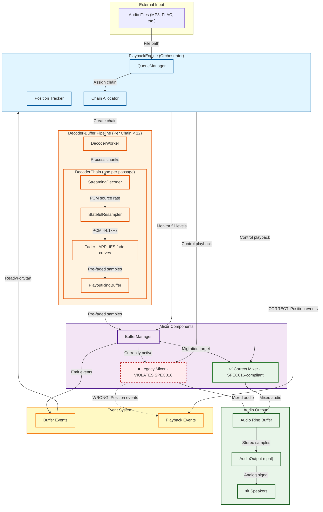

# WKMP Audio Playback Architecture Flow Diagram

**Date:** 2025-01-30
**Context:** PLAN014 Mixer Refactoring - Understanding PlaybackEngine and Mixer roles

---

## Mermaid Flowchart



---

## Architecture Explanation

### High-Level Flow: Audio Files → Speakers

```
Audio Files → QueueManager → Chain Assignment → DecoderWorker → DecoderChain
→ BufferManager → Mixer → Audio Ring Buffer → AudioOutput (cpal) → Speakers
```

---

## Component Roles

### PlaybackEngine (Orchestrator)
**Location:** [engine.rs](../../wkmp-ap/src/playback/engine.rs)

**Responsibilities:**
- Manages QueueManager (current/next/queued passages)
- Allocates decoder chains to passages (HashMap<QueueEntryId, ChainIndex>)
- Tracks playback position (AtomicU64 for lock-free updates)
- **Should emit position events** (currently done by legacy mixer - architectural violation)
- Controls playback state (play/pause/resume)

### QueueManager
**Location:** [queue_manager.rs](../../wkmp-ap/src/playback/queue_manager.rs)

**Purpose:** Tracks which passages are in the playback pipeline

**Structure:**
- **Current:** Currently playing
- **Next:** Next to play (gets full buffer)
- **Queued:** After next (get partial buffers)

### DecoderWorker
**Location:** [decoder_worker.rs](../../wkmp-ap/src/playback/decoder_worker.rs)

**Purpose:** Single-threaded worker processing all decoder chains

**Architecture:** [DBD-DEC-040] Serial decoding (one decoder at a time)

### DecoderChain (Pipeline Components)
**Location:** [pipeline/decoder_chain.rs](../../wkmp-ap/src/playback/pipeline/decoder_chain.rs)

Each chain (up to 12 concurrent) processes one passage:

1. **StreamingDecoder** (`symphonia`)
   - Decodes audio files (MP3, FLAC, etc.)
   - Produces PCM samples at source sample rate
   - ~1 second chunks [DBD-DEC-110]

2. **StatefulResampler** (`rubato`)
   - Converts to 44.1kHz working sample rate
   - Preserves state for streaming operation

3. **Fader** [pipeline/fader.rs](../../wkmp-ap/src/playback/pipeline/fader.rs)
   - **APPLIES fade curves BEFORE buffering** [DBD-FADE-030/050]
   - Fade-in: Start → Fade-In Point
   - Fade-out: Fade-Out Point → End
   - **Output:** Pre-faded samples

4. **PlayoutRingBuffer** [playout_ring_buffer.rs](../../wkmp-ap/src/playback/playout_ring_buffer.rs)
   - Stores **pre-faded samples** (NOT raw samples)
   - Capacity: 661,941 samples (15 seconds @ 44.1kHz) [DBD-PARAM-070]
   - Lock-free ring buffer (producer/consumer split)

### BufferManager
**Location:** [buffer_manager.rs](../../wkmp-ap/src/playback/buffer_manager.rs)

**Responsibilities:**
- Creates/destroys buffers for queue entries
- Tracks buffer fill levels
- Emits events (ReadyForStart, StateChanged, Exhausted)
- **Event-driven:** No polling [PERF-POLL-010]

### Mixer Components (Two Implementations)

#### ❌ Legacy Mixer (Currently Active - Violates SPEC016)
**Location:** [pipeline/mixer.rs](../../wkmp-ap/src/playback/pipeline/mixer.rs) (CrossfadeMixer)

**Violations:**
- Complex state machine (Playing, Crossfading, Paused, etc.)
- **Emits position events** (should be PlaybackEngine's responsibility)
- Tightly coupled to buffer management
- 1,969 lines of complex code

#### ✅ Correct Mixer (SPEC016-Compliant - Migration Target)
**Location:** [mixer.rs](../../wkmp-ap/src/playback/mixer.rs)

**Responsibilities:**
1. **Reads pre-faded samples** from buffers (NO fade curve application)
2. **Sums overlapping samples** (crossfade = simple addition)
3. **Applies master volume** (single multiplication)
4. **Outputs single stream** to audio ring buffer

**NOT responsible for:**
- Position tracking (PlaybackEngine's job)
- Fade curve application (Fader's job, already done before buffering)
- Complex state management

### Audio Ring Buffer
**Location:** [ring_buffer.rs](../../wkmp-ap/src/playback/ring_buffer.rs) (output ring buffer)

**Purpose:** Lock-free buffer between mixer and audio callback

**Capacity:** 88,200 samples (2 seconds @ 44.1kHz) [DBD-PARAM-030]

### AudioOutput
**Location:** [output.rs](../../wkmp-ap/src/audio/output.rs)

**Purpose:** Interface to audio device via cpal

**Callback:** ~512 frames per callback [DBD-PARAM-110]

---

## Architectural Boundaries

### Where Fade Curves Are Applied

**BEFORE buffering:** Fader component applies fade curves BEFORE samples enter PlayoutRingBuffer

```
Decoder → Resampler → Fader (applies curves) → Buffer (stores pre-faded)
                         ↓
                   Pre-faded samples
                         ↓
                   Mixer reads (NO runtime fade calculations)
```

**Key Principle [DBD-MIX-042]:**
- **Buffer contents:** Pre-faded samples (already multiplied by fade curve)
- **Mixer reads:** Pre-faded samples (simple mixing only)

### Where Position Tracking Should Happen

**PlaybackEngine (NOT mixer)**

```
❌ CURRENT (Wrong):
   Legacy mixer emits PositionUpdate events
   → Violates separation of concerns
   → Mixer tracks passage IDs (stateful)

✅ CORRECT (Target):
   PlaybackEngine emits PositionUpdate events
   → Proper architecture
   → Mixer remains stateless
```

### Fader → Buffer → Mixer Separation

```
Decoder → Resampler → Fader → Buffer → Mixer → Output
                        ↑        ↑       ↑
                        |        |       |
          Applies curves|  Stores|  Reads pre-faded,
          (fade-in/out) |  pre-  |  sums overlaps,
                        |  faded |  applies volume
```

**Key Principle [DBD-MIX-042]:**
- **Fader:** Passage-specific processing (fade curves)
- **Buffer:** Storage (pre-faded samples)
- **Mixer:** Global processing (sum overlaps, master volume)

---

## Event Flow

### Buffer Events
**Source:** BufferManager
**Destination:** PlaybackEngine

**Events:**
- `ReadyForStart`: Buffer has minimum threshold (e.g., 22,050 samples = 0.5s)
- `StateChanged`: Buffer state transition (Empty → Filling → Ready → Draining)
- `Exhausted`: Buffer drained and decode complete

### Playback Events
**Source (Current):** Legacy mixer ❌ (wrong)
**Source (Correct):** PlaybackEngine ✅ (correct)

**Events:**
- `PositionUpdate`: Current frame position (~100ms intervals)
- `PassageStarted`: New passage began playback
- `PassageCompleted`: Passage finished playback

---

## PLAN014 Migration Status

### Current State
- Legacy mixer (`pipeline/mixer.rs`) is active
- Violates SPEC016 separation of concerns
- Emits position events (architectural violation)

### Target State
- Correct mixer (`mixer.rs`) becomes active
- SPEC016-compliant: reads pre-faded, sums, applies volume
- PlaybackEngine emits position events
- Simpler, testable, maintainable

### Current Work: Sub-Increment 4a

**Objective:** Move position event emission from mixer to PlaybackEngine

**Tasks:**
1. Add position tracking fields to PlaybackEngine
2. Emit position events in playback loop
3. Remove position event dependencies from mixer instantiation
4. Verify events still work

---

## Viewing This Diagram

**In VSCode:**
1. Install "Markdown Preview Mermaid Support" extension
2. Open this file
3. Press `Ctrl+Shift+V` (Preview)

**Online:**
1. Copy the mermaid code block
2. Paste into https://mermaid.live/

**In GitHub/GitLab:**
- Mermaid diagrams render automatically in markdown files

---

**Date:** 2025-01-30
**Author:** Claude (PLAN014 Implementation)
