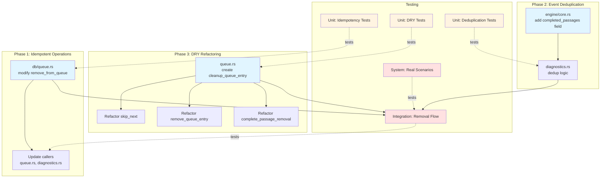

# Dependencies Map: PLAN022 Queue Handling Resilience

**Plan:** PLAN022 Queue Handling Resilience Improvements
**Date:** 2025-11-06

---

## Dependency Categories

### 1. Code Dependencies (Implementation Files)

#### Files to Modify

| File | Status | Purpose | Lines to Modify | Dependency Type |
|------|--------|---------|-----------------|-----------------|
| wkmp-ap/src/db/queue.rs | ✅ Exists | Database queue operations | ~15 (function signature + impl) | MODIFY |
| wkmp-ap/src/playback/engine/core.rs | ✅ Exists | PlaybackEngine struct | ~5 (add field) | MODIFY |
| wkmp-ap/src/playback/engine/diagnostics.rs | ✅ Exists | Event handler | ~30 (dedup logic) | MODIFY |
| wkmp-ap/src/playback/engine/queue.rs | ✅ Exists | Queue operations | ~200 (helper + refactoring) | MODIFY |

**Total Implementation Effort:** ~250 lines modified across 4 existing files

#### New Test Files

| File | Status | Purpose | Est. Lines | Dependency Type |
|------|--------|---------|------------|-----------------|
| wkmp-ap/tests/queue_deduplication_tests.rs | ❌ New | Unit tests for deduplication | ~200 | CREATE |
| wkmp-ap/tests/cleanup_helper_tests.rs | ❌ New | Unit tests for DRY helper | ~150 | CREATE |
| wkmp-ap/tests/queue_removal_integration_tests.rs | ❌ New | Integration tests | ~100 | CREATE |
| wkmp-ap/tests/system_queue_resilience_tests.rs | ❌ New | System tests | ~100 | CREATE |

**Total Test Effort:** ~550 lines across 4 new test files

#### Existing Test Infrastructure (Reuse)

| File | Status | Purpose | Usage |
|------|--------|---------|-------|
| wkmp-ap/tests/test_engine.rs | ✅ Exists | Test harness utilities | Import and use for new tests |
| wkmp-ap/tests/helpers/audio_generator.rs | ✅ Exists | Generate test audio files | Create short audio for system tests |
| wkmp-ap/tests/helpers/mod.rs | ✅ Exists | Test helper modules | Import for test utilities |
| wkmp-ap/tests/event_driven_playback_tests.rs | ✅ Exists | Existing playback tests | Verify no regression |

---

### 2. Documentation Dependencies (Read-Only)

#### Architecture and Design Documents

| Document | Lines | Section to Read | Purpose |
|----------|-------|-----------------|---------|
| docs/SPEC028-playback_orchestration.md | ~900 | Section 2 (Event-Driven Architecture), Section 5 (Marker-Driven Events) | Understand event flow, marker patterns |
| docs/SPEC016-decoder_buffer_design.md | ~600 | Section 2.2 (Chain Assignment Lifecycle) | Understand cleanup ordering rationale |
| docs/REQ001-requirements.md | ~1500 | Search for "queue" (selective) | Verify no conflicts with existing requirements |
| docs/GOV002-requirements_enumeration.md | ~300 | Requirement ID format | Follow REQ-XXX-YYY numbering scheme |
| docs/IMPL002-coding_conventions.md | ~400 | All | Follow WKMP coding style |

**Reading Strategy (Context Window Management):**
- Read executive summaries first
- Use grep to find relevant sections
- Read specific line ranges only (not full documents)
- Total context: <500 lines per session

#### Analysis Documents

| Document | Lines | Section to Read | Purpose |
|----------|-------|-----------------|---------|
| wip/queue_handling_mechanism_analysis.md | ~850 | Section 1 (Summary), Section 3 (Failure Analysis) | Understand root cause, failure scenarios |
| wip/SPEC029-queue_handling_resilience.md | 1201 | All (source specification) | Reference for all requirements |

---

### 3. External Dependencies

#### Rust Crates (Existing, No Changes)

| Crate | Version | Purpose | Usage |
|-------|---------|---------|-------|
| tokio | ^1.35 | Async runtime | spawn, RwLock, Instant |
| sqlx | ^0.7 | Database access | Pool<Sqlite>, query execution |
| uuid | ^1.6 | Queue entry IDs | Uuid type, parsing |
| tracing | ^0.1 | Logging | debug!, info!, warn!, error! |
| anyhow | ^1.0 | Error handling | Result types |

**Status:** All crates already in wkmp-ap/Cargo.toml - NO new dependencies required

#### Standard Library

| Module | Purpose | Usage |
|--------|---------|-------|
| std::collections::HashMap | Deduplication state | Store queue_entry_id → timestamp |
| std::time::Instant | Timestamps | Track when events processed |
| std::time::Duration | Time windows | 5-second deduplication window |
| std::sync::Arc | Shared ownership | Wrap deduplication HashMap |

**Status:** Standard library only - no external dependencies

---

### 4. Database Dependencies

#### Schema (No Changes Required)

| Table | Purpose | Columns Used | Operations |
|-------|---------|--------------|------------|
| queue | Queue entries | guid (PK), passage_guid, play_order | DELETE |

**Schema Impact:** NONE - existing schema sufficient
**Migrations Required:** NONE
**Backward Compatibility:** 100% (no schema changes)

#### Database Constraints

- SQLite version: Requires JSON1 extension (existing requirement)
- ACID properties: Rely on SQLite transaction guarantees
- Concurrent access: Single writer (PlaybackEngine) ensures consistency

---

### 5. Integration Points

#### HTTP REST API (No Changes)

| Endpoint | Method | Purpose | Impact |
|----------|--------|---------|--------|
| /playback/skip | POST | Skip current passage | Uses skip_next() (will be refactored internally) |
| /playback/queue/{id} | DELETE | Remove queue entry | Uses remove_queue_entry() (will be refactored internally) |
| /playback/queue | DELETE | Clear entire queue | Uses clear_queue() (no changes) |

**API Compatibility:** 100% - No request/response changes
**Versioning:** No version bump required (internal changes only)

#### SSE Events (No Format Changes)

| Event | Purpose | Schema Impact |
|-------|---------|---------------|
| QueueChanged | Queue contents changed | None - format unchanged |
| PassageCompleted | Passage finished | None - format unchanged |
| QueueIndexChanged | Queue position shifted | None - format unchanged |

**Event Compatibility:** 100% - Existing consumers unaffected
**Event Schema:** Unchanged (no new fields)

#### Microservices Communication

| Service | Communication | Impact |
|---------|---------------|--------|
| wkmp-ui | HTTP REST API calls, SSE subscriptions | None - API unchanged |
| wkmp-pd | No direct communication | None |

**Inter-Service Compatibility:** 100% - wkmp-ap internal changes only

---

### 6. Testing Dependencies

#### Test Infrastructure (Existing)

| Component | Status | Usage |
|-----------|--------|-------|
| TestEngine | ✅ Exists | Mock PlaybackEngine for unit tests |
| create_test_audio_file() | ✅ Exists | Generate audio files for integration tests |
| assert_no_error_logs() | ❌ Need | Verify ERROR logs eliminated (create utility) |
| DecoderWorkerSpy | ✅ Exists | Track decode requests (event_driven_playback_tests.rs) |
| Mock components | ❌ Need | Track cleanup step ordering (create for DRY tests) |

**Status:** Mostly exists, need 2 new test utilities

#### Test Data Requirements

| Data Type | Purpose | Source |
|-----------|---------|--------|
| Short audio files (1-2 seconds) | System tests | Generate via audio_generator.rs |
| Truncated audio files (EOF before marker) | EOF handling tests | Generate with early EOF |
| SQLite test database | Integration tests | In-memory database (create per test) |
| Mock passage/queue entries | Unit tests | Create test data structures |

**Test Data Status:** All can be generated programmatically - no external data files needed

---

## Dependency Graph

**Legend:**
- Blue: Implementation files
- Yellow: Unit tests
- Red: Integration/System tests
- Solid lines: Code dependencies
- Dotted lines: Test coverage

---

## Dependency Verification Checklist

### Before Implementation Starts

- [x] All files to modify exist and are accessible
- [x] No new external dependencies required (using existing Cargo crates)
- [x] Test infrastructure available and understood
- [x] Documentation references identified (no missing docs)
- [ ] User confirms scope and dependencies are correct

### During Implementation

- [ ] Each file modification verified to compile independently
- [ ] Test infrastructure utilities created as needed
- [ ] Documentation references consulted for implementation guidance
- [ ] No unexpected dependencies discovered

### After Implementation

- [ ] All modified files compile successfully
- [ ] All new test files added to test suite
- [ ] No unintended file modifications (git diff review)
- [ ] Cargo.toml unchanged (no new dependencies added)

---

## Dependency Risk Assessment

### Low Risk Dependencies (Green)

**1. Existing Code Files**
- Risk: Low
- Rationale: All files exist, well-understood, under active maintenance
- Mitigation: N/A (standard implementation)

**2. Existing Cargo Crates**
- Risk: Low
- Rationale: Tokio, sqlx, uuid are stable and widely used
- Mitigation: N/A (standard stack)

**3. Test Infrastructure**
- Risk: Low
- Rationale: Existing test patterns proven effective
- Mitigation: N/A (reuse established patterns)

### Medium Risk Dependencies (Yellow)

**4. Database Behavior**
- Risk: Low-Medium
- Rationale: Relying on SQLite ACID guarantees
- Mitigation: Unit tests verify idempotency under concurrent access
- Monitoring: Integration tests exercise concurrent scenarios

**5. Async Concurrency (RwLock)**
- Risk: Low-Medium
- Rationale: Potential for deadlocks if lock ordering incorrect
- Mitigation: Use standard Arc<RwLock> pattern, read locks for checks only
- Monitoring: Stress tests with concurrent passage completions

### High Risk Dependencies (Red)

**None identified** - All dependencies are existing, stable, and well-understood.

---

## Dependency Change Log

**If dependencies change during implementation:**

| Date | Dependency Changed | Reason | Impact | Approved By |
|------|-------------------|--------|--------|-------------|
| [Date] | [Dependency] | [Reason] | [Impact] | [Name] |

**Status:** No changes as of 2025-11-06

---

## Dependency Sign-Off

**Dependencies Mapped:** 2025-11-06
**Mapped By:** Claude Code (Plan Workflow Phase 1)
**Verified:** All dependencies exist and are accessible
**Status:** Ready for Phase 2 (Specification Completeness Verification)
