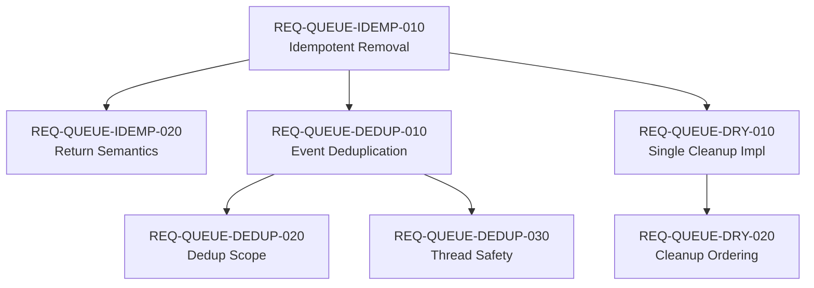

# Requirements Index: PLAN022 Queue Handling Resilience

**Source:** wip/SPEC029-queue_handling_resilience.md
**Date:** 2025-11-06
**Total Requirements:** 7

---

## Requirements Summary

| Req ID | Type | Brief Description | Source Line | Priority |
|--------|------|-------------------|-------------|----------|
| REQ-QUEUE-IDEMP-010 | Functional | Idempotent queue removal operations | 151 | P0 |
| REQ-QUEUE-IDEMP-020 | Interface | Return value semantics for removal | 158 | P0 |
| REQ-QUEUE-DEDUP-010 | Functional | PassageComplete event deduplication | 249 | P0 |
| REQ-QUEUE-DEDUP-020 | Functional | Deduplication scope (5-second window) | 256 | P0 |
| REQ-QUEUE-DEDUP-030 | Non-Functional | Thread-safe deduplication state | 263 | P0 |
| REQ-QUEUE-DRY-010 | Design | Single cleanup implementation (DRY) | 375 | P0 |
| REQ-QUEUE-DRY-020 | Design | Cleanup operation ordering | 382 | P0 |

**All requirements are P0 (High Priority)** - This is a resilience/reliability improvement affecting system observability and maintainability.

---

## Detailed Requirements

### REQ-QUEUE-IDEMP-010: Idempotent Queue Removal

**Category:** Functional
**Source:** SPEC029:151-157

**Description:**
Database removal operations MUST be idempotent:
- First call: Remove entry if exists, return `Ok(true)`
- Subsequent calls: Return `Ok(false)` (not error)
- Never error on missing entry (already removed is success case)

**Rationale:** Eliminate ERROR logs from duplicate PassageComplete events.

**Acceptance Criteria:**
- First removal succeeds with Ok(true)
- Second removal succeeds with Ok(false)
- Removal of non-existent entry returns Ok(false)
- No ERROR logs for duplicate removal attempts

---

### REQ-QUEUE-IDEMP-020: Return Value Semantics

**Category:** Interface
**Source:** SPEC029:158-164

**Description:**
`remove_from_queue()` MUST return `Result<bool>`:
- `Ok(true)`: Entry was removed by this call
- `Ok(false)`: Entry not found (idempotent no-op)
- `Err(_)`: Database error (connection failure, etc.)

**Rationale:** Enable callers to distinguish between successful removal, idempotent no-op, and actual errors.

**Acceptance Criteria:**
- Return type is `Result<bool>` (not `Result<()>`)
- Return value semantics match specification
- All callers updated to handle new return type
- Database errors still propagate as Err

---

### REQ-QUEUE-DEDUP-010: PassageComplete Deduplication

**Category:** Functional
**Source:** SPEC029:249-254

**Description:**
The system MUST deduplicate PassageComplete events:
- Only process first event for each `queue_entry_id`
- Track processed entries for 5 seconds (safety margin)
- Automatically cleanup stale entries (prevent memory leak)

**Rationale:** Prevent double-removal attempts from multiple event sources (PassageComplete marker, EOF, EOF before leadout).

**Acceptance Criteria:**
- First PassageComplete event processes normally
- Duplicate events within 5 seconds are ignored
- Debug log shows duplicate detection
- Multiple distinct queue entries process independently
- Stale entries cleaned up after 5 seconds

---

### REQ-QUEUE-DEDUP-020: Deduplication Scope

**Category:** Functional
**Source:** SPEC029:256-261

**Description:**
Deduplication applies to:
- `PlaybackEvent::PassageComplete` only
- Per `queue_entry_id` (not passage_id)
- Time window: 5 seconds (longer than any passage transition)

**Rationale:** Scoped deduplication prevents false positives while covering all race condition windows.

**Acceptance Criteria:**
- Deduplication applies to PassageComplete events only
- Other event types not affected
- Keyed by queue_entry_id (unique per queue instance)
- 5-second window covers all observed race windows

---

### REQ-QUEUE-DEDUP-030: Thread Safety

**Category:** Non-Functional
**Source:** SPEC029:263-268

**Description:**
Deduplication state MUST be thread-safe:
- Use `Arc<RwLock<HashMap<Uuid, Instant>>>` for shared state
- Read lock for checks (concurrent safe)
- Write lock for insertions/removals (exclusive)

**Rationale:** Prevent race conditions in deduplication logic itself (async/concurrent environment).

**Acceptance Criteria:**
- Deduplication state uses Arc<RwLock<HashMap>>
- Read locks used for duplicate checks
- Write locks used for insertions/removals
- No data races under concurrent passage completion

---

### REQ-QUEUE-DRY-010: Single Cleanup Implementation

**Category:** Design
**Source:** SPEC029:375-380

**Description:**
Resource cleanup logic MUST be implemented once:
- Single helper method for all cleanup operations
- All callers (skip, remove, clear) use helper
- Helper handles all cleanup steps in correct order

**Rationale:** Eliminate code duplication (5-7 cleanup steps repeated across 3 methods) to reduce maintenance burden and prevent divergence.

**Acceptance Criteria:**
- Single `cleanup_queue_entry()` helper method exists
- `skip_next()` uses helper
- `remove_queue_entry()` uses helper
- `complete_passage_removal()` uses helper (or becomes helper)
- Code duplication reduced by 40-60% (measured by line count)

---

### REQ-QUEUE-DRY-020: Cleanup Operation Ordering

**Category:** Design
**Source:** SPEC029:382-392

**Description:**
Cleanup helper MUST execute steps in this order:
1. Release decoder-buffer chain (free resources first)
2. Stop mixer (clear audio output state)
3. Remove from queue (database + memory)
4. Release buffer (free decoded audio memory)
5. Emit events (notify subscribers)
6. Try chain reassignment (allocate freed chain to waiting passages)

**Rationale:** Order ensures resources freed before reassignment, persistence before memory updates.

**Acceptance Criteria:**
- Cleanup steps execute in specified order
- Order verified by unit test (mock components track call sequence)
- All existing cleanup paths follow same order
- No behavioral regression (existing tests still pass)

---

## Requirements Dependencies

**Dependency Analysis:**
- REQ-QUEUE-IDEMP-010 is foundational (all others build on it)
- REQ-QUEUE-IDEMP-020 extends REQ-QUEUE-IDEMP-010 (interface spec)
- REQ-QUEUE-DEDUP-010/020/030 form a subsystem (event deduplication)
- REQ-QUEUE-DRY-010/020 form a subsystem (code organization)
- No circular dependencies
- Can implement in parallel: Idempotency → {Deduplication, DRY refactoring}

---

## Traceability to Source Specification

All requirements extracted from SPEC029-queue_handling_resilience.md:

- Section 4.1: Idempotent Database Operations (REQ-QUEUE-IDEMP-*)
- Section 4.2: Event Deduplication (REQ-QUEUE-DEDUP-*)
- Section 4.3: DRY Cleanup Refactoring (REQ-QUEUE-DRY-*)

Source document line references provided for verification.

---

## Out of Scope

The following are explicitly NOT requirements for this implementation:

**Out of Scope:**
- Telemetry SSE events for duplicate detection (future enhancement per SPEC029:1170)
- Configurable deduplication window (future enhancement per SPEC029:1173)
- Event source consolidation (mixer/marker changes, deferred per SPEC029:1176)
- Background cleanup task optimization (alternative to per-event spawn, SPEC029:342)
- Performance profiling and optimization beyond baseline implementation

**Rationale:** Focus on core resilience improvements first; enhancements deferred to future work per SPEC029 Section 9.

---

## Assumptions

**Assumption 1:** SQLite database operations are atomic
- Justification: SQLite provides ACID guarantees
- Impact if False: Would need additional transaction management
- Mitigation: None required (standard SQLite behavior)

**Assumption 2:** Tokio async runtime handles concurrent access correctly
- Justification: RwLock + Arc provide standard concurrency primitives
- Impact if False: Data races in deduplication state
- Mitigation: Covered by REQ-QUEUE-DEDUP-030 (thread safety requirement)

**Assumption 3:** 5-second deduplication window covers all race windows
- Justification: Based on observed duplicate events within 7ms (SPEC029:369)
- Impact if False: Duplicates outside window not caught
- Mitigation: Window significantly larger than observed maximum (5000ms >> 7ms)

**Assumption 4:** Existing test suite will catch regressions
- Justification: wkmp-ap has comprehensive test coverage (event_driven_playback_tests.rs, mixer_tests/)
- Impact if False: Behavioral regressions slip through
- Mitigation: Run full test suite before/after implementation

---

## Constraints

**Technical Constraints:**
- Must maintain backward compatibility with existing HTTP API (no breaking changes)
- Must not change SSE event formats (consumers depend on current schema)
- Must use existing Rust/Tokio/SQLite stack (no new dependencies)
- Must follow WKMP coding conventions (IMPL002)

**Timeline Constraints:**
- Estimated 5 hours total implementation time (per SPEC029:1203)
- Target: Complete within one working day

**Quality Constraints:**
- Zero behavioral regressions (all existing tests must pass)
- 100% test coverage for new functionality (per TDD approach)
- Code review approval required before merge

---

## Success Metrics

**Quantitative Metrics:**
- ERROR logs from duplicate events: Current >0 → Target 0
- Code duplication: Current ~120 lines → Target <70 lines (40-60% reduction)
- Test coverage: Target 100% for new code paths
- Existing test suite: 100% passing (no regressions)

**Qualitative Metrics:**
- Logs clearly distinguish idempotent no-op from actual errors
- Code maintainability improved (single cleanup implementation)
- Future developers can understand deduplication mechanism easily

---

## Requirements Sign-Off

**Requirements Extracted:** 2025-11-06
**Extracted By:** Claude Code (Plan Workflow Phase 1)
**Source Verification:** All requirements traced to SPEC029 line numbers
**Status:** Ready for Phase 2 (Specification Completeness Verification)
