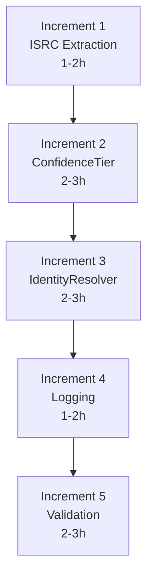

# Increment Index

**Plan:** PLAN-EMBID-001
**Total Increments:** 5
**Estimated Total Effort:** 8-13 hours (expected: 10 hours)

---

## Overview

**Critical Path:** I1 → I2 → I3 → I4 → I5 (all sequential)

---

## Increment Summary

| # | Name | Effort | Requirements | Tests | Checkpoint |
|---|------|--------|--------------|-------|------------|
| 1 | [ISRC Extraction](increment_01.md) | 1-2h | FR-02 | TC-U-001, TC-U-002 | - |
| 2 | [ConfidenceTier](increment_02.md) | 2-3h | FR-04 | TC-U-003-006 | After |
| 3 | [IdentityResolver](increment_03.md) | 2-3h | FR-05, FR-06 | TC-I-001-003 | - |
| 4 | [Logging](increment_04.md) | 1-2h | FR-08 | TC-U-007-008 | After |
| 5 | [Validation](increment_05.md) | 2-3h | NFR-01-04 | TC-S-001-004 | After |

---

## Checkpoints

### Checkpoint 1: After Increment 2
**Criteria:**
- [ ] ISRC extraction working
- [ ] ConfidenceTier enum complete
- [ ] Unit tests TC-U-001 through TC-U-006 pass
- [ ] `cargo check -p wkmp-ai` succeeds

### Checkpoint 2: After Increment 4
**Criteria:**
- [ ] IdentityResolver uses Stage 0
- [ ] Logging includes confidence tier
- [ ] All unit and integration tests pass
- [ ] No regression in existing functionality

### Checkpoint 3: After Increment 5
**Criteria:**
- [ ] Coverage >= 98% on test dataset
- [ ] Performance < 50ms per file
- [ ] All system tests pass
- [ ] Ready for production use

---

## Files to Create/Modify

### New Files
| File | Increment | Purpose |
|------|-----------|---------|
| `matching/confidence_tier.rs` | 2 | ConfidenceTier enum and logic |
| `tests/stage0_integration.rs` | 5 | Integration tests |

### Modified Files
| File | Increment | Changes |
|------|-----------|---------|
| `extractors/id3_extractor.rs` | 1 | Add ISRC extraction |
| `types.rs` | 1, 2 | Add ISRC field, import ConfidenceTier |
| `matching/mod.rs` | 2 | Export confidence_tier module |
| `fusion/identity_resolver.rs` | 3, 4 | Add Stage 0 logic, logging |

---

## Prerequisites Check

| Prerequisite | Status |
|--------------|--------|
| lofty crate available | YES |
| ID3Extractor exists | YES |
| IdentityResolver exists | YES |
| Test framework set up | YES |
| tracing crate available | YES |

---

## Quick Start

1. Read [00_PLAN_SUMMARY.md](../00_PLAN_SUMMARY.md) for overview
2. Start with [increment_01.md](increment_01.md)
3. Run tests: `cargo test -p wkmp-ai`
4. Proceed to next increment when tests pass
5. Check against checkpoint criteria at milestones
